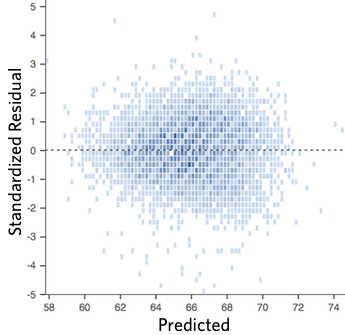

# Regression III

Following the introduction of regression models in previous weeks, we will develop these models further in this session. How do we interpret categorical variables used in regression? What are interaction effects, and why we might need them? These are some of the questions we will address this week. 

## Fitting regression with categorical predictors

In previous weeks, we explained regression using a numeric input. It turns out we can also use regression with categorical explanatory variables. It is quite straightforward to run it. 

We will use the same dataset from previous weeks. We will use the replication data from one of the papers that Prof Sharkey published to study what contributed to the decline of crime from the 90s. This data is found in the [Harvard Dataverse](https://dataverse.harvard.edu/dataset.xhtml?persistentId=doi:10.7910/DVN/46WIH0). If you are interested in the specific study analysing this data, you can find it [here](https://journals.sagepub.com/doi/abs/10.1177/0003122417736289).

```{r}
urlfile <- "https://dataverse.harvard.edu/api/access/datafile/:persistentId?persistentId=doi:10.7910/DVN/46WIH0/ARS2VS"
communitycrime <- read.table(urlfile, sep = '\t',header = T)
```

As before, we create an object with the permanent `URL` address, and then we use a function to read the data into R. We use the `read.table` function from base R for this. We pass two arguments to the function `sep= '\t'`, telling R this file is tab separated. The `header = T` function tells R that it is TRUE (T) that this file has a first row that acts as a header (this row has the name of the variables).

There are many more variables here than we will need, so let's do some filtering and selection. We will focus on 2012, the most recent year in the dataset, and just a few select variables.

```{r, message=FALSE}
library(dplyr)
df <- filter(communitycrime, year == "2012")
df <- select(df, place_name, state_name, viol_r, black, lesshs, unemployed, fborn, incarceration, log_incarceraton, swornftime_r, log_viol_r, largest50)
```

So now we have a more manageable data set that we can use for this session. The file includes a sample of 264 US cities (see *place_name*) across 44 states. See previous weeks for code on how to figure out what these states are. 

We have one categorical variable in the dataset, *largest50*, identifying whether the city is one of the 50 largest in the country.

```{r}
table(df$largest50)
class(df$largest50)
```

This variable is, however, stored in a numeric vector. We may want to change this to reflect the fact it is categorical.

```{r}
df$largest50 <- as.factor(df$largest50)
class(df$largest50)
```

Let's rename the levels. In previous sessions, we illustrated how to do that with base R functions. Here, we introduce a new package, `forcats`, worth considering when doing any work with factor variables. You can read more about it [here](https://forcats.tidyverse.org).

```{r}
library(forcats)
df$largest50 <- fct_recode(df$largest50, Yes = "1", No = "0")
table(df$largest50)
```

We can explore if particularly large cities have higher rates of violence (remember, a rate controls for population size, so if this were to be significant, it would be telling us that it's not just because there are more people in them!). This is how you would express the model:

```{r}
fit_2 <- lm(log_viol_r ~ largest50, data=df)
```

Notice that there is nothing different in how we ask for the model compared to last week. And see below the regression line:

```{r, echo=FALSE, warning = FALSE, message=FALSE}
library(ggplot2)
ggplot(data=df, aes(x=largest50, y=log_viol_r)) +
  geom_boxplot() +
  geom_point(alpha=.5, position = "jitter", color="orange") +
  geom_abline(intercept = fit_2$coefficients[1],
    slope = fit_2$coefficients[2], color="red", size=1) +
  theme_bw()
```

Although in the plot, we still see a line, what we are really estimating here is the average of *log_viol_r* for each of the two categories. 

Let's have a look at the results:

```{r}
summary(fit_2)
```

As you can see, the output does not look too different. But notice that in the printout, you see how the row with the coefficient and other values for our input variable *largest50* we see that R is printing `largest50Yes`. What does this mean?

When you only have one predictor, the value of the intercept is the mean value of what we call the **reference category**, and the coefficient for the slope tells you how much higher (if it is positive) or how much lower (if it is negative) is the mean value for the other category in your factor.

The reference category is the one for which R does not print the *level* next to the name of the variable for which it gives you the regression coefficient. Here we see that the named level is "Yes" (`largest50Yes`). That's telling you that the reference category here is "No". Therefore, the Y-intercept, in this case, is the mean value of violence for cities that are not the largest in the country, whereas the coefficient for the slope tells you how much higher the mean value is for the largest cities in the country. Don't believe me?

```{r}
#Compute the mean for the smaller cities
mean(df$log_viol_r[df$largest50 == "No"], na.rm=TRUE)
#Compute the difference between the two means
mean(df$log_viol_r[df$largest50 == "Yes"], na.rm=TRUE) - mean(df$log_viol_r[df$largest50 == "No"], na.rm=TRUE)
```

So, to reiterate, the coefficient for a single binary predictor in a linear regression model often represents the difference in the means of the outcome variable between the two groups defined by the binary predictor (the two groups).

With categorical variables encoded as **factors**, you always have a situation like this: a reference category and then as many additional coefficients as there are additional levels in your categorical variable. Each of these additional categories is input into the model as **"dummy" variables**. Here, our categorical variable has two levels. Thus, we have only one dummy variable. There will always be one fewer dummy variable than the number of levels. The level with no dummy variable, females in this example, is known as the **reference category** or the **baseline**.

It turns out the regression table is printing out a test of statistical significance for every input in the model. If we look at the table above, the p value associated with it is near 0. This is indeed considerably lower than the conventional significance level of 0.05. So, we could conclude that the probability of obtaining this value if the null hypothesis is true is very low. However, the observed r squared is also kind of poor. Read [this](http://blog.minitab.com/blog/adventures-in-statistics/how-to-interpret-a-regression-model-with-low-r-squared-and-low-p-values) to understand a bit more about this phenomenon of low p, but also low r-squared.

If, rather than a binary explanatory variable, you had a factor with five levels. Then, if you were to run a regression model, this would result in a model with 4 dummy variables. The coefficient of each of these dummies would tell you how much higher or lower (if the sign were negative) the level of violence for each of the levels for which you have a dummy compared to your reference category or baseline is. One thing that is important to keep in mind is that R, by default, will use the first level in your factor as the baseline category. 

```{r}
levels(df$largest50)
```

In our case, you can see "No" listed first. Keep in mind for your assignment that levels in factors are often alphabetically listed, not in a particularly meaningful or useful way.
If you want to change this, you may need to reorder the levels. See [here](https://forcats.tidyverse.org/reference/fct_relevel.html) for instructions on how to do this.

## Motivating multiple regression

So, we saw above and in previous weeks that our models with just one predictor are not terribly powerful. Partly, that's due to the fact that they are not properly specified; they do not include a solid set of good predictor variables that can help us explain variation in our response variable. We can build better models by expanding the number of predictors (although keep in mind you should also aim to build models as parsimonious as possible).

Another reason why it is important to think about additional variables in your model is to control for spurious correlations (although here, you may also want to use your common sense when selecting your variables!). You must have heard before that correlation does not equal causation. Just because two things are associated, we cannot assume that one is the cause for the other. Typically, we see how the pilots switch on the secure belt button when there is turbulence. These two things are associated - they tend to come together. But the pilots are not causing the turbulences by pressing a switch! The world is full of **spurious correlations**, associations between two variables that should not be taken too seriously. You can explore a few [here](http://tylervigen.com/). It's funny. 

Looking only at covariation between pairs of variables can be misleading. It may lead you to conclude that a relationship is more important than it really is. This is no trivial matter, but one of the most important ones we confront in research and policy. 

It's not an exaggeration to say that most quantitative explanatory research is about trying to control for the presence of **confounders**, variables that may explain away observed associations. Think about any criminology question: Does marriage reduce crime? Or is it that people who get married are different from those who don't (and are those pre-existing differences that are associated with less crime)? Do gangs lead to more crime? Or is it that young people who join gangs are more likely to be offenders to start with? Are the police being racist when they stop and search more members of ethnic minorities? Or are there other factors (i.e., offending, area of residence, time spent in the street) that, once controlled, would mean no ethnic dis-proportionality in stop and searches? Does a particular program reduce crime? Or is the observed change due to something else?

These things also matter for policy. Wilson and Kelling, for example, argued that signs of incivility (or antisocial behaviour) in a community lead to more serious forms of crime later on as people withdraw to the safety of their homes when they see those signs of incivilities and this leads to a reduction in informal mechanisms of social control. All the policies to tackle antisocial behaviour in this country are very much informed by this model and were heavily influenced by the broken windows theory.

But is the model right? Sampson and Raudenbush argue that this is not entirely correct. They argued and tried to show that other confounding (poverty, collective efficacy) factors explain the association between signs of incivility and more serious crime. In other words, the reason why you see antisocial behaviour in the same communities that you see crime is because other structural factors explain both of those outcomes. They also argue that perceptions of antisocial behaviour are not just produced by observed antisocial behaviour but also by stereotypes about social class and race. If you believe them, then the policy implications are that only tackling antisocial behaviour won't help you to reduce crime (as Wilson and Kelling have argued). So, as you can see, this stuff matters for policy, not just for theory. 

Multiple regression is one way of checking the relevance of competing explanations. You could set up a model where you try to predict crime levels with an indicator of broken windows and an indicator of structural disadvantage. If, after controlling for structural disadvantage, you see that the regression coefficient for broken windows is still significant, you may be onto something, particularly if the estimated effect is still large. If, on the other hand, the regression coefficient of your broken windows variable is no longer significant, then you may be tempted to think that perhaps Sampson and Raudenbush were onto something. 

## Fitting and interpreting a multiple regression model

It could not be any easier to fit a multiple regression model. You simply modify the formula in the `lm()` function by adding terms for the additional inputs.

```{r}
fit_3 <- lm(log_viol_r ~ unemployed + largest50, data=df)
summary(fit_3)
```

With more than one input, you need to ask yourself whether all of the regression coefficients are zero. We are assuming the residuals are normally distributed, though with large samples, the F statistics approximate the F distribution.

You see the F test printed at the bottom of the summary output and the associated p-value, which, in this case, is way below the conventional .05 that we use to declare statistical significance and reject the null hypothesis. At least one of our inputs must be related to our response variable. 

Notice that the table printed also reports a t-test and p-value for each of the predictors. These test whether each of these predictors is associated with the response variable when adjusting for the other variables in the model. They report the "partial effect of adding that variable to the model" (James et al. 2014: 77). In this case, we can see that both variables seem to be significantly associated with the response variable.

If we look at the r squared, we can see that it is higher than before. This quantity, r squared, will always increase as a consequence of adding new variables, even if the new variables added are weakly related to the response variable. However, the increase we are observing suggests that adding these two variables results in a substantial improvement to our previous model.

We see that the coefficients for the predictors change very little; it goes down a bit for *unemployed*, and it goes down somehow more for *largest50*. **But their interpretation now changes**. A common interpretation is that now the regression for each variable tells you about changes in Y related to that variable **when the other variables in the model are held constant**. So, for example, you could say the coefficient for *unemployed* represents the increase in the log of the violence rate for every one-unit increase in the measure of unemployment *when holding all other variables in the model constant* (in this case, that refers to holding constant *largest50*). But this terminology can be a bit misleading.

Other interpretations are also possible and are more generalizable. Gelman and Hill (2007: p. 34) emphasise what they call the *predictive interpretation* which considers how "the outcome variable differs, on average, when comparing two groups of units that differ by 1 in the relevant predictor while being identical in all the other predictors". So [if you're regressing y on u and v, the coefficient of u is the average difference in y per difference in u, comparing pairs of items that differ in u but are identical in v](http://andrewgelman.com/2013/01/05/understanding-regression-models-and-regression-coefficients/).

So, for example, in this case, we could say that comparing respondents who have the same level of unemployment but who differ in whether they are one of the largest cities or not, the model predicts an expected difference of .53 in their violent crime measure. And cities with the same size category but that differ by 1% point in unemployment, we would expect to see a difference of 0.23 in their violent crime measure. So, we are interpreting the regression slopes **as comparisons of observation that differ in one predictor while being at the same levels of the other predictors**.

As you can see, interpreting regression coefficients can be kind of tricky[^12]. The relationship between the response y and any one explanatory variable can change greatly depending on what other explanatory variables are present in the model. 

For example, if you contrast this model with the one we run with only *largest50* as a predictor, you will notice that the intercept has changed. You can no longer read the intercept as the mean value of violence for smaller cities. *Adding predictors to the model changes their meaning*. Now, the intercept index is the value of violence for smaller cities *that, in addition, score 0 in unemployed*. In this case, you don't have cases that meet this condition (equal to zero in all your predictors). More often than not, there is not much value in bothering to interpret the intercept because it does not represent a real observation in your sample.

Something you need to be particularly careful about is to interpret the coefficients in a causal manner. Unless your data comes from an experiment, this is unlikely to be helpful. With observational data, regression coefficients should not be read as indexing causal relations. This sort of textbook warning is, however, often neglectfully ignored by professional researchers. Often authors carefully draw sharp distinctions between causal and correlational claims when discussing their data analysis, but then interpret the correlational patterns in a totally causal way in their conclusion section. This is what is called the [causation](http://junkcharts.typepad.com/numbersruleyourworld/2012/07/the-causation-creep.html) creep. Beware. Don't do this tempting as it may be.

Comparing the simple models with this more complex model, we could say that adjusting for *largest50* does not change much the impact of *unemployed* in violence. Almost the same can be said about the effect of *largest50* when holding *unemployed* fixed. 

## Presenting your regression results.

Clearly communicating your results is incredibly important. We have seen the tabular results produced by R. If you want to use them in a paper, you may need to tidy up those results. There are a number of packages (`textreg`, `stargazer`) that automatise that process. They take your `lm` objects and produce tables that you can put straight away in your reports or papers. One popular trend in presenting results is the **coefficient plot** as an alternative to the table of regression coefficients. There are various ways of producing coefficient plots with R for a variety of models. See [here](https://rpubs.com/friendly/coefplots-demo) for example.

We are going to use instead the `plot_model()` function of the `sjPlot` package, which makes it easier to produce these sorts of plots. You can find a more detailed tutorial about this function [here](https://strengejacke.github.io/sjPlot/articles/plot_marginal_effects.html#:~:text=plot_model()%20is%20a%20generic,(model%20coefficients)%20are%20plotted.). See below for an example:

```{r, warning=FALSE, message=FALSE}
library(sjPlot)
```

Let's try a more complex example:

```{r}
fit_4 <- lm(log_viol_r ~ unemployed + largest50 + black + fborn + log_incarceraton, data=df)
plot_model(fit_4)
```

<!-- Be advised to use these plots judiciously. There may be other sort of plots that may be [more appropriate](http://www.carlislerainey.com/2012/07/06/why-i-dont-like-coefficient-plots/) for what you want to communicate to your audience than the coefficient plot.-->

You can further customise this:

```{r}
plot_model(fit_4, title="Violence across cities")
```

What you see plotted here are the point estimates (the circles), the confidence intervals around those estimates (the longer the line, the less precise the estimate), and the colours representing whether the effect is negative (red) or positive (blue). There are other packages that also provide similar functionality, like the `dotwhisker` package, that you may want to explore; see more details [here](https://cran.r-project.org/web/packages/dotwhisker/vignettes/dotwhisker-vignette.html).

The `sjPlot` package also allows you to produce HTML tables for a more professional presentation of your regression tables. For this, we use the `tab_model()` function. This kind of tabulation may be particularly helpful for your final assignment.

```{r}
tab_model(fit_4)
```

As before, you can further customise this table. Let's change, for example, the name displayed for the dependent variable.

```{r}
tab_model(fit_4, dv.labels = "Violence rate (log)")
```

Or you could change the labels for the independent variables:

```{r}
tab_model(fit_4, pred.labels = c("(Intercept)", "Percent unemployment", 
            "Largest cities (Yes)","Percent black",
            "Percent foreign-born", "Incarceration rate (log)"), 
          dv.labels = "Violence rate (log)")
```

Visual displays of the effects of the variables in the model are particularly helpful. The `effects` package allows us to produce plots to visualise these relationships (when adjusting for the other variables in the model). Here's an example going back to our model fit_3, which contained unemployment and the dummy for large cities as predictor variables:

```{r, warning=FALSE,message=FALSE}
library(effects)
plot(allEffects(fit_3), ask=FALSE)
```

Notice that the line has a confidence interval drawn around it (to reflect the likely impact of sampling variation) and that the predicted means for smaller and largest cities (when controlling for unemployment) also have a confidence interval.

## Rescaling input variables to assist interpretation

The interpretation of regression coefficients is sensitive to the scale of measurement of the predictors. This means one cannot compare the magnitude of the coefficients to compare the relevance of variables to predict the response variable. Let's look at the more recent model. How can we tell which predictors have a stronger effect?

```{r}
summary(fit_4)
```

We just cannot. One way of dealing with this is by rescaling the input variables. A common method involves subtracting the mean and dividing it by the standard deviation of each numerical input. The coefficients in these models are the expected difference in the response variable, comparing units that differ by one standard deviation in the predictor while adjusting for other predictors in the model. 

Instead, [Gelman (2008)](http://www.stat.columbia.edu/~gelman/research/published/standardizing7.pdf) has proposed dividing each numeric variable *by two times its standard deviation* so that the generic comparison is with inputs equal to plus/minus one standard deviation. As Gelman explains, the resulting coefficients are comparable to untransformed binary predictors. The implementation of this approach in the `arm` package subtracts the mean of each binary input while subtracting the mean and dividing it by two standard deviations for every numeric input.

The way we would obtain these rescaled inputs uses the `standardize()` function of the `arm` package, which takes the name of the stored fit model as an argument.

```{r, message=FALSE}
library(arm)
standardize(fit_4)
```

Notice the main change affects the numerical predictors. The unstandardised coefficients are influenced by the degree of variability in your predictors, which means they will typically be larger for your binary inputs. With unstandardised coefficients, you are comparing the complete change in one variable (whether one is a large city or not) with one-unit changes in your numerical variable, which may not amount to much change. So, by putting in a comparable scale, you avoid this problem.

Standardising in the way described here will help you to make fairer comparisons. These standardised coefficients are comparable in a way that the unstandardised coefficients are not. We can now see what inputs have a comparatively stronger effect. It is very important to realise, though, that one **should not** compare standardised coefficients *across different models*.

## Testing conditional hypothesis: interactions

In the social sciences, there is a great interest in what are called conditional hypotheses or interactions. Many of our theories do not assume simply **additive effects** but **multiplicative effects**. For example, [Wikstrom and his colleagues (2011)](http://euc.sagepub.com/content/8/5/401.short) suggest that the threat of punishment only affects the probability of involvement in crime for those who have a propensity to offend but is largely irrelevant for people who do not have this propensity. Or you may think that a particular crime prevention programme may work in some environments but not in others. The interest in this kind of conditional hypothesis is growing.

One of the assumptions of the regression model is that the relationship between the response variable and your predictors is additive. That is if you have two predictors, `x1` and `x2`. Regression assumes that the effect of `x1` on `y` is the same at all levels of `x2`. If that is not the case, you are then violating one of the assumptions of regression. This is, in fact, one of the most important assumptions of regression (see previous week for details), even if researchers often overlook it.

One way of extending our model to accommodate for interaction effects is to add additional terms to our model, a third predictor, `x3`, where `x3` is simply the product of multiplying `x1` by `x2`. Notice we keep a term for each of the **main effects** (the original predictors) as well as a new term for the interaction effect. "Analysts should include all constitutive terms when specifying multiplicative interaction models except in very rare circumstances" (Brambor et al., 2006: 66).

How do we do this in R? One way is to use the following notation in the formula argument. Notice how we have added a third term, `unemployed:largest50`, which is asking R to test the conditional hypothesis that the size of the cities may have a different impact on the violent crime rate.

```{r}
fit_5 <- lm(log_viol_r ~ unemployed + largest50 + unemployed:largest50 , data=df)
# which is equivalent to: 
# fit_5 <- lm(log_viol_r ~ unemployed * largest50, data=BCS0708)
summary(fit_5)
```

You see here that, essentially, you have only two inputs (the size of the city and unemployment) but several regression coefficients. Gelman and Hill (2007) suggest reserving the term input for the variables encoding the information and using the term predictor to refer to each of the terms in the model. So here, we have two inputs and four predictors (one for the constant term, one for unemployment, another for the largest 50 dummy, and a final one for the interaction effect).

In this case, the test for the interaction effect is non-significant, which suggests there isn't such an interaction. The R squared barely changes. Let's visualise the results with the `effects` package:

```{r}
plot(allEffects(fit_5), ask=FALSE)
```

Notice that essentially, what we are doing is running two regression lines and testing whether the slope is different for the two groups. The intercept is different; we know that largest cities are more violent, but what we are testing here is whether violence goes up in a steeper fashion (and in the same direction) for one or the other group as unemployment goes up. We see that's not the case here. The estimated lines are almost parallel.

A word of warning: the moment you introduce an interaction effect, the meaning of the coefficients for the other predictors changes (what it is often referred to as the "main effects" as opposed to the interaction effect). You cannot retain the interpretation we introduced earlier. Now, for example, the coefficient for the *largest50* variable relates to the marginal effect of this variable when *unemployment* equals zero. The typical table of results helps you to understand whether the effects are significant but offers little of interest that will help you to meaningfully interpret what the effects are. For this, it is better if you use some of the graphical displays we have covered.

Essentially, the regression coefficients that get printed are interpretable only for certain groups. So now:

+ The intercept still represents the predicted score of violence for the smaller cities and has a score of 0 in unemployment (as before).

+ The coefficient of the *largest50Yes* predictor now can be thought of as the difference between the predicted score of violence for small cities *that have a score of 0 in unemployment* and largest cities *that have a score of 0 in unemployment*.

+ The coefficient of *unemployed* now becomes the comparison of mean violence *for small cities* who differ by one point in unemployment.

+ The coefficient for the interaction term represents the difference in the slope for *unemployed* comparing smaller and largest cities, the difference in the slope of the two lines that we visualised above.

Models with interaction terms are too often misinterpreted. We strongly recommend you read this piece by [Brambor et al (2005)](https://www.cambridge.org/core/journals/political-analysis/article/abs/understanding-interaction-models-improving-empirical-analyses/9BA57B3720A303C61EBEC6DDFA40744B) to understand some of the issues involved. When discussing logistic regression we will return to this and will consider tricks to ease the interpretation.

Equally, [John Fox (2003)](https://www.jstatsoft.org/article/view/v008i15) piece on the `effects` package goes into much more detail than we can explain here - the logic and some of the options that are available when producing plots to show interactions with this package. You may also want to look at the newer `interactions` package [here](https://interactions.jacob-long.com/index.html).


<!--## Plotting residuals

Many of the assumptions can be tested first by having a look at your residuals. Remember, the residuals are the 'error' in your model. In previous weeks we defined the ordinary residuals as the difference between the observed and the predicted values, the distance between the points in your scatterplot and the regression line. Apart from the ordinary residuals, most software computes other forms of closely related ones: the standardised, the studentised, and the Pearson residuals. 

The raw residuals are just the difference between the observed and the predicted, the other three are ways of normalising this measure, so you can compare what is large, what is small, etc. For example, with the standardized residuals, you essentailly calculate z scores, and given a normal distribution of the standardized residuals, the mean is 0, and the standard deviations is 1. 
Pearson residuas are raw residuals divided by the standard error of the observed value. 
Studentized resiruals (also called standardized pearson residuals) are raw residuals divided by their standard error. 
You can read more about these [here](https://r-forge.r-project.org/scm/viewvc.php/*checkout*/pkg/BinomTools/inst/ResidualsGLM.pdf?revision=6&root=binomtools&pathrev=6). 

Plotting these residuals versus the fitted values and versus each of the predictors is the most basic way of diagnosing problems with your regression model. However, as Fox and Weisberg (2011) emphasise 
> this "is useful for revealing problems but less useful for determining the exact nature of the problem" and consequently one needs "other diagnostic graphs to suggest improvements to the model".

In the previous session we fitted the model `tcviolent ~ tcarea + sex`. This was our `fit_3` model during that session. You may have to run the model again if you do not have it in your global environment.

To obtain the basic residual plots for this model we use the `residualPlots()` function of the `car` package.


```{r}
library(car)
BCS0708<-read.csv("https://raw.githubusercontent.com/eonk/dar_book/main/datasets/BCS0708.csv")

fit_3 <- lm(tcviolent ~ tcarea + sex, data=BCS0708)
residualPlots(fit_3)
```
This function will produce plots of the Pearson residuals versus each of the predictors in the model and versus the fitted values.

#### Residuals vs predicted values
The most important of this is the last one, *the scatterplot of the Pearson residuals versus the fitted values*. In these plots one has to pay particular attention to nonlinear trends, trends in variations across the graph, but also isolated points. 
Ideally a plot of the residuals should show that: 

- they’re pretty symmetrically distributed, tending to cluster towards the middle of the plot
- they’re clustered around the lower single digits of the y-axis (e.g., 0.5 or 1.5, not 30 or 150)
- in general there aren’t clear patterns

For example this is a good looking scatterplot of residuals vs fitted values: 

 

On the other hand, if your plot isn’t evenly distributed vertically, or they have an outlier, or they have a clear shape to them, that indicates you can detect a clear pattern or trend in your residuals. In this case, then your model has room for improvement.

For example, these are scatterplots of residuals vs fitted values that indicate a problem: 
 
 
 
 

How concerned should you be if your model isn’t perfect, if your residuals look a bit unhealthy? It’s up to you. Most of the time a decent model is better than none at all. So take your model, try to improve it, and then decide whether the accuracy is good enough to be useful for your purposes.

#### Residuals vs predictors

These plots are related to the **homogeneity of variance** assumption we introduced earlier.

When the predictor is **categorical**, we will see a collection of boxplots (one for each level in the predictor). A good fit will be indicated by boxplots that have the same centre and similar spread. 

When the predictor is **numeric**, we see a scatterplot of the predictor against the Pearson residuals. Here we also look at any systematic differences in the spread of the residuals across the X axis. When the variances are not unequal you can often see a funnel form shaping up, with less variance at one end of the X axis than the other. Though other systematic patterns are also possible. You also need to pay attention to the shape of the red line printed in the output. This line should be straight. If you observe non-linearities (e.g., a curved line), this may be a more serious issue than the unequal spread and will need addressing.

#### Diagnostic

When you run the `residualPlots()` function R will also print two numerical tests. 

First we have a curvature test for each of the plots by adding a quadratic term and testing the quadratic to be zero (more on this in a few sections). This is Tukey's test for nonadditivity when plotting against fitted values. When this test is significant it may indicate a **lack of fit** for this particular predictor. 

The Tukey test optimally should not be significant. We can see in the first of the three plots that the red line is a bit curved. It is this pattern that the printed tests are picking up. 


#### Marginal plots
We can further diagnose the model by printing **marginal model plots** using the `marginalModelPlots()` function of the `car` package.

```{r, error=TRUE, message=FALSE, warning=FALSE, echo=FALSE}
marginalModelPlots(fit_3)
```

This will plot a scatterplot for each predictor variable against the response variable. This displays the conditional distribution of the response given each predictor, *ignoring the other predictors*. They are called marginal plots because they show the marginal relationship between the outcome and *each predictor*. It will also print a scatterplot of the response versus the fitted value displaying the conditional distribution of the outcome given the fit of the model. We observe here the curvature that was already identified by the previous plots (notice the blue line).

We can also use the `marginalModelPlots()` function to assess the **homogeneity of variance** assumption using the following argument:

```{r, error=TRUE}
marginalModelPlots(fit_3, sd = TRUE)
```

This will print the estimated standard deviation lines to the graph. You would want this to be **constant** across the X axis.

#### Diagnostic for homoskedasiticity
And since we are discussing homoskedasiticity (e.g., homogeneity of variance or constant/equal variance), it is worth pointing out that the `car` package implements a score test that evaluates whether the variance is constant. To obtain this test we use the `ncvTest()` function.

```{r}
ncvTest(fit_3)
```

When the test is **significant**, as it is here, we may suspect there **is** a problem with non-constant variance (also called heterokedasticity). In practice, should already be visible from the plot of residuals versus fits plot.
-->

## Multicollinearity

The regression model may experience problems when there is strong collinearity—when the predictors are related to each other. In these scenarios, the standard errors for the coefficients will be large, and the confidence intervals will be broader. Thus, it will be more difficult to detect a significant relationship even if there is one.

To diagnose multicollinearity, the first step may be to observe the correlation between the predictors in the model. Let's first subset the data to obtain only the relevant predictors and our main outcome. For this, I will introduce another form of selecting columns in a data frame using the `dplyr` package.

```{r}
library(MASS)
library(dplyr, quietly=TRUE, warn.conflict=FALSE)
data <- Boston
Boston_R <- dplyr::select(data, crim, lstat, dis, chas, medv)
```

Then, we can obtain the correlations using the `cor()` function.

```{r}
c_1 <- cor(Boston_R)
c_1
```

And then, we can visualise these correlations with the `corrplot` package. 

```{r}
library(corrplot, quietly = TRUE, warn.conflicts = FALSE)
corrplot(c_1, order = "hclust", tl.pos="d")
```

We can see some non-trivial correlations between some of the predictors, particularly between median property value and per cent lower status (r=-73).

Correlations among pairs of variables will only give you a first impression of the problem. What we are really concerned about is what happens once you throw all the variables in the model. Not all problems with multicollinearity will be detected by the correlation matrix. The recommended reading describes the variance inflation factor as a tool to diagnose multicollinearity. Let's look at the one we obtain with the first model (pre-transformations) that we run with the `Boston` dataset:

```{r}
fit_B1 <- lm(crim ~ medv + lstat + dis + chas, data = Boston)
vif(fit_B1)
```

Typically, a VIF larger than 5 or 10 indicates serious problems with collinearity. Fox (2008) recommends using the square root of the variance inflation factor:

```{r}

sqrt(vif(fit_B1))
```

Typically, it is assumed that you need a value greater than 2 for the square root of the variance inflation factor before collinearity seriously impairs the precision of the estimation. It does not look as if we would have to worry much on the basis of these results.

When you have a set of related inputs or regressors (either because you have a multicategory factor and various dummy variables or because you have polynomial regressors), you cannot use the variance inflation factor. There is, however, a similar statistic that you can use in these contexts: the **generalised variance inflation factor**. We could use this measure for our final model for the `Boston` data. We invoke this statistic using the same code as before:

```{r}
fit_B3 <- lm(log(crim) ~ poly(medv, 2) + log(lstat) + log(dis) + chas, data = Boston)

vif(fit_B3)
```

Now that we are using the transformed variables, it looks as if we have more of an issue with the coefficient for `lstat`. The confidence interval for this coefficient is about 2 times larger than it would be without collinearity, which goes a long way towards explaining why it is no longer significant.

The problem with collinear inputs is that they do not add much new to the model. Non-collinearity is not an assumption of the regression model. And everything is related to everything else, to some extent at least. But if a predictor is strongly related to some other input, then we are simply adding redundant information to the model. If you are developing a risk assessment tool for probation, you don't want to add loads of predictors that are highly correlated (for this simply requires probation to collect redundant information). Also, in these situations is hard to tell apart the relative importance of the collinear predictors (if you are interested in explanation rather than prediction). It can be difficult to separate their effects.

A number of solutions to multicollinearity have been proposed, from dropping the culprits to creating composite variables that summarise variation among the correlated inputs to more complex techniques. Still, all these are well beyond the aims of this course.

It is very important, however, to remember that there are some circumstances in which multicollinearity can be safely ignored. Professor Paul Allison [discusses this issue](http://www.statisticalhorizons.com/multicollinearity) in his blog, and you may want to check the full discussion. Essentially, Prof. Allison argues that one can ignore multicollinearity when:

+ "The variables with high VIFs are control variables, and the variables of interest do not have high VIFs... In this case, the coefficients of the variables of interest are not affected, and the performance of the control variables as controls is not impaired."

+ "The high VIFs are caused by the inclusion of powers or products of other variables. If you specify a regression model with both x and x2, there’s a good chance that those two variables will be highly correlated. Similarly, if your model has x, z, and xz, both x and z are likely to be highly correlated with their product. This is not something to be concerned about, however, because the p-value for xz is not affected by the multicollinearity..."

+ "The variables with high VIFs are indicator (dummy) variables that represent a categorical variable with three or more categories. If the proportion of cases in the reference category is small, the indicator variables will necessarily have high VIFs, even if the categorical variable is not associated with other variables in the regression model."


<!--## Summary: exercise for this week
Once you finish your lab session, don't forget to do this [Exercise](https://eonk.shinyapps.io/MCD_ex) and have a chance to sum-up this week's R codes.-->


[^8]: [This](http://link.springer.com/chapter/10.1007/978-1-4614-9170-5_15) is a fine chapter too if you struggle with the explanations in the required reading. Many universities, like the University of Manchester, have full access to Springer ebooks. You can also have a look at [these notes](http://people.stern.nyu.edu/wgreene/Statistics/MultipleRegressionBasicsCollection.pdf).
[^9]: [This](http://blog.minitab.com/blog/adventures-in-statistics/regression-analysis-how-do-i-interpret-r-squared-and-assess-the-goodness-of-fit) is a reasonable explanation of how to interpret R-Squared.
[^10]: [This blog post](http://www.sumsar.net/blog/2013/12/an-animation-of-the-construction-of-a-confidence-interval/) provides a nice animation of the confidence interval and hypothesis testing.

[^12]: We recommend reading chapter 13 "Woes of regression coefficients" of an old book Mostseller and Tukey (1977) Data Analysis and Regression. Reading: Addison-Wesley Publishing.
[^13]: Look at [this](
http://www.r-bloggers.com/stop-using-bivariate-correlations-for-variable-selection/) too.
