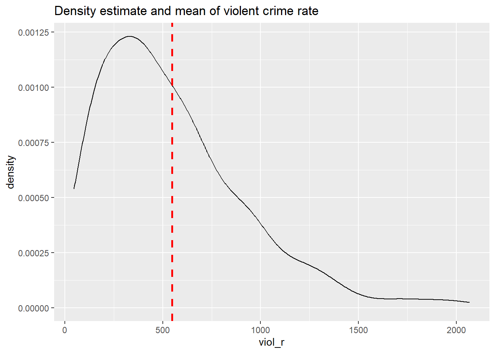
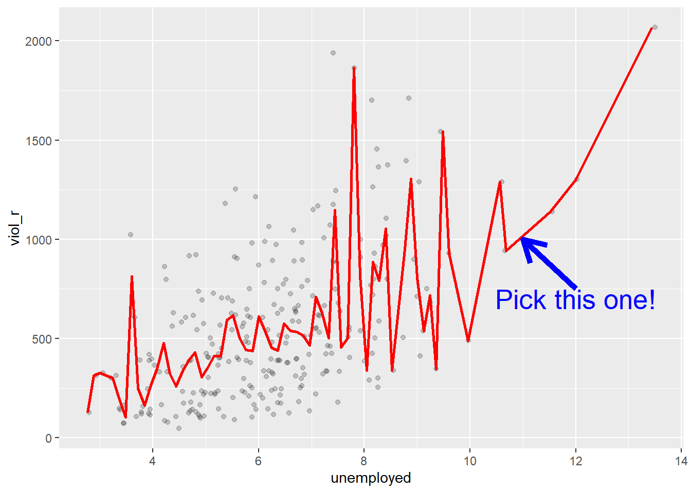
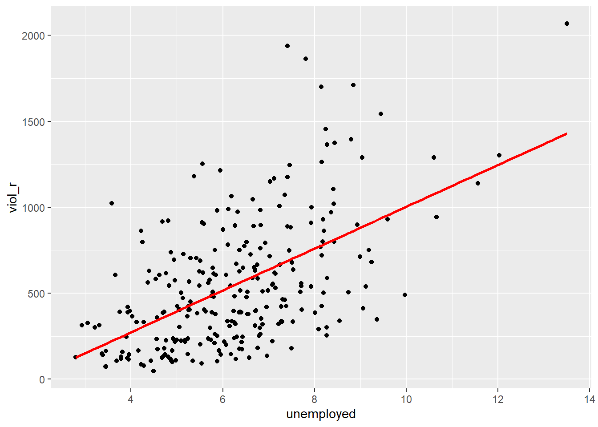
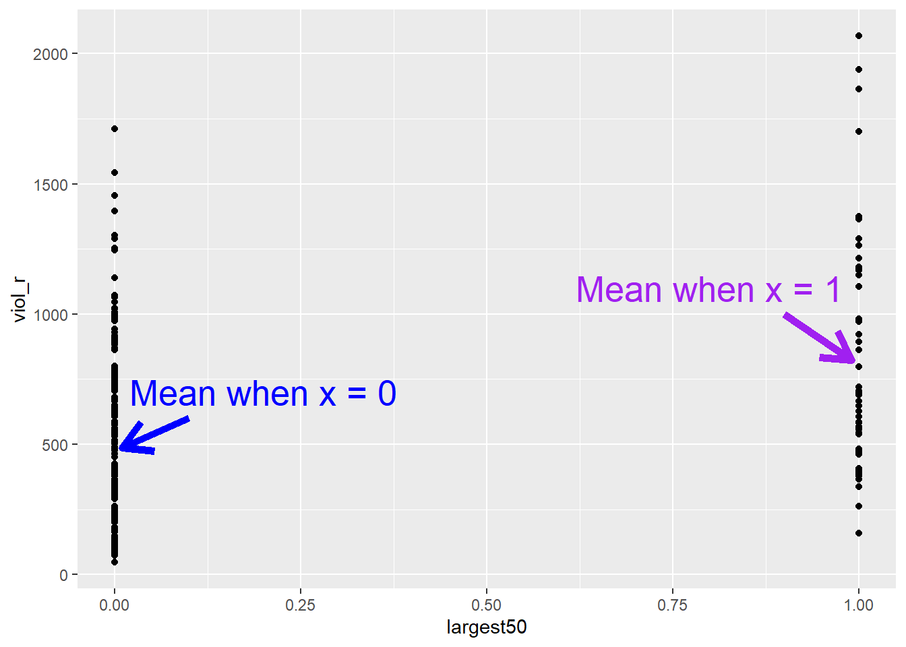
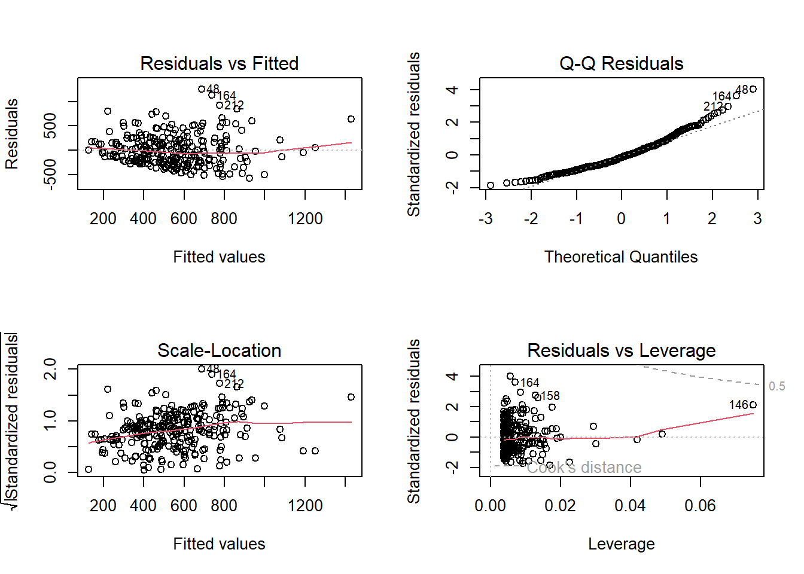
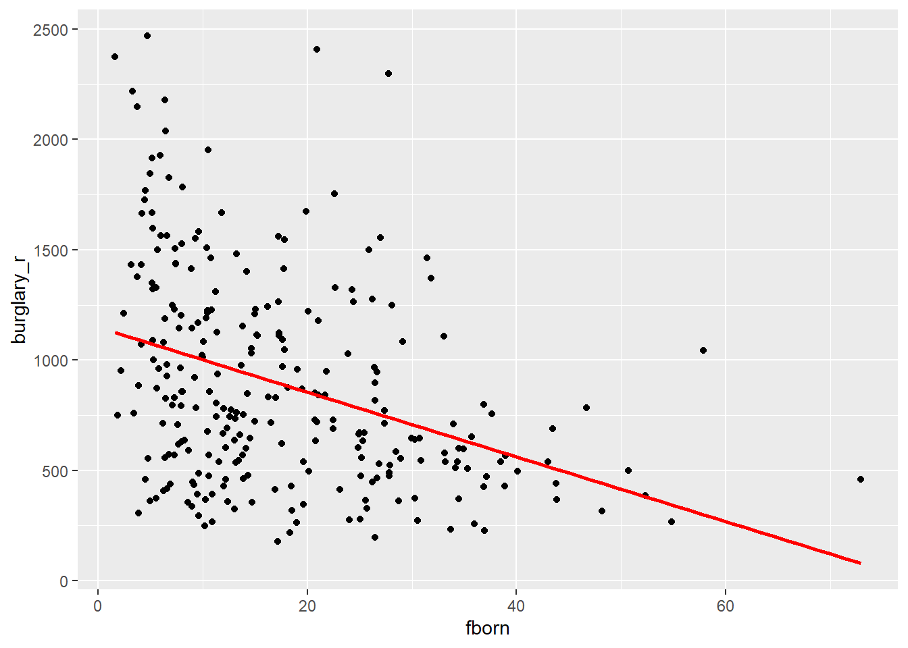

# Regression II: numerical independent variables

## Introduction

Last week, we began studying linear regression modelling as a powerful tool to assess the relationship between two variables. We learned that, in bivariate analysis, we always start with a research hypothesis derived from theory, and from that, we identify a *dependent* variable (also known as an *outcome* or *response* variable) and an *independent* variable (also known as an *explanatory* or *predictor* variable). We then learned that when the dependent variable is numerical and the independent variable is binary, we examine their association by calculating the difference between the average scores of the dependent variable across the two groups of the binary independent variable; that is, the mean difference represents the association in this scenario. Finally, we learned that the linear regression framework is a powerful method that allows us to efficiently estimate the mean difference. By defining a linear model given by $Y = \alpha + \beta \cdot X$, where $Y$ represents the numerical dependent variable and $X$ represents the binary independent variable, we can use the linear regression estimator to estimate values for $\alpha$ and $\beta$. In this model, $\widehat{\alpha}$ represents the average score of the dependent variable among observations in the reference group, and $\widehat{\beta}$ represents the mean difference.

In this session, we will continue our journey with linear regression models. This form of analysis has been one of the primary techniques of data analysis in the social sciences for many years, and it belongs to a family of techniques known as generalised linear models. Regression is a flexible method that allows us to "explain" or "predict" a given outcome ($Y$) as a function of an independent variable ($X$). Building on last week’s material, this week we will study the scenario in which both the dependent variable *and* the independent variable are numerical. It is the same linear model as last week; in fact, we can always use linear regression models when the dependent variable is numerical. For example, next week, we will expand it even further and learn about models with categorical independent variables as well as models with multiple explanatory variables simultaneously—what we call *multiple* regression models.

We will use a new dataset today, specifically the data used by Patrick Sharkey and his colleagues, to study the association between non-profit organisations and crime levels. In [*"Uneasy Peace"*](https://books.wwnorton.com/books/Uneasy-Peace/), Prof Sharkey argues that one factor contributing to the decline of crime from the 1990s onwards was the role played by non-profit community organisations in bringing peace and services to deteriorated neighbourhoods. Watch this video to gain a more theoretical background and learn about the research. 

<iframe src="https://www.youtube.com/embed/47IISvRXmpA" width="672" height="400px" data-external="1"></iframe>

In this session, we will use the replication data from one of the papers that Prof Sharkey published to study this question. This data is found in the [Harvard Dataverse](https://dataverse.harvard.edu/dataset.xhtml?persistentId=doi:10.7910/DVN/46WIH0). If you are interested in the specific study analysing this data, you can find it [here](https://journals.sagepub.com/doi/abs/10.1177/0003122417736289).


```r
# create an object with the URL address of the dataset
urlfile <- "https://dataverse.harvard.edu/api/access/datafile/:persistentId?persistentId=doi:10.7910/DVN/46WIH0/ARS2VS"

# import the dataset into R
communitycrime <- read.table(urlfile, sep = '\t',header = T)
```

As before, we create an object with the permanent `URL` address, and then we use a function to read the data into R. The data can be saved using an `api`, and it is in tab-separated format. We use the `read.table` function from base R for this. We pass two arguments to the function `sep= '\t'`, telling R this file is tab separated. The `header = T` function tells R that it is TRUE (T) that this file has a first row that acts as a header (this row has the name of the variables).

There are many more variables here that we are going to need, so let's do some filtering and selection. We will focus on 2012, the most recent year in the dataset, and just a few select variables.


```r
# load the dplyr package for data cleaning
library(dplyr)
```

```
## Warning: package 'dplyr' was built under R version 4.3.3
```

```r
# create a new object, 'df', that only includes
# observations from 2012
df <- filter(communitycrime, year == "2012")

# select just some variables from the dataset
df <- select(df, place_name, state_name, viol_r, 
             black, lesshs, unemployed, fborn,
             incarceration, log_incarceraton,
             swornftime_r, log_viol_r, largest50)
```

So now we have a more manageable data set that we can use for this session. The file includes a sample of 264 US cities (see variable `place_name`) across 44 of states (variable `state_name`). As ever, we always start understanding what our unit of analysis is (i.e., what each row represents). In this case, our unit of analysis are cities in the US: each row of the data frame `df` represents a different city. Then we have information (*variables*) on those cities, such as their level of violence and their unemployment rate. You can check the names of each column (i.e., each variable) included in the dataset by using the `names()` function.


```r
# print the names of all columns in the dataset 'df'
names(df)
```

```
##  [1] "place_name"       "state_name"       "viol_r"           "black"           
##  [5] "lesshs"           "unemployed"       "fborn"            "incarceration"   
##  [9] "log_incarceraton" "swornftime_r"     "log_viol_r"       "largest50"
```

The variables we have extracted contain information on the demographic composition of those cities (per cent black population, per cent without a high school degree, per cent unemployed, per cent foreign-born), and some criminal justice ones (incarceration rate and the rate of sworn full-time police officers). We also have measures of the violence rate and a binary indicator that tells us if the city is one of the 50 largest in the country.

We will examine the relationship between unemployment and violence. Based on Sharkey's book, we would expect that cities with a larger percentage of unemployed residents would also have larger violence rates. Therefore, *violence rate* is our dependent variable, and *unemployment percentage* is our independent variable. They are both numerical variables. Let's start examining the following scatterplot. On the Y-axis, we have the distribution of our dependent variable, violence rate, ranging from 0 to just over 2000. On the X-axis, we have the distribution of our independent variable, unemployment percentage, ranging from 0 to 14. Each dot in the scatterplot represents one of the 264 cities in our dataset.


```r
# load the 'ggplot2' package
library(ggplot2)

# plot a scatterplot
ggplot(df, aes(x = unemployed, y = viol_r)) +
  geom_point() 
```


What do you think when looking at this scatterplot? Is there a relationship between violence and unemployment? Does it look like cities with a high score on the X-axis (unemployment) also have a high score on the Y-axis (violent crime)? It may be a bit hard to see, but we think there is certainly a trend. 

## Motivating regression

Now, imagine that we play a game. Imagine we have all the names of the cities in a hat, and we randomly take one of the names from the hat. You're sitting in the audience, and you have to guess the level of violence (`viol_r`) for that city. Imagine paying £150 to the student who gets the closest to the right value. What would you guess if you only had one guess and knew (as we do) how violent crime is distributed across all cities? 


```r
# plot a density plot with the distribution of violence rate
ggplot(df, aes(x = viol_r)) + 
  geom_density() +
  geom_vline(xintercept = mean(df$viol_r), linetype = "dashed", size = 1, color="red") +
  ggtitle("Density estimate and mean of violent crime rate")
```




```r
summary(df$log_viol_r)
```

```
##    Min. 1st Qu.  Median    Mean 3rd Qu.    Max. 
##   3.831   5.532   6.149   6.061   6.595   7.634
```

If we only had one shot, we would go for the mean (or perhaps the median, given the skew). Most cities have values clustered around those values, which is another way of saying they are bound to be not too far from them. It would be silly to say 15, for example, or 1500, since very few cities have such low or high levels of violence (as measured by `viol_r`).

Imagine, however, that now, when we take the name of the city from the hat, you are also told how much unemployment there is in that city---so the value of the `unemployed` variable for the city that has been selected (for example, 11). Imagine that you also have the scatterplot we produced earlier in front of you. Would you still go for a value close to 500 (the mean) as your best guess for the value of the selected city? 

We certainly would not go with the overall mean or median as our prediction any more. If somebody told us that 10% of the population residing in the city was unemployed, we would be more inclined to guess the average level of violence for the cities *with that level of unemployment* (the conditional mean) rather than the overall mean across all the cities. Wouldn't you? 

If we plot the conditional means, we can see that the mean `viol_r` for cities that report an unemployment rate of 11% is around 1000. So you may be better off guessing that.



Linear regression tackles this problem using a slightly different approach. Rather than focusing on the conditional mean (smoothed or not), it draws a straight line that tries to capture the trend in the data. If we focus on the regions of the scatterplot that are less sparse, we see that this is an upward trend, suggesting that as the level of unemployment increases, so does the level of violent crime. 

Simple linear regression draws a single straight line of predicted values **as the model for the data**. This line would be a **model**, a *simplification* of the real world like any other model (e.g., a toy pistol, an architectural drawing, a subway map) that assumes that there is approximately a linear relationship between $X$ and $Y$. Let's draw the regression line:


```r
# produce a scatterplot and a regression line
# summarising the relationship between unemployment
# and violence rate
ggplot(data = df, aes(x = unemployed, y = viol_r)) +
  geom_point() +
  geom_smooth(method = "lm", se = FALSE, color = "red", size = 1) 
```

```
## `geom_smooth()` using formula = 'y ~ x'
```



The `geom_smooth` function asks for a geom with the regression line, `method = lm` asks for the linear regression line, `se = FALSE` asks for just the line to be printed, and the other arguments specify the colour and thickness of the line.

What that line is doing is giving you guesses (predictions) for the values of violent crime based on the information we have about the level of unemployment. It gives you one possible guess for the value of violence for every possible value of unemployment and links them all together in a straight line. 

Another way to think about this line is as the best possible summary of the cloud of points represented in the scatterplot (if we can assume that a straight line would do a good job of this). If we were to tell you to draw a straight line that best represents this pattern of points, the regression line would be the one that best does it (if certain assumptions are met).

The linear model is then a model that takes the form of the equation of a straight line through the data. The line does not go through all the points. In fact, you can see it is a slightly less accurate representation than the (smoothed) conditional means:


As De Veaux et al. (2012: 179) highlight: "like all models of the real world, the line will be wrong, wrong in the sense that it can't match reality exactly. But it can help us understand how the variables are associated". A map is never a perfect representation of the world; the same happens with statistical models. Yet, as with maps, models can be helpful.

## Fitting a simple regression model

In order to draw a regression line, we need to know two things: 
(1) We need to know where the line begins: what is the value of $Y$ (our dependent variable) when $X$ (our independent variable) is 0 so that we have a point from which to start drawing the line. The technical name for this point is the **intercept**.
(2) And we need to know what is the **slope** of that line, that is, how inclined the line is, the angle of the line.

If you recall from elementary algebra (and you may not), the equation for any straight line is:
$Y = m \cdot X + c$ 
In statistics, we use a slightly different notation, although the equation remains the same:
$Y = \alpha + \beta \cdot X$

We need the origin of the line ($\alpha$) and the slope of the line ($\beta$). How does `R` get the intercept and the slope for the red line? How does `R` know where to draw this line? We need to estimate these **parameters** (or **regression coefficients**) from the data. How? We don't have time to get into these more mathematical details now. You should study the [required reading](http://link.springer.com/chapter/10.1007/978-1-4614-7138-7_3) to understand this (*required means it is required, it is not optional*)[^8]. For now, suffice to say that for linear regression models like the one we cover here when drawing the line, `R` tries to minimise the distance from every point in the scatterplot to the regression line using a method called **least squares estimation**.

In order to fit the model, we use the `lm()` function using the formula specification `(Y ~ X)`---exactly as we did last week. Typically, you want to store your regression model into an object. For example, let's fit a linear model regression violence rates on percentage of unemployment and store the results under an object named `fit_1`:


```r
# run a regression model where violence rate is
# the dependent variable and per cent unemployed
# is the independent variable
fit_1 <- lm(viol_r ~ unemployed, data = df)
```

In your `R` Studio global environment space, you will see a new object called `fit_1` with 12 elements on it. We can get a sense for what this object is and includes using the functions we introduced in previous weeks:


```r
# check the class of the object "fit_1"
class(fit_1)
```

```
## [1] "lm"
```

```r
# check the attributes of the object "fit_1"
attributes(fit_1)
```

```
## $names
##  [1] "coefficients"  "residuals"     "effects"       "rank"         
##  [5] "fitted.values" "assign"        "qr"            "df.residual"  
##  [9] "xlevels"       "call"          "terms"         "model"        
## 
## $class
## [1] "lm"
```

`R` is telling us that this is an object of class `lm` and includes several attributes. One of the beauties of `R` is that you are producing all the results from running the model, putting them in an object, and then giving you the opportunity to use them later on. If you want to see the basic results from running the model, you can simply print the name of the object.


```r
# print results of the regression model "fit_1"
fit_1
```

```
## 
## Call:
## lm(formula = viol_r ~ unemployed, data = df)
## 
## Coefficients:
## (Intercept)   unemployed  
##      -213.7        121.7
```

This is exactly the same as we did last week. The output of the `lm()` function in `R` provides us with two numbers under "Coefficients:". The value of -213.7 is the estimated value for the **Intercept** (i.e., $\widehat{\alpha}= -213.7$). This indicates the predicted score of $Y$ when $X$ equals zero. In this case, it indicates that a hypothetical city with 0% of its population under unemployment would have an expected violence rate of -213.7.

We then need the $\widehat{\beta}$ regression coefficient for our independent variable, the value that will shape the **slope** in this scenario. This value is 121.7. This estimated regression coefficient for our independent variable has a convenient interpretation. When the value is positive, it tells us that *every one unit increase in* $X$ *is associated with a* $\beta$ *increase on* $Y$. If the coefficient is negative, then it represents a decrease in $Y$. Here, we can read it as "every one unit increase in the percentage of people unemployed is associated with a 121.7 unit increase in violence rate."

Knowing these two parameters not only allows us to draw the line, but we can also solve for any given value of $X$. Let's go back to our guess-the-violence game. Imagine if we tell you the unemployment percentage is 4. What would be your best bet now? We can go back to our regression line equation and insert the estimated parameters:

$Y = \alpha + \beta \cdot X$   
$Y = -213.7 + 121.7 \cdot 4$  
$Y = 273.1$

Or, if you don't want to do the calculation yourself, you can use the `predict` function (differences are due to rounding error):


```r
# First, you name your stored model, and then you identify the new data 
# (which has to be in a data frame format and with a variable name matching 
# the one in the original data set)
predict(fit_1, data.frame(unemployed = c(4))) 
```

```
##        1 
## 272.9868
```

This is the expected value of $Y$, *violence rate*, when $X$, *percentage of unemployment*, is 4% of the population *according to our model* (according to our simplification of the real world, our simplification of the whole cloud of points into just one straight line). Look back at the scatterplot we produced earlier with the green line. Does it look like the red line when X is 4 corresponds to a value of Y of 273.1?

## Residuals: R squared

In the output, when we ran the model above, we saw something called the residuals. The residuals (in regression) are the differences between the observed values of Y for each case minus the predicted or expected value of Y, in other words, the distances between each point in the dataset and the regression line (see the visual example below). 


You see, we have our line, our predicted value, and then we have the black dots, which are our observed values. The distance between them is essentially the amount by which we were wrong, and all these distances between observed and predicted values are our residuals. **Least square estimation**, the "machine" we use to build the regression line, essentially aims to reduce the squared average of all these distances: that's how it draws the line.

Why do we have residuals? Well, think about it. The fact that the line is not a perfect representation of the cloud of points makes sense, doesn't it? You cannot predict perfectly what the value of Y is for every city just by looking ONLY at unemployment! This line only uses information regarding unemployment. This means there's bound to be some difference between our predicted level of violence, given our knowledge of unemployment (the regression line) and the actual level of violence (the actual location of the points in the scatterplot). Other things that matter are not being taken into account by our model to predict the values of Y. There are other things that surely matter regarding understanding violence. And then, of course, we have measurement errors and other forms of noise.

We can re-write our equation like this if we want to represent each value of Y (rather than the predicted value of Y) then: 
$y = b_0 + b_1x + e(residuals)$

The residuals capture how much variation is unexplained - how much we still have to learn if we want to understand variation in Y. A good model tries to maximise explained variation and reduce the magnitude of the residuals. 

We can use information from the residuals to produce a measure of effect size - how good our model is in predicting variation in our dependent variables. Remember our game where we try to guess violence (Y)? If we had no information about X, our best bet for Y would be the mean of Y. The regression line aims to improve that prediction. By knowing X's values, we can build a regression line that aims to get us closer to the actual values of Y. 


The distance between the mean (our best guess without any other information) and the observed value of Y is the **total variation**. The residual is the difference between our predicted value of Y and the observed value of Y. This is what we cannot explain (i.e., variation in Y that is *unexplained*). The difference between the mean value of Y and the expected value of Y (the value given by our regression line) is how much better we are doing with our prediction by using information about X (i.e., in our previous example, it would be variation in Y that can be *explained* by knowing about unemployment). How much closer the regression line gets us to the observed values? We can then contrast these two different sources of variation (explained and unexplained) to produce a single measure of how good our model is. The formula is as follows:


\[
R^2 = \frac{\text{Explained Variation}}{\text{Total Variation}}
\]

This can also be written as:

\[
R^2 = \frac{\sum (\hat{Y}_i - \bar{Y})^2}{\sum (Y_i - \bar{Y})^2}
\]

Where:
- \( Y_i \): observed values of the dependent variable.
- \( \hat{Y}_i \): predicted values from the regression line.
- \( \bar{Y} \): mean of the observed \( Y \) values.
- \( \sum (\hat{Y}_i - \bar{Y})^2 \): explained variation (the squared differences between the predicted values and the mean of \( Y \)).
- \( \sum (Y_i - \bar{Y})^2 \): total variation (the squared differences between the observed values and the mean of \( Y \)).


<!---->

All this formula is doing is taking a ratio of the explained variation (the squared differences between the regression line and the mean of Y for each observation) by the total variation (the squared differences of the observed values of Y for each observation from the mean of Y). This gives us a measure of the **percentage of variation in Y that is "explained" by X**. 

Then, we can take this value as a measure of the strength of our model. If you look at the R output, you will see that the $R^2$ for our model was .29 (look at the multiple R square value in the output). We can say that our model explains 29% of the variance in the fear of violent crime measure.


```r
#As an aside, and to continue emphasising your appreciation of the object-oriented nature of R,
#when we run the summary() function, we are simply generating a list object of the class summary.lm.
attributes(summary(fit_1))
```

```
## $names
##  [1] "call"          "terms"         "residuals"     "coefficients" 
##  [5] "aliased"       "sigma"         "df"            "r.squared"    
##  [9] "adj.r.squared" "fstatistic"    "cov.unscaled" 
## 
## $class
## [1] "summary.lm"
```

```r
#This means that we can access its elements if so we wish. 
#So, for example, to obtain just the R Squared, we could ask for:
summary(fit_1)$r.squared
```

```
## [1] 0.2991119
```

Knowing how to interpret this is important. $R^2$ ranges from 0 to 1. The greater it is, the more powerful our model is; the more explaining we are doing, the better we can account for variation in our outcome $Y$ with our input. In other words, the stronger the relationship is between $Y$ and $X$. As with all the other measures of effect size, interpretation is a matter of judgement. You are advised to see what other researchers report in relation to the particular outcome that you may be exploring. [This](http://blog.minitab.com/blog/adventures-in-statistics/regression-analysis-how-do-i-interpret-r-squared-and-assess-the-goodness-of-fit) is a reasonable explanation of how to interpret R-Squared.

Weisburd and Britt (2009: 437) suggest that in criminal justice, you rarely see values for $R^2$ greater than .40. Thus if your $R^2$ is larger than .40, you can assume you have a powerful model. When, on the other hand, $R^2$ is lower than .15 or .2, the model is likely to be viewed as relatively weak. Our observed r squared here is not too bad. There is considerable room for improvement to develop a better model to explain violence[^9]. In any case, many people would argue that $R^2$ is a bit overrated. You need to be aware of what it measures and the context in which you use it. Read [here](http://blog.minitab.com/blog/adventures-in-statistics/how-high-should-r-squared-be-in-regression-analysis) for some additional detail.

## Is this the same as last week?

Yes! Last week, we used linear regression modelling to assess the association between a binary independent variable and a numerical dependent variable. We learned that the estimated intercept ($\alpha$) represents the average score of the dependent variable in the reference group ($\bar{Y} \mid x=0$), and that the slope coefficient ($\beta$) represents the mean difference ($(\bar{Y} \mid x=1) - (\bar{Y} \mid x=0)$). Now, we're taking a deeper dive into linear regression modelling and understanding that fitting a regression model is essentially drawing a line---the line that best represents the linear relationship between an independent variable $X$ and a dependent variable $Y$.

In fact, everything we learned today applies for what we studied last week. A binary independent variable is just a special case of linear regression models. Let's have a look at another independent variable: whether the city is one of the largest 50 cities in the United States or not. The name of the variable is `largest50`


```r
# print frequency table of variable largest50
table(df$largest50)
```

```
## 
##   0   1 
## 216  48
```

48 observations have a score of 1, indicating that they are one of the 50 largest cities in the United States, whereas 216 observations have a score of 0, indicating that they not. Sharkey also hypothesised that violent crime is more common in large cities. So, we can treat violence rate (`viol_r`) as our numerical dependent variable and whether they are one of the largest 50 cities in the country (`largest50`) as our new binary independent variable. We can test this association by fitting a linear regression model that estimates parameters $\alpha$ (the intercept) and $\beta$ (the slope coefficient, in this case representing the mean difference). But, if today we learned that linear regression models are essentially all about drawing a line, what if we start producing a scatterplot?


```r
# produce a scatterplot between violence rate and largest 50
ggplot(data = df, aes(x = largest50, y = viol_r)) +
  geom_point()
```


This scatterplot does not seem very useful... This is because, as we already knew, our independent variable in this example is binary, which means it can only take two values: 0 or 1. Therefore, all the dots in the scatterplot are stacked on 0 or on 1. 

But this scatterplot is not entirely useless! If we quickly check, for instance, what the average violence rate among smaller cities is and what the average violence rate among larger cities is, we can try to eyeball those means in the plot


```r
# load the dplyr package
library(dplyr)

# produce grouped means using group_by
df %>%
  group_by(largest50) %>%
  summarise(average_violence = mean(viol_r))
```

```
## # A tibble: 2 × 2
##   largest50 average_violence
##       <dbl>            <dbl>
## 1         0             486.
## 2         1             824.
```



The average violence rate in smaller cities is 486, whereas the average violence rate is larger cities is 824. Although this scatterplot does not look particularly useful at first, we can spot those two means in each distribution of "stacked dots". But isn't linear regression modelling essentially just about drawing a line? What if simply draw a line connecting the two means?


That's exactly what linear regression does! It draws a line. This line, because the independent variable is binary, only goes from 0 (a group representing smaller cities) to 1 (a group representing larger cities). If we fit a linear regression model:


```r
# fit a linear regression model
lm(viol_r ~ largest50, data = df)
```

```
## 
## Call:
## lm(formula = viol_r ~ largest50, data = df)
## 
## Coefficients:
## (Intercept)    largest50  
##       485.6        338.0
```

We can see that the estimated Intercept is $\widehat{\alpha}=485.6$. This is the expected score of the dependent variable $Y$ (i.e., violence rates) in the hypothetical scenario of $x=0$---but it just so happens that, in this case, $x=0$ represents the group of smaller cities, so the intercept has a much more meaningful interpretation!

Similarly, we can see that the slope coefficient is $\widehat{\beta} = 338$. As we learned today, we could simply interpret this number by stating that every unit increase in the variable `largest50` is associated with a 338-unit increase in violence rates. However, the variable `largest50` cannot increase by one unit in the conventional sense, as it is binary; or rather, it can *only* increase by one unit. The only possible change in this variable is between $x = 0$ (representing the group of smaller cities) and $x = 1$ (representing the group of larger cities)---it's the line going from the mean when X equals 0 all the way to the mean when X equals 1. Therefore, the idea of a "one-unit increase" for a binary variable necessarily implies the **difference** between the estimated scores of the two groups. This is why we interpret the slope coefficient ($\beta$) for binary variables as the mean difference---this is a special case of linear regression models!

## Regression assumptions 

Like other models and statistical tests, the regression model also makes assumptions of its own. In fact, there are so many that we could spend an entire class discussing them. Gelman and Hill (2007) point out that the most important regression assumptions by decreasing order of importance are:

+ **Validity**. The data should be appropriate for the question that you are trying to answer:

> "Optimally, this means that the outcome measure should accurately reflect the phenomenon of interest, the model should include all relevant predictors, and the model should generalize to all cases to which it will be applied... Data used in empirical research rarely meet all (if any) of these criteria precisely. However, keeping these goals in mind can help you be precise about the types of questions you can and cannot answer reliably."

+ **Additivity and linearity**. These are the most important mathematical assumptions of the model. You can include interaction effects in your models if the additivity assumption is violated. This is something we will discuss in more detail in future sessions. Similarly, we will discuss problems with non-linearities. If the relationship is non-linear (e.g., it is curvilinear), predicted values will be wrong in a biased manner, meaning that predicted values will systematically miss the true pattern of the mean of y (as related to the x-variables).

+ **Independence of errors**. Regression assumes that the errors from the prediction line (or hyperplane for multiple regression) are independent. Suppose there is a dependency between the observations (you are assessing change across the same units, working with spatial units, or with units that are somehow grouped, such as students from the same class). In that case, you may have to use more appropriate models (e.g., multilevel models, spatial regression, etc.).

+ **Equal variances of errors**. When the variance of the residuals is unequal, you may need different estimation methods. This is, nonetheless, considered a minor issue. There is a small effect on the validity of t-test and F-test results, but generally, regression inferences are robust with regard to the variance issue.

+ **Normality of errors**. The residuals should be normally distributed. Gelman and Hill (2007: 46) discuss this as the least important of the assumptions and, in fact, "do *not* recommend diagnostics of the normality of the regression residuals". If the errors do not have a normal distribution, it usually is not particularly serious. Regression inferences tend to be robust with respect to normality (or nonnormality of the errors). In practice, the residuals may appear to be nonnormal when the wrong regression equation has been used. So, we will show you how to inspect the normality of the residuals, not because this is a problem in itself, but because it may give you further evidence that there is some other problem with the model you are applying to your data.

So, these are the assumptions of linear regression. 

In this section, we can go through very quickly how to test some of them using visuals. While finding that some of the assumptions are violated does not necessarily mean that you have to scrap your model, it is important to use these diagnostics to illustrate that you have considered what the possible issues with your model are and if you find any serious issues that you address them. 

In `R`, we can use the `plot()` function on our output `lm` object to look through some diagnostics. This gives us 4 plots, so to show them all, we'll use the code `par(mfrow = c(2, 2))` to split our plot window into 4 panes (remember to set back, run `par(mfrow = c(1, 1))`). Let's return to `fit_1`, our model. 


```r
par(mfrow = c(2, 2))
plot(fit_1)
```




The 4 plots we get are:

- **Residuals vs Fitted**. Used to check the linear relationship assumptions. A horizontal line, without distinct patterns, is an indication of a linear relationship, which is good.
- **Normal Q-Q**. Used to examine whether the residuals are normally distributed. It’s good if residual points follow the straight dashed line.
- **Scale-Location (or Spread-Location)**. Used to check the homogeneity of variance of the residuals (homoscedasticity). A horizontal line with equally spread points is a good indication of homoscedasticity.
- **Residuals vs Leverage**. Used to identify influential cases, that is, extreme values that might influence the regression results when included or excluded from the analysis. 

In our example, we have issues with all four of them. This is probably due to the fact that our dependent variable is not normally distributed---check the histogram in the beginning of the section again---indicating that we probably have a non-linear relationship between unemployment and violence rates. We will revisit this in future sessions.

For the purposes of this module, it is enough that you understand that these assumptions of regression exist, what they mean, and how you might test for them. For some of them, for example, additivity, we will discuss some ways to address this in future weeks in sections focused on interaction effects. For others, it is just important to keep in mind when these might be violated and raise these as possible limitations in your ability to rely on the conclusions you draw from your results. 
 

## Lab Exercises

**Your turn!** In the lab session, using the same data set, answer the following questions. Note that not all questions necessarily require analysing data in `R`. After you finish, click on '*Reveal answer!*' to check your answers.

We start revisiting the `communitycrime` dataset (which we loaded in the beginning of the section) to select new variables:


```r
# select new variables from the raw dataset
df_homework <- communitycrime %>%
  filter(year == 2012) %>%
  select(place_name, state_name, burglary_r, fborn, largest100)
```

Using data from 264 cities in the United States in 2012, you want to assess whether the percentage or residents who are foreign born is associated with burglary rates. Your variables of interest are `burglary_r`, reflecting the burglary rate of the cities in the United States; `fborn`, indicating the percentage of foreign-born residents; and `largest100`, indicating whether the city is one of the 100 largest cities in the US.

1. Based on your research hypothesis, what are your dependent and independent variables?

<details>
<summary><i>Reveal answer!</i></summary>

Dependent variable: burglary rates, i.e., `burglary_r`.

Independent variable: percentage of foreign-born population, i.e., `fborn`.

</details>

2. Is your dependent variable numerical or categorical? If categorical, is it binary, ordinal, or multinomial? What about the independent variable?

<details>
<summary><i>Reveal answer!</i></summary>

The dependent variable, burglary rates (`burglary_r`), is a numerical variable.

The independent variable, percentage of foreign born (`fborn`), is also a numerical variable.

</details>

3. Using your dependent and independent variables, what is your null hypothesis?

<details>
<summary><i>Reveal answer!</i></summary>

Null hypothesis: there is no association between the percentage of foreign-born residents and the burglary rate in cities in the United States.

</details>

4. Examine the relationship between your dependent and your independent variable using the appropriate visualisation strategies

<details>
<summary><i>Reveal answer!</i></summary>

We can produce a scatterplot to assess the relationship


```r
# produce scatterplot
ggplot(df_homework, aes(x = fborn, y = burglary_r)) + 
  geom_point()
```


Based on the scatterplot, we could expect a negative relationship: a higher concentration of foreign-born residents appears to be associated with fewer burglaries. We can check the regression line.


```r
# produce scatterplot
ggplot(df_homework, aes(x = fborn, y = burglary_r)) + 
  geom_point() + 
  geom_smooth(method = "lm", se = FALSE, color = "red", size = 1) 
```

```
## `geom_smooth()` using formula = 'y ~ x'
```



</details>

5. Let's build a regression model. Replacing $Y$ with the name of your dependent variable, and $X$ with the name of your independent variable, write down the equation with the unknown parameters (i.e, $\alpha$ and $\beta$) that you want to estimate. *Note: this question does not involve any data analysis*.

<details>
<summary><i>Reveal answer!</i></summary>

$$
burglary\_r = \alpha + \beta \cdot fborn
$$

</details>

6. Using the `lm()` function, estimate the parameters of your linear regression model. Rewrite the equation above replacing unknown parameters with the estimated parameters.

<details>
<summary><i>Reveal answer!</i></summary>


```r
# fit linear regression model
lm(burglary_r ~ fborn, data = df_homework)
```

```
## 
## Call:
## lm(formula = burglary_r ~ fborn, data = df_homework)
## 
## Coefficients:
## (Intercept)        fborn  
##     1148.12       -14.67
```

Based on the results of the linear regression model, we can rewrite the equation in the following way:

$$
burglary\_r = 1148.12 - 14.67 \cdot fborn
$$

This indicates that the expected level of burglary rates in a hypothetical city with 0% foreign-born residents would be 1148.12. Every one-unit increase in the percentage of foreign-born residents is associated with a decrease of 14.67 units of burglary rates.

</details>

7. Based on your regression model, what is the expected burglary rate in a city with 1% foreign-born residents? What about a city with 10%? And 50%?

<details>
<summary><i>Reveal answer!</i></summary>

We can use the regression model to make those predictions. We can calculate manually or use `R` as a calculator.


```r
# fit regression model
regression_model <- lm(burglary_r ~ fborn, data = df_homework)

# predict burglary scores when foreign born is 1
predict(regression_model, data.frame(fborn = c(1))) 
```

```
##        1 
## 1133.445
```

```r
# predict burglary scores when foreign born is 10
predict(regression_model, data.frame(fborn = c(10))) 
```

```
##       1 
## 1001.37
```

```r
# predict burglary scores when foreign born is 50
predict(regression_model, data.frame(fborn = c(50))) 
```

```
##        1 
## 414.3705
```

The predicted burglary rate in a city with 1% of foreign-born residents is 1133.45. In a city with 10% of foreign-born residents, it is 1101.37. In a city with 50% foreign-born residents, it is 414.37.

</details>


8. What is the $R^2$ of your regression model?

<details>
<summary><i>Reveal answer!</i></summary>


```r
# extract R Squared
summary(regression_model)$r.squared
```

```
## [1] 0.1319607
```

The $R^2$ is 0.1319, suggesting that 13.19% of the variance in burglary rates is explained by this regression model.

</details
