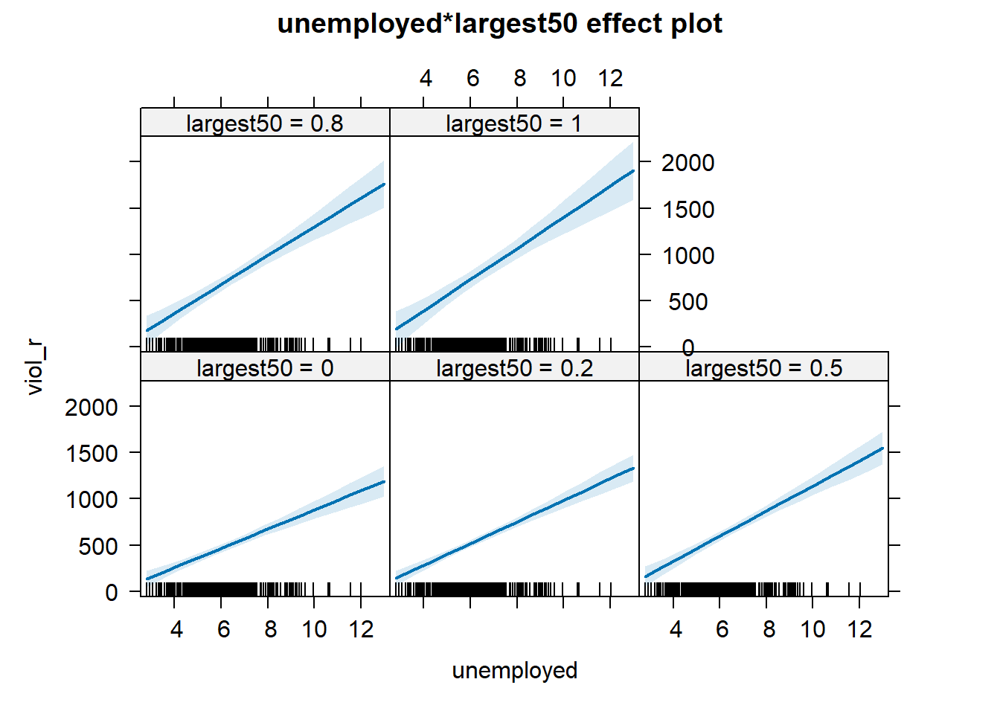

# Regression III: categorical independent variables and multiple regression models

In previous weeks, we learned that linear regression models are a powerful method that allows us to assess the association between a binary or numerical independent variable and a numerical dependent variable. This week, we will develop these models even further. Specifically, we will learn how to handle scenarios when the dependent variable is numerical (as in previous weeks), but the independent variable is categorical with more than two groups (i.e., ordinal or nominal variables). In addition, we will finally introduce the world of *multivariate analysis*, when we analyse more than two variables at the same time.

## Fitting regression with categorical predictors

With linear regression models, the dependent variable $Y$ will always be numerical. If the independent variable $X$ is numerical, the estimated slope coefficient $\beta$ implies that every one-unit increase in $X$ is associated with a $\beta$-increase in $Y$. If the independent variable $X$ is binary, the estimated slope coefficient $\beta$ implies the mean difference: expected scores of $Y$ in the comparison group are $\beta$ units higher/lower than in the reference group. Now, let's expand that rationale to other categorical independent variables with more than two groups. It is quite straightforward to run it, and very similar to the binary case!

We will use the same dataset from last week. We will use the replication data from one of the papers that Prof Sharkey published to study what contributed to the decline of crime from the 1990s. This data is found in the [Harvard Dataverse](https://dataverse.harvard.edu/dataset.xhtml?persistentId=doi:10.7910/DVN/46WIH0). If you are interested in the specific study analysing this data, you can find it [here](https://journals.sagepub.com/doi/abs/10.1177/0003122417736289).


```r
# create an object with the URL address of the dataset
urlfile <- "https://dataverse.harvard.edu/api/access/datafile/:persistentId?persistentId=doi:10.7910/DVN/46WIH0/ARS2VS"

# import the dataset into R
communitycrime <- read.table(urlfile, sep = '\t',header = T)
```

As before, we create an object with the permanent `URL` address, and then we use a function to read the data into `R`. We use the `read.table()` function from base `R` for this. We pass two arguments to the function `sep= '\t'`, telling `R` this file is tab separated. The `header = T` function tells `R` that it is `TRUE` (`T`) that this file has a first row that acts as a header (this row has the name of the variables).

There are many more variables here than we will need, so let's do some filtering and selection. We will focus on 2012, the most recent year in the dataset, and just a few select variables.


```r
# load the dplyr package for data cleaning
library(dplyr)

# create a new object, 'df', that only includes observations from 2012
# and removes missing observations from the variable 'region'
df <- filter(communitycrime, year == "2012", !is.na(region))

# select just some variables from the dataset
df <- select(df, place_name, state_name, region, viol_r, black, lesshs, unemployed, fborn, incarceration, log_incarceraton, swornftime_r, log_viol_r, largest50)
```

So now we have a more manageable data set that we can use for this session. Our unit of analysis, as last week, are cities in the United States, and our sample includes 263 US cities (see `place_name`) across 44 states. See previous weeks for the code on how to figure out what these states are. 

We have one categorical variable with more than two groups in this dataset, `region`, which identifies the region in the United States the city is located in. There are four regions: East Coast, Midwest, South, and West Coast. Let's start recoding this variable to ensure that it is treated as a factor with the relevant labels.


```r
# frequency table of the variable 'region'
table(df$region)
```

```
## 
##   1   2   3   4 
##  23  45  91 104
```

```r
# factorising variable 'region' and assigning relevant labels
df <- mutate(df, region = factor(region, 
                                 levels = c(1, 2, 3, 4), 
                                 labels = c("East Coast", "Midwest", "South", "West Coast")))

# frequency table of variable 'region' to make sure
# that our changes worked as expected
table(df$region)
```

```
## 
## East Coast    Midwest      South West Coast 
##         23         45         91        104
```

One possible avenue for research here is exploring the extent to which different regions in the US have different rates of violence. In this case, as in previous weeks, violence rate would be our dependent variable and region in the US, our independent variable. The question, then, is whether we can simply throw a categorical independent variable in a regression model.

Now, let's return to Week 5 for a minute and remember how we handle *binary* independent variables. If our independent variable is binary, what we want to do is essentially calculate the mean of the dependent variable across both groups of the independent variable. With a categorical (ordinal or nominal) variable, we can start similarly: we can start calculating the mean of the dependent variable across *all* groups of the independent variable. For example, let's calculate the average rate of violence across the four regions in the US.


```r
# calculate the mean of 'viol_r' across groups of 'region'
df %>%
  group_by(region) %>%
  summarise(average = mean(viol_r))
```

```
## # A tibble: 4 × 2
##   region     average
##   <fct>        <dbl>
## 1 East Coast    790.
## 2 Midwest       634.
## 3 South         589.
## 4 West Coast    417.
```

Great, we know that the average violence rate in cities in the East Coast is 790, the average violence rate in cities in the Midwest is 634, the average violence rate in cities in the South is 589, and the average violence rate in cities in the West Coast is 417. We can also visually inspect those mean differences using a grouped boxplot.


```r
# load the 'ggplot2' package
library(ggplot2)

# produce a grouped boxplot assessing the distribution of
# 'viol_r' across groups of 'region'
ggplot(data = df, aes(x = region, y = viol_r)) +
  geom_boxplot()
```


Now, how about including this categorical variable as an independent variable in a regression model? If we think about it, theoretically, we could recode this categorical variable into several binary variables. For example, we could create one binary variable that indicates whether the city is from the East Coast ($=1$) or elsewhere ($=0$), another binary variable indicating whether the city is from the Midwest ($=1$) or elsewhere ($=0$), another binary variable indicating whether the city is from the South ($=1$) or elsewhere ($=0$), and a fourth binary variable indicating whether the city is from the West Coast ($=1$) or elsewhere ($=0$). This would be good because we already know how to handle binary independent variables. Given that the variable `region` has four groups, we could create four new binary variables.


```r
# create four new binary variables based on groups of 'region'
df <- mutate(df,
             east_coast = case_when(region == "East Coast" ~ 1, TRUE ~ 0),
             midwest = case_when(region == "Midwest" ~ 1, TRUE ~ 0),
             south = case_when(region == "South" ~ 1, TRUE ~ 0),
             west_coast = case_when(region == "West Coast" ~ 1, TRUE ~ 0)
             )

## Now, let's check if this worked

# table of frequency for new binary variable 'east_coast'
table(df$east_coast)
```

```
## 
##   0   1 
## 240  23
```

```r
# table of frequency for new binary variable 'midwest'
table(df$midwest)
```

```
## 
##   0   1 
## 218  45
```

```r
# table of frequency for new binary variable 'south'
table(df$south)
```

```
## 
##   0   1 
## 172  91
```

```r
# table of frequency for new binary variable 'west_coast'
table(df$west_coast)
```

```
## 
##   0   1 
## 159 104
```

Great, it worked! Now, each one of the groups is presented by its own binary variable. We could, for example, simply estimate four separate regression models, each including one independent binary variable. That would allow us to examine the association between region and rates of violence!

True, that would... but that's not very efficient. After all, we had to manually create four separate binary variables and then would need to run four separate linear regression models. Not exactly an easy solution.

Now, let's think again --- a bit more deeply --- about what the regression model estimates when we have a binary independent variable. Let's use the variable `largest50` as a quick example --- this variable indicates whether the city is one of the 50 largest cities in the US. As we know, a linear model is given by

$$
Y = \alpha + \beta \cdot X
$$
If we regress rates of violence (`viol_r`) on this binary indicator (`largest50`), the regression estimator will yield estimates of the intercept ($\alpha$) and the slope coefficient ($\beta$).


```r
# fit a regression model with 'viol_r' as the DV and 'largest50' as the IV
lm(viol_r ~ largest50, data = df)
```

```
## 
## Call:
## lm(formula = viol_r ~ largest50, data = df)
## 
## Coefficients:
## (Intercept)    largest50  
##       484.4        339.2
```

Based on the output above, we know that the estimated intercept is $\widehat{\alpha}=484.4$, indicating the average rates of violence in smaller cities. We also know that the estimated slope coefficient is $\widehat{\beta}=339.2$, indicating that the average rate of violence is 339.2 scores higher in the larger cities than in smaller cities.

In other words, we had a categorical variable with two groups (`largest50`$=0$ indicating smaller cities and `largest50`$=1$ indicating larger cities), we estimated a regression model, which then returned the average score for one of the groups ($\alpha$, for the *reference group*) and one slope coefficient indicating the mean difference between that group and the reference group ($\beta$).

Now, let's fit another regression model where the dependent variable is rates of violence (`viol_r`) and the independent variable is region (`region`), a categorical variable. Let's see what happens.


```r
# fit a regression model with 'viol_r' as the DV and 'region' as the IV
lm(viol_r ~ region, data = df)
```

```
## 
## Call:
## lm(formula = viol_r ~ region, data = df)
## 
## Coefficients:
##      (Intercept)     regionMidwest       regionSouth  regionWest Coast  
##            790.0            -155.6            -200.9            -373.2
```

It works! But how do we make sense of it? We now have one estimated intercept and **three** estimated slope coefficients! The estimated intercept ($\widehat{\alpha}=790$) we immediately recognise as the mean rate of violence in the East Coast (check the grouped averages above!). And the three slope coefficients all make reference to the remaining groups: Midwest ($\widehat{\beta}=-155.6$), South ($\widehat{\beta}=-200.9$), and West Coast ($\widehat{\beta}=-373.2$). What's going on here?

Essentially, what happened is that we have four different groups. One of those groups is what we call the **reference category**: this is the group whose average is represented by the Intercept. Then, the model returns one coefficient for each of the remaining groups. Those coefficients reflect the mean difference between each group and the reference group. For example, the slope coefficient for the Midwest is $\widehat{\beta}=-155.6$, implying that cities in the Midwest have an average rate of violence 155.6 units lower than the average rate of violence in the East Coast. This checks out! We knew that the average violence rate in Midwest cities was 634, which is exactly 156 units lower than the East Coast's average of 790 (any small differences are due to rounding error).

Similarly, the slope coefficient for the South is $\widehat{\beta}=-200.9$, implying that cities in the South have an average rate of violence 200.9 units lower than the average rate of violence in the East Coast. the slope coefficient for- the West Coast is $\widehat{\beta}=-373.2$, implying that cities in the West Coast have an average rate of violence 200.9 units lower than the average rate of violence in the East Coast. 

With categorical variables, the value of the intercept is the mean value of $Y$ in the **reference category**, and then we have one slope coefficient for each of the remaining groups---each one of them indicating the estimated mean difference between that group and the reference group. If, hypothetically, we had a categorical variable with 10 groups and used it as an independent variable in a regression model, that would yield nine slope coefficients---each one of them estimating the mean difference between each group and reference category.

Now, before we created a series of binary variables. What if we used them instead of the `region` variable? For example, we could fit a regression model including the binary variables `midwest`, `south`, and `west_coast` as independent variables at the same time. 


```r
# fit a regression model with binary independent variables
lm(viol_r ~ midwest + south + west_coast, data = df)
```

```
## 
## Call:
## lm(formula = viol_r ~ midwest + south + west_coast, data = df)
## 
## Coefficients:
## (Intercept)      midwest        south   west_coast  
##       790.0       -155.6       -200.9       -373.2
```

It's exactly the same model! That's what `R` is doing in the background. Because we left the group 'East Coast' out, we are treating it as the reference category. Therefore, its average score is represented by the estimated intercept. Then, each slope coefficient estimates the mean difference between each group and the reference group. What `R` is doing in the background is exactly that: creating a bunch of binary variables from the categorical variable, including each one of them as a separate variable in the model---except for one group, which is left out and treated as the reference category, so that all comparisons are made against this group.

So, that's great! We don't need to manually create a bunch of new binary variables. Every time we include a `factor` as an independent variable, `R` will do all of that automatically for us. We just need to make sure we interpret the coefficients correctly! It's as if we were estimating the following linear model:

$$
viol\_r = \alpha + \beta_1\cdot MidWest + \beta_2\cdot South + \beta_3\cdot West Coast
$$

When dealing with categorical independent variables, therefore, a key question becomes the choice of the reference category. We need to choose the reference category that makes more sense for us, given that all comparisons will be made against that group. We can check which group is the reference category by checking the `levels()` of the factor variable; `R` will always pick the first category as the reference category.


```r
# checking the levels of variable 'region'
levels(df$region)
```

```
## [1] "East Coast" "Midwest"    "South"      "West Coast"
```

Because the group "East Coast" is the first group, `R` has picked it as the reference category in the regression model above. If we want to change the reference category, we can use the `fct_relevel()` function from the `forcats` package. For example, if we want the West Coast to be the reference group, we simply use the following code:


```r
# install the package if you haven't yet. You only need to do it once.
## install.packages("forcats")

# load the 'forcats' package
library(forcats)

# changing the reference group of variable 'region' to West Coast
df <- mutate(df, region = fct_relevel(region, "West Coast"))

# check that it worked. 'West Coast' should be the first group now
levels(df$region)
```

```
## [1] "West Coast" "East Coast" "Midwest"    "South"
```

If we estimate a regression model with `viol_r` as the dependent variable and `region` as the independent variable, we will get different results now.


```r
# regression model using 'West Coast' as the reference group
lm(viol_r ~ region, data = df)
```

```
## 
## Call:
## lm(formula = viol_r ~ region, data = df)
## 
## Coefficients:
##      (Intercept)  regionEast Coast     regionMidwest       regionSouth  
##            416.8             373.2             217.6             172.4
```

**Important!** The code we used to fit this regression model is *exactly* the same as before. Yet, the results are different. Now, we are treating 'West Coast' as the reference group. Therefore, the estimated intercept $\widehat{\alpha}=416.8$ is the average violence rate in the West Coast, and each of the three slope coefficients is the difference between the average violence rates in each region and in the West Coast. 

Always check what is the reference category when dealing with categorical independent variables!

## Motivating multiple regression

Hang on! In the model above, we estimated not only $\alpha$ and $\beta$, but actually $\alpha, \beta_1, \beta_2,$ and $\beta_3$! How come we estimated so many regression coefficients? Welcome to **multiple regression models**, our first stop in multivariate analysis!

Say you have a dataset from a given hypothetical city. This dataset contains 365 rows, one for each day of the year. One of the columns included in this dataset is a count of robberies that were recorded by the police each day. Another column indicates how many ice creams were sold that day. Just for fun, you decide to estimate a regression model where robbery counts is the dependent variable and ice cream sales is the independent variable. Interestingly, you find a positive and strong association! Every additional ice cream sold was associated with an expected increase in robberies! You check model assumptions and model fit, and it all seems fine. What's going on here? Should we ban ice creams as a criminal policy aiming to reduce robberies?

We shouldn't, of course. The association between ice cream consumption and robberies is a *spurious association*.^ [You must have heard before that correlation does not equal causation. Just because two things are associated, we cannot assume that one is the cause of the other. Typically, we see how the pilots switch on the secure belt button when there is turbulence. These two things are associated - they tend to come together. But the pilots are not causing the turbulences by pressing a switch! The world is full of **spurious correlations**, associations between two variables that should not be taken too seriously. You can explore a few [here](http://tylervigen.com/). It's funny.] In this case, what we have is a common factor not accounted for: weather. On hot, sunny days, people consume more ice creams; and on hot, sunny days, with more people circulating on the streets, more crimes tend to happen. Therefore, what we have here is a bivariate association between ice cream consumption and robberies generated by a third common factor. By not accounting for weather, we find a non-causal association induced by a *confounder*. That's not good! Our result indicating a positive association between ice cream consumption and robberies is actually biased---once weather is accounted for, there is no association!

It's always important to think about potential confounders---i.e., potential third common factors not accounted for. Every time we examine the association between an independent variable $X$ and a dependent variable $Y$, we need to ask ourselves: could there be a third common factor causing both $X$ and $Y$? If there is, our regression model could be biased since not accounting for that confounder could potentially lead to a spurious association.

Looking only at covariation between pairs of variables can be misleading. It may lead you to conclude that a relationship is more important than it really is. This is no trivial matter, but one of the most important ones we confront in research and policy. 

It's not an exaggeration to say that most quantitative explanatory research is about trying to control for the presence of **confounders**, variables that may explain away observed associations. Think about any criminology question: Does marriage reduce crime? Or is it that people who get married are different from those who don't (and are those pre-existing differences that are associated with less crime)? Do gangs lead to more crime? Or is it that young people who join gangs are more likely to be offenders to start with? Are the police being racist when they stop and search more members of ethnic minorities? Or are there other factors (i.e., offending, area of residence, time spent in the street) that, once controlled, would mean no ethnic disproportionality in stop and searches? Does a particular program reduce crime? Or is the observed change due to something else?

These things also matter for policy. Wilson and Kelling, for example, argued that signs of incivility (or antisocial behaviour) in a community lead to more serious forms of crime later on as people withdraw to the safety of their homes when they see those signs of incivilities, and this leads to a reduction in informal mechanisms of social control. All the policies to tackle antisocial behaviour in this country are very much informed by this model and were heavily influenced by the broken windows theory.

But is the model right? Sampson and Raudenbush argue that this is not entirely correct. They argued and tried to show that other confounding (poverty, collective efficacy) factors explain the association between signs of incivility and more serious crime. In other words, the reason why you see antisocial behaviour in the same communities that you see crime is because other structural factors explain both of those outcomes. They also argue that perceptions of antisocial behaviour are not just produced by observed antisocial behaviour but also by stereotypes about social class and race. If you believe them, then the policy implications are that only tackling antisocial behaviour won't help you to reduce crime (as Wilson and Kelling have argued). So, as you can see, this stuff matters for policy, not just for theory. 

That's when **multiple regression models** become super useful! Multiple regression is one way of checking the relevance of competing explanations. You could set up a model where you try to predict crime levels with an indicator of broken windows and an indicator of structural disadvantage. If, after controlling for structural disadvantage, you see that the regression coefficient for broken windows is still significant, you may be onto something, particularly if the estimated effect is still large. If, on the other hand, the regression coefficient of your broken windows variable is no longer significant, then you may be tempted to think that perhaps Sampson and Raudenbush were onto something. 

## Fitting and interpreting a multiple regression model

It could not be any easier to fit a multiple regression model. The linear model simply includes more coefficients:

$$
Y = \alpha + \beta_1\cdot X_1 + \beta_2\cdot X_2 + \beta_3\cdot X_3 + ... + \beta_n\cdot X_n
$$

In other words, we still have only one dependent variable $Y$, which has to be numerical. We also have several independent variables $X_1, X_2, X_3, ..., X_n$, and for each independent variable, we have an associated slope coefficient $\beta_1, \beta_2, \beta_3, ..., \beta_n$.

To estimate a multiple regression in `R`, you simply modify the formula in the `lm()` function by adding terms for the additional inputs. The model works like this:


```r
# multiple regression formula: we just add as many independent variables as we need
lm(dependent_variable ~ independent_variable_1 + independent_variable_2 + independent_variable_3 + independent_variable_4, data = dataset )
```

For example, let's regress violence rates on unemployment percentage in a city and whether the city is one of the 50 largest cities in the country. This linear model would look like this:

$$
viol\_r = \alpha + \beta_1\cdot unemployed + \beta_2\cdot largest50
$$

So, now have three regression coefficients to estimate: $\alpha$, $\beta_1$, and $\beta_2$. We can use the `lm()` function in `R` to estimate them.


```r
# fit multiple regression model
multiple_regression <- lm(viol_r ~ unemployed + largest50, data=df)

# print results of the multiple regression model
multiple_regression
```

```
## 
## Call:
## lm(formula = viol_r ~ unemployed + largest50, data = df)
## 
## Coefficients:
## (Intercept)   unemployed    largest50  
##      -236.3        116.5        295.5
```

What do the two coefficients mean now? **Their interpretation now changes**!

The intercept is the expected score of $Y$ when *all* independent variables are 0. In this case, the intercept is the expected violence rate when both $unemployed = 0$ and $largest50 = 0$. That is, a hypothetical city with 0% of its population unemployed and that is not one of the 50 largest cities in the country is expected to have a violence rate of $=236.3$. From now on, more often than not, there is not much value in bothering to interpret the intercept because it will not always represent a real observation in your sample.

The slope coefficients represent the *partial association* between the independent variable and dependent variable *controlling for the other independent variables*. In this case, the coefficient $\widehat{\beta_1}=116.5$ implies that, *controlling for whether or not the city is one of the largest 50 cities in the country*, every additional percentage point increase in unemployment is associated with an expected increase of 116.5 in violence rates. Similarly, the coefficient $\widehat{\beta_2}=295.5$ implies that, *controlling for unemployment percentage*, cities in the top 50 by size have an expected violence rate 295.5 units higher than smaller cities.

Other interpretations are also possible and are more generalizable. Gelman and Hill (2007: p. 34) emphasise what they call the *predictive interpretation* which considers how "the outcome variable differs, on average, when comparing two groups of units that differ by 1 in the relevant predictor while being identical in all the other predictors". So [if you're regressing y on u and v, the coefficient of u is the average difference in y per difference in u, comparing pairs of items that differ in u but are identical in v](http://andrewgelman.com/2013/01/05/understanding-regression-models-and-regression-coefficients/).

So, for example, in this case, we could say that comparing respondents who have the same level of unemployment but who differ in whether they are one of the largest cities or not, the model predicts an expected difference of 295.5 in their violent crime measure. And cities with the same size category but that differ by 1% point in unemployment, we would expect to see a difference of 116.5 in their violent crime measure. So, we are interpreting the regression slopes **as comparisons of observation that differ in one predictor while being at the same levels of the other predictors**.

As you can see, interpreting regression coefficients can be kind of tricky[^12]. The relationship between the dependent variable $Y$ and any one explanatory variable can change greatly depending on what other explanatory variables are present in the model. 

Something you need to be particularly careful about is to interpret the coefficients in a causal manner. Unless your data comes from an experiment, this is unlikely to be helpful. With observational data, regression coefficients should not be read as indexing causal relations. This sort of textbook warning is, however, often neglectfully ignored by professional researchers. Often, authors carefully draw sharp distinctions between causal and correlational claims when discussing their data analysis but then interpret the correlational patterns in a totally causal way in their conclusion section. This is what is called the [causation](http://junkcharts.typepad.com/numbersruleyourworld/2012/07/the-causation-creep.html) creep. Beware. Don't do this tempting as it may be.

Comparing the simple models with this more complex model, we could say that adjusting for *largest50* does not change much the association between *unemployed* and violence. Almost the same can be said about the effect of *largest50* when holding *unemployed* fixed. 

If we look at the $R^2$, we can see that it is higher than before. This quantity, the R squared, will always increase as a consequence of adding new variables, even if the new variables added are weakly related to the response variable. However, the increase we are observing suggests that adding these two variables results in a substantial improvement to our previous model.


```r
# check the R squared of the multiple regression model
summary(multiple_regression)$r.squared
```

```
## [1] 0.3951664
```

## Rescaling input variables to assist interpretation

The interpretation of regression coefficients is sensitive to the scale of measurement of the independent variables. This means one cannot compare the magnitude of the coefficients to compare the relevance of variables to predict the response variable. Let's look at the following multiple regression model, including five independent variables. How can we tell which independent variable have a stronger effect?


```r
# fit new multiple regression model with more independent variables
multiple_regression_2 <- lm(viol_r ~ unemployed + largest50 + black + fborn + log_incarceraton, data=df)

# print results
multiple_regression_2
```

```
## 
## Call:
## lm(formula = viol_r ~ unemployed + largest50 + black + fborn + 
##     log_incarceraton, data = df)
## 
## Coefficients:
##      (Intercept)        unemployed         largest50             black  
##          221.896            80.555           246.871             9.078  
##            fborn  log_incarceraton  
##           -4.102           -50.506
```

We just cannot. One way of dealing with this is by rescaling the input variables. A common method involves subtracting the mean and dividing it by the standard deviation of each numerical input. The coefficients in these models are the expected difference in the response variable, comparing units that differ by one standard deviation in the predictor while adjusting for other predictors in the model. 

Instead, [Gelman (2008)](http://www.stat.columbia.edu/~gelman/research/published/standardizing7.pdf) has proposed dividing each numeric variable *by two times its standard deviation* so that the generic comparison is with inputs equal to plus/minus one standard deviation. As Gelman explains, the resulting coefficients are comparable to untransformed binary predictors. The implementation of this approach in the `arm` package subtracts the mean of each binary input while subtracting the mean and dividing it by two standard deviations for every numeric input.

The way we would obtain these rescaled inputs uses the `standardize()` function of the `arm` package, which takes the name of the stored fit model as an argument.


```r
# install package you haven't yet; you only need to do it once
## install.packages("arm")

# load 'arm' package
library(arm)

# obtain standardised results
standardize(multiple_regression_2)
```

```
## 
## Call:
## lm(formula = viol_r ~ z.unemployed + c.largest50 + z.black + 
##     z.fborn + z.log_incarceraton, data = df)
## 
## Coefficients:
##        (Intercept)        z.unemployed         c.largest50             z.black  
##             546.21              270.06              246.87              297.93  
##            z.fborn  z.log_incarceraton  
##             -98.15              -30.72
```

Notice that the main change affects the numerical predictors. The unstandardised coefficients are influenced by the degree of variability in your predictors, which means they will typically be larger for your binary inputs. With unstandardised coefficients, you are comparing the complete change in one variable (whether one is a large city or not) with one-unit changes in your numerical variable, which may not amount to much change. So, by putting in a comparable scale, you avoid this problem.

Standardising in the way described here will help you to make fairer comparisons. These standardised coefficients are comparable in a way that the unstandardised coefficients are not. We can now see what inputs have a comparatively stronger effect. It is very important to realise, though, that one **should not** compare standardised coefficients *across different models*.

## Testing conditional hypothesis: interactions

In the social sciences, there is a great interest in what are called conditional hypotheses or interactions. Many of our theories do not assume simply **additive effects** but **multiplicative effects**. For example, [Wikstrom and his colleagues (2011)](http://euc.sagepub.com/content/8/5/401.short) suggest that the threat of punishment only affects the probability of involvement in crime for those who have a propensity to offend but is largely irrelevant for people who do not have this propensity. Or you may think that a particular crime prevention programme may work in some environments but not in others. The interest in this kind of conditional hypothesis is growing.

One of the assumptions of the regression model is that the relationship between the dependent variable and the independent variables is additive. That is, if you have two independent variables, `X1` and `X2`, regression assumes that the effect of `X1` on `Y` is the same at all levels of `X2`. If that is not the case, you are then violating one of the assumptions of regression. This is, in fact, one of the most important assumptions of regression (see previous week for details), even if researchers often overlook it.

One way of extending our model to accommodate for interaction effects is to add additional terms to our model, a third predictor, `X3`, where `X3` is simply the product of multiplying `X1` by `X2`. Notice that we keep a term for each of the **main effects** (the original predictors) as well as a new term for the interaction effect. "Analysts should include all constitutive terms when specifying multiplicative interaction models except in very rare circumstances" (Brambor et al., 2006: 66). The model now looks like this:

$$
Y = \alpha + \beta_1\cdot X_1 + \beta_2\cdot X_2 + \beta_3\cdot X_1\cdot X_2
$$

How do we do this in `R`? One way is to use the following notation in the formula argument. Notice how we have added a third term, `unemployed:largest50`, which is asking `R` to test the conditional hypothesis that the size of the cities may have a different impact on the violent crime rate.


```r
# fit multiple regression model with an interaction term
multiple_regression_3 <- lm(viol_r ~ unemployed + largest50 + unemployed:largest50 , data = df)

## alternatively, we could also set the same model using the following code:
# multiple_regression_3 <- lm(viol_r ~ unemployed * largest50 , data = df)

# now, print results
multiple_regression_3
```

```
## 
## Call:
## lm(formula = viol_r ~ unemployed + largest50 + unemployed:largest50, 
##     data = df)
## 
## Coefficients:
##          (Intercept)            unemployed             largest50  
##              -157.11                103.65               -121.22  
## unemployed:largest50  
##                64.22
```

```r
# check the R squared
summary(multiple_regression_3)$r.squared
```

```
## [1] 0.4083445
```

You see here that, essentially, you have only two independent variables (the size of the city and unemployment) but three slope coefficients. In this case, the test for the interaction effect is very small, which suggests there isn't such an interaction. The $R^2$ barely changes. Let's visualise the results with the `effects` package:


```r
# install package if you haven't done do
## install.packages("effects")

# load the 'effects' package
library(effects)
```

```
## Loading required package: carData
```

```
## lattice theme set by effectsTheme()
## See ?effectsTheme for details.
```

```r
# plot interaction effects
plot(allEffects(multiple_regression_3), ask = FALSE)
```



Notice that, essentially, what we are doing is running two regression lines and testing whether the slope is different for the two groups. The intercept is different; we know that the largest cities are more violent, but what we are testing here is whether violence goes up in a steeper fashion (and in the same direction) for one or the other group as unemployment goes up. We see that's not the case here. The estimated lines are almost parallel...

A word of warning: the moment you introduce an interaction effect, the meaning of the coefficients for the other predictors changes (what it is often referred to as the "main effects" as opposed to the interaction effect). You cannot retain the interpretation we introduced earlier. Now, for example, the coefficient for the *largest50* variable relates to the marginal effect of this variable when *unemployment* equals zero. The typical table of results helps you to understand whether the effects are significant but offers little of interest that will help you meaningfully interpret what the effects are. For this, it is better if you use some of the graphical displays we have covered.

Essentially, the regression coefficients that get printed are interpretable only for certain groups. So now:

+ The intercept still represents the predicted score of violence for the smaller cities and has a score of 0 in unemployment (as before).

+ The coefficient of the *largest50Yes* predictor now can be thought of as the difference between the predicted score of violence for small cities *that have a score of 0 in unemployment* and largest cities *that have a score of 0 in unemployment*.

+ The coefficient of *unemployed* now becomes the comparison of mean violence *for small cities* that differ by one point in unemployment.

+ The coefficient for the interaction term represents the difference in the slope for *unemployed* comparing smaller and largest cities, the difference in the slope of the two lines that we visualised above.

Models with interaction terms are too often misinterpreted. We strongly recommend you read this piece by [Brambor et al (2005)](https://www.cambridge.org/core/journals/political-analysis/article/abs/understanding-interaction-models-improving-empirical-analyses/9BA57B3720A303C61EBEC6DDFA40744B) to understand some of the issues involved. When discussing logistic regression, we will return to this and will consider tricks to ease the interpretation.

Equally, [John Fox (2003)](https://www.jstatsoft.org/article/view/v008i15) piece on the `effects` package goes into much more detail than we can explain here - the logic and some of the options that are available when producing plots to show interactions with this package. You may also want to look at the newer `interactions` package [here](https://interactions.jacob-long.com/index.html).


<!--## Plotting residuals

Many of the assumptions can be tested first by having a look at your residuals. Remember, the residuals are the 'error' in your model. In previous weeks, we defined the ordinary residuals as the difference between the observed and the predicted values, the distance between the points in your scatterplot and the regression line. Apart from the ordinary residuals, most software computes other forms of closely related ones: the standardised, the studentised, and the Pearson residuals. 

The raw residuals are just the difference between the observed and the predicted, the other three are ways of normalising this measure, so you can compare what is large, what is small, etc. For example, with the standardized residuals, you essentailly calculate z scores, and given a normal distribution of the standardized residuals, the mean is 0, and the standard deviations is 1. 
Pearson residuas are raw residuals divided by the standard error of the observed value. 
Studentized resiruals (also called standardized pearson residuals) are raw residuals divided by their standard error. 
You can read more about these [here](https://r-forge.r-project.org/scm/viewvc.php/*checkout*/pkg/BinomTools/inst/ResidualsGLM.pdf?revision=6&root=binomtools&pathrev=6). 

Plotting these residuals versus the fitted values and versus each of the predictors is the most basic way of diagnosing problems with your regression model. However, as Fox and Weisberg (2011) emphasise 
> this "is useful for revealing problems but less useful for determining the exact nature of the problem" and consequently one needs "other diagnostic graphs to suggest improvements to the model".

In the previous session we fitted the model `tcviolent ~ tcarea + sex`. This was our `fit_3` model during that session. You may have to run the model again if you do not have it in your global environment.

To obtain the basic residual plots for this model we use the `residualPlots()` function of the `car` package.


```r
library(car)
```

```
## 
## Attaching package: 'car'
```

```
## The following object is masked from 'package:arm':
## 
##     logit
```

```
## The following object is masked from 'package:dplyr':
## 
##     recode
```

```r
BCS0708<-read.csv("https://raw.githubusercontent.com/eonk/dar_book/main/datasets/BCS0708.csv")

fit_3 <- lm(tcviolent ~ tcarea + sex, data=BCS0708)
residualPlots(fit_3)
```


```
##            Test stat Pr(>|Test stat|)    
## tcarea        6.2571        4.123e-10 ***
## sex                                      
## Tukey test    4.6065        4.094e-06 ***
## ---
## Signif. codes:  0 '***' 0.001 '**' 0.01 '*' 0.05 '.' 0.1 ' ' 1
```
This function will produce plots of the Pearson residuals versus each of the predictors in the model and versus the fitted values.

#### Residuals vs predicted values
The most important of this is the last one, *the scatterplot of the Pearson residuals versus the fitted values*. In these plots one has to pay particular attention to nonlinear trends, trends in variations across the graph, but also isolated points. 
Ideally a plot of the residuals should show that: 

- they’re pretty symmetrically distributed, tending to cluster towards the middle of the plot
- they’re clustered around the lower single digits of the y-axis (e.g., 0.5 or 1.5, not 30 or 150)
- in general there aren’t clear patterns

For example this is a good looking scatterplot of residuals vs fitted values: 

 

On the other hand, if your plot isn’t evenly distributed vertically, or they have an outlier, or they have a clear shape to them, that indicates you can detect a clear pattern or trend in your residuals. In this case, then your model has room for improvement.

For example, these are scatterplots of residuals vs fitted values that indicate a problem: 
 
 
 
 

How concerned should you be if your model isn’t perfect, if your residuals look a bit unhealthy? It’s up to you. Most of the time a decent model is better than none at all. So take your model, try to improve it, and then decide whether the accuracy is good enough to be useful for your purposes.

#### Residuals vs predictors

These plots are related to the **homogeneity of variance** assumption we introduced earlier.

When the predictor is **categorical**, we will see a collection of boxplots (one for each level in the predictor). A good fit will be indicated by boxplots that have the same centre and similar spread. 

When the predictor is **numeric**, we see a scatterplot of the predictor against the Pearson residuals. Here we also look at any systematic differences in the spread of the residuals across the X axis. When the variances are not unequal you can often see a funnel form shaping up, with less variance at one end of the X axis than the other. Though other systematic patterns are also possible. You also need to pay attention to the shape of the red line printed in the output. This line should be straight. If you observe non-linearities (e.g., a curved line), this may be a more serious issue than the unequal spread and will need addressing.

#### Diagnostic

When you run the `residualPlots()` function R will also print two numerical tests. 

First we have a curvature test for each of the plots by adding a quadratic term and testing the quadratic to be zero (more on this in a few sections). This is Tukey's test for nonadditivity when plotting against fitted values. When this test is significant it may indicate a **lack of fit** for this particular predictor. 

The Tukey test optimally should not be significant. We can see in the first of the three plots that the red line is a bit curved. It is this pattern that the printed tests are picking up. 


#### Marginal plots
We can further diagnose the model by printing **marginal model plots** using the `marginalModelPlots()` function of the `car` package.


```
## Error in plot.window(...): need finite 'xlim' values
```


This will plot a scatterplot for each predictor variable against the response variable. This displays the conditional distribution of the response given each predictor, *ignoring the other predictors*. They are called marginal plots because they show the marginal relationship between the outcome and *each predictor*. It will also print a scatterplot of the response versus the fitted value displaying the conditional distribution of the outcome given the fit of the model. We observe here the curvature that was already identified by the previous plots (notice the blue line).

We can also use the `marginalModelPlots()` function to assess the **homogeneity of variance** assumption using the following argument:


```r
marginalModelPlots(fit_3, sd = TRUE)
```

```
## Warning in xy.coords(x, y, xlabel, ylabel, log): NAs introduced by coercion
```

```
## Warning in min(x): no non-missing arguments to min; returning Inf
```

```
## Warning in max(x): no non-missing arguments to max; returning -Inf
```

```
## Error in plot.window(...): need finite 'xlim' values
```


This will print the estimated standard deviation lines to the graph. You would want this to be **constant** across the X axis.

#### Diagnostic for homoskedasiticity
And since we are discussing homoskedasiticity (e.g., homogeneity of variance or constant/equal variance), it is worth pointing out that the `car` package implements a score test that evaluates whether the variance is constant. To obtain this test we use the `ncvTest()` function.


```r
ncvTest(fit_3)
```

```
## Non-constant Variance Score Test 
## Variance formula: ~ fitted.values 
## Chisquare = 186.8947, Df = 1, p = < 2.22e-16
```

When the test is **significant**, as it is here, we may suspect there **is** a problem with non-constant variance (also called heterokedasticity). In practice, should already be visible from the plot of residuals versus fits plot.
-->

## Multicollinearity

The regression model may experience problems when there is strong collinearity—when the predictors are related to each other. In these scenarios, the standard errors for the coefficients will be large, and the confidence intervals will be broader. Thus, it will be more difficult to detect a significant relationship, even if there is one.

To diagnose multicollinearity, the first step may be to observe the correlation between the predictors in the model. Let's first subset the data to obtain only the relevant predictors and our main outcome. For this, I will introduce another form of selecting columns in a data frame using the `dplyr` package. We will be using the Boston data avaible from the MASS package in R - we have used this in previous weeks. 


```r
library(MASS)
library(dplyr, quietly=TRUE, warn.conflict=FALSE)
data <- Boston
Boston_R <- dplyr::select(data, crim, lstat, dis, chas, medv)
```

Then, we can obtain the correlations using the `cor()` function.


```r
c_1 <- cor(Boston_R)
c_1
```

```
##              crim      lstat         dis        chas       medv
## crim   1.00000000  0.4556215 -0.37967009 -0.05589158 -0.3883046
## lstat  0.45562148  1.0000000 -0.49699583 -0.05392930 -0.7376627
## dis   -0.37967009 -0.4969958  1.00000000 -0.09917578  0.2499287
## chas  -0.05589158 -0.0539293 -0.09917578  1.00000000  0.1752602
## medv  -0.38830461 -0.7376627  0.24992873  0.17526018  1.0000000
```

And then, we can visualise these correlations with the `corrplot` package. 


```r
library(corrplot, quietly = TRUE, warn.conflicts = FALSE)
```

```
## Warning: package 'corrplot' was built under R version 4.3.3
```

```
## corrplot 0.95 loaded
```

```r
corrplot(c_1, order = "hclust", tl.pos="d")
```


We can see some non-trivial correlations between some of the predictors, particularly between median property value and per cent lower status (r=-73).

Correlations among pairs of variables will only give you a first impression of the problem. What we are really concerned about is what happens once you throw all the variables in the model. Not all problems with multicollinearity will be detected by the correlation matrix. The recommended reading describes the variance inflation factor as a tool to diagnose multicollinearity. Let's look at the one we obtain with the first model (pre-transformations) that we run with the `Boston` dataset:


```r
library(car)# make sure you install the package if not available
fit_B1 <- lm(crim ~ medv + lstat + dis + chas, data = Boston)
vif(fit_B1)
```

```
##     medv    lstat      dis     chas 
## 2.358517 2.850675 1.399747 1.057865
```

Typically, a VIF larger than 5 or 10 indicates serious problems with collinearity. Fox (2008) recommends using the square root of the variance inflation factor:


```r
sqrt(vif(fit_B1))
```

```
##     medv    lstat      dis     chas 
## 1.535746 1.688394 1.183109 1.028525
```

Typically, it is assumed that you need a value greater than 2 for the square root of the variance inflation factor before collinearity seriously impairs the precision of the estimation. It does not look as if we would have to worry much on the basis of these results.

When you have a set of related inputs or regressors (either because you have a multicategory factor and various dummy variables or because you have polynomial regressors), you cannot use the variance inflation factor. There is, however, a similar statistic that you can use in these contexts: the **generalised variance inflation factor**. We could use this measure for our final model for the `Boston` data. We invoke this statistic using the same code as before:


```r
fit_B3 <- lm(log(crim) ~ poly(medv, 2) + log(lstat) + log(dis) + chas, data = Boston)

vif(fit_B3)
```

```
##                   GVIF Df GVIF^(1/(2*Df))
## poly(medv, 2) 4.439803  2        1.451580
## log(lstat)    4.151409  1        2.037501
## log(dis)      1.770096  1        1.330450
## chas          1.058015  1        1.028599
```

Now that we are using the transformed variables, it looks as if we have more of an issue with the coefficient for `lstat`. The confidence interval for this coefficient is about 2 times larger than it would be without collinearity, which goes a long way towards explaining why it is no longer significant.

The problem with collinear inputs is that they do not add much new to the model. Non-collinearity is not an assumption of the regression model. And everything is related to everything else, to some extent, at least. But if a predictor is strongly related to some other input, then we are simply adding redundant information to the model. If you are developing a risk assessment tool for probation, you don't want to add loads of predictors that are highly correlated (for this simply requires probation to collect redundant information). Also, in these situations is hard to tell apart the relative importance of the collinear predictors (if you are interested in explanation rather than prediction). It can be difficult to separate their effects.

A number of solutions to multicollinearity have been proposed, from dropping the culprits to creating composite variables that summarise variation among the correlated inputs to more complex techniques. Still, all these are well beyond the aims of this course.

It is very important, however, to remember that there are some circumstances in which multicollinearity can be safely ignored. Professor Paul Allison [discusses this issue](http://www.statisticalhorizons.com/multicollinearity) in his blog, and you may want to check the full discussion. Essentially, Prof. Allison argues that one can ignore multicollinearity when:

+ "The variables with high VIFs are control variables, and the variables of interest do not have high VIFs... In this case, the coefficients of the variables of interest are not affected, and the performance of the control variables as controls is not impaired."

+ "The high VIFs are caused by the inclusion of powers or products of other variables. If you specify a regression model with both x and x2, there’s a good chance that those two variables will be highly correlated. Similarly, if your model has x, z, and xz, both x and z are likely to be highly correlated with their product. This is not something to be concerned about, however, because the p-value for xz is not affected by the multicollinearity..."

+ "The variables with high VIFs are indicator (dummy) variables that represent a categorical variable with three or more categories. If the proportion of cases in the reference category is small, the indicator variables will necessarily have high VIFs, even if the categorical variable is not associated with other variables in the regression model."


<!--## Summary: exercise for this week
Once you finish your lab session, don't forget to do this [Exercise](https://eonk.shinyapps.io/MCD_ex) and have a chance to sum-up this week's R codes.-->


[^8]: [This](http://link.springer.com/chapter/10.1007/978-1-4614-9170-5_15) is a fine chapter too if you struggle with the explanations in the required reading. Many universities, like the University of Manchester, have full access to Springer ebooks. You can also have a look at [these notes](http://people.stern.nyu.edu/wgreene/Statistics/MultipleRegressionBasicsCollection.pdf).
[^9]: [This](http://blog.minitab.com/blog/adventures-in-statistics/regression-analysis-how-do-i-interpret-r-squared-and-assess-the-goodness-of-fit) is a reasonable explanation of how to interpret R-Squared.
[^10]: [This blog post](http://www.sumsar.net/blog/2013/12/an-animation-of-the-construction-of-a-confidence-interval/) provides a nice animation of the confidence interval and hypothesis testing.

[^12]: We recommend reading chapter 13 "Woes of regression coefficients" of an old book Mostseller and Tukey (1977) Data Analysis and Regression. Reading: Addison-Wesley Publishing.
[^13]: Look at [this](
http://www.r-bloggers.com/stop-using-bivariate-correlations-for-variable-selection/) too.
