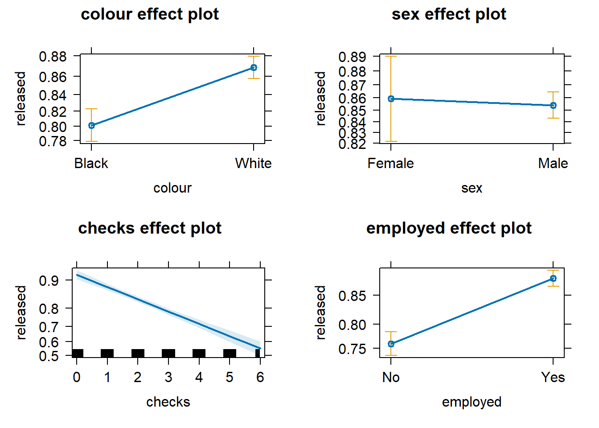
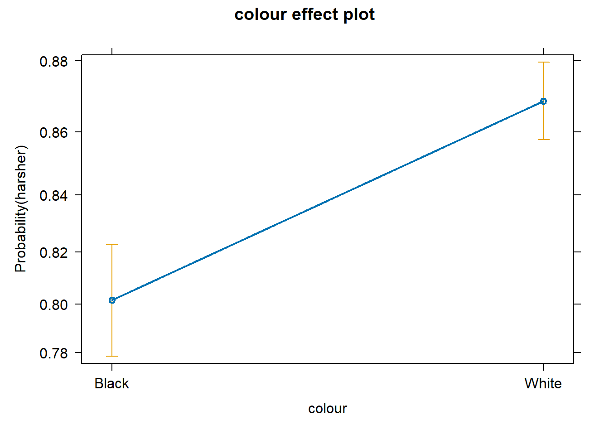
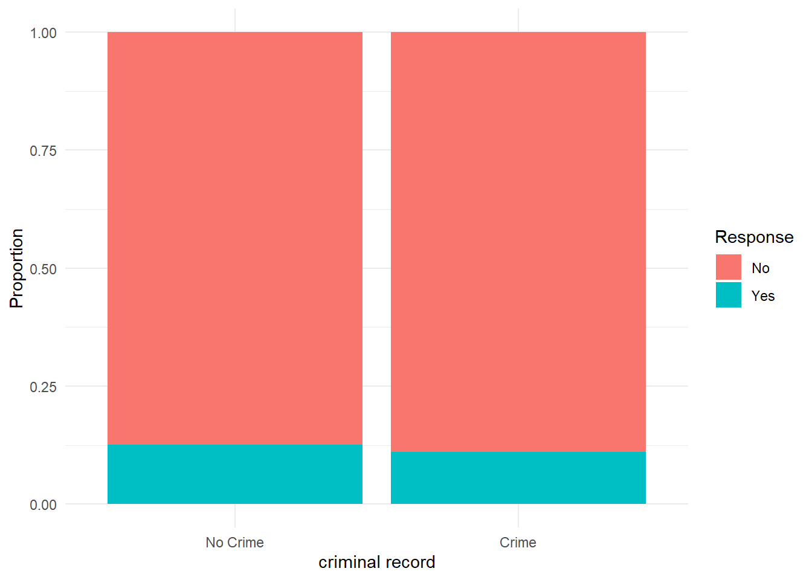

# Categorical variables and logistic regression


In previous weeks, we ventured into the world of bivariate analysis and even multivariate analysis. We learned that we always have a dependent variable (aka outcome or response variable), which measures the phenomenon we aim to explain, and one or more independent variables (aka explanatory or predictor variables), which represent the phenomena we think explain that.

We essentially learned how to handle every possible scenario when the dependent variable is numerical. For instance, if the independent variable is binary, we are interested in the mean difference---i.e., the extent to which the average score of the dependent variable is different in one group in relation to the other group. If the independent variable is categorical with more than two groups, we are interested in the extent to which average scores of the dependent variable are different in each of the groups in relation to a reference group. If the independent variable is numerical, we are interested in the extent to which average scores of the dependent variable are expected to change based on every one-unit increase in the independent variable. In all these cases, we saw that the linear regression model provides a powerful framework for quantifying these relationships. In every scenario, the slope coefficient represents the association between any independent variable and a numerical variable.

Now, however powerful and versatile linear regression models are, they rely on a key assumption: the dependent variable must be numerical. Models are very flexible as to what can go into the right-hand side of the linear equation, but the left-hand side is pretty restrictive. So, what do we do when we have a categorical dependent variable? That's our focus this week! This week is all about categorical variables. We begin by introducing a common method for *describing* relationships between any two categorical variables: cross-tabulations. We then move on and learn about a new type of regression model---one that is *very* similar to everything we already know about linear regression models but designed to accommodate binary dependent variables: **logistic regression models**.

## Cross-tabulations

In earlier sessions, we covered how to run frequency distributions using the `table()` function. Cross tabulations, also called **contingency tables**, are essentially crossed frequency distributions, where you plot the frequency distributions of more than one categorical variable simultaneously. This semester, we are only going to explore **two-way cross-tabulations**, that is, contingency tables where we plot the frequency distribution of *two* categorical variables at the same time. Frequency distributions are a useful way of exploring categorical variables that do not have too many categories. By extension, cross-tabulations are a useful way of exploring relationships between two categorical variables that do not have too many levels or categories.

This week, we will use the `Arrests` dataset from the `effects` package. You can obtain details about this dataset and the variables included by using `help(Arrests, package="effects")`. If you don't have that package, you must install and load it.


```r
# install package if you haven't done so
## install.packages("effects")

# load the 'effects' package
library(effects)

# load the dataset "Arrests"
data(Arrests)#, package = "effects")
```

Please note that when importing data into `R` using the `data()` function, the imported object may not immediately appear in the Environment panel. Worry not---if you didn't receive any error messages, the data frame `Arrests` (note the capitalised letter!) should be loaded into your `R` session. To double-check, let's check the dimensions of this data frame.


```r
# check the dimensions of the 'Arrests' object
dim(Arrests)
```

```
## [1] 5226    8
```

We can see that the data frame `Arrests` has 5226 observations and 8 columns. The unit of analysis here is individuals arrested in Toronto for possession of marijuana. For each of these 5226 individuals, we have information on eight characteristics. Let's check the names of the variables.


```r
# check the names of all columns in 'Arrests'
names(Arrests)
```

```
## [1] "released" "colour"   "year"     "age"      "sex"      "employed" "citizen" 
## [8] "checks"
```

This dataset includes information on police treatment of individuals arrested in Toronto for possession of marijuana. For example, it includes information on whether they are White or Black (`colour`), the year (`year`), their age (`age`), their gender (`sex`), whether they are currently employed (`employed`), whether they are Canadian citizens (`citizen`), and the number of entries in the criminal justice system (`checks`). Crucially, the dataset also contains information indicating whether the arrestee was released with a summons. In this case, the police could:

+ Release the arrestee with a summons---like a parking ticket 

+ Bring to the police station, held for bail, etc.---harsher treatment 

Let's use the `table()` function to examine the frequency distribution of this variable


```r
# produce frequency table
table(Arrests$released)
```

```
## 
##   No  Yes 
##  892 4334
```

4334 arrestees were released with a summons, whereas 892 received a harsher treatment. As usual, when dealing with frequency tables, it is often better to examine results in relation to proportions (or percentages) instead of raw counts. We can obtain proportions using the `prop.table()` function (do note that the `prop.table()` function requires a `table()` object as its argument!).


```r
# store the frequency table under the name "table_released"
table_released <- table(Arrests$released)

# compute proportions of the frequency table
prop.table(table_released)
```

```
## 
##       No      Yes 
## 0.170685 0.829315
```

In other words, 82.93% of arrestees were released with a summons, and 17.07% received a harsher treatment. Let's see if we can develop an understanding of the factors that affect this outcome. In particular, let's assume our research goal is to investigate whether race is associated with harsher treatment. In this case, race is our independent variable, and the treatment offered to the arrestees is our dependent variable. 

Let's quickly examine our independent variable too.


```r
# store the frequency table under the name "table_colour"
table_colour <- table(Arrests$colour)

# print the frequency table
table_colour
```

```
## 
## Black White 
##  1288  3938
```

```r
# compute proportions of the frequency table
prop.table(table_colour)
```

```
## 
##   Black   White 
## 0.24646 0.75354
```
 
Now we know that our sample contains 1288 (24.65%) Black arrestees and 3938 (75.35%) White arrestees.

Given that they are both categorical variables, we can start producing a cross-tabulation. We can simply use the `table()` function and another variable as a second argument in the function. The first variable included in the function will be represented by rows, whereas the second variable will be represented by columns. Conventionally, we usually include the dependent variable in the columns and the independent variable in the rows


```r
# produce a cross-tabulation and store it under "crosstab_released"
crosstab_released <- table(Arrests$colour, Arrests$released)

# print the cross-tabulation
crosstab_released
```

```
##        
##           No  Yes
##   Black  333  955
##   White  559 3379
```

By checking both frequency distributions at the same time, we can see that 333 arrestees are Black and received a harsher treatment, 955 are Black and were released with a summons, 559 are White and received a harsher treatment, and 3379 are White and were released with a summons. So, is there an association? Do we think that Black arrestees are treated more harshly than White arrestees?

As before, just looking at the raw counts is tricky. A better approach is to look at *proportions*. But which proportions? If we simply use the `prop.table()` function, `R` will calculate the **total percentages**---but that is not very helpful in addressing our question.


```r
# compute total proportions of the cross-tabulation
prop.table(crosstab_released)
```

```
##        
##                 No        Yes
##   Black 0.06371986 0.18274015
##   White 0.10696517 0.64657482
```

We can see now that 6.37% of all arrestees are Black and received a harsher treatment, 18.27% are Black and were released with a summons, 10.7% are White and received a harsher treatment, and 64.66% are White and were released with a summons. In other words, what the `prop.table()` function did was just divide the raw count in each cell of the contingency table by the total number of arrestees in the dataset (i.e., 5226). Not very helpful.

Instead, we are only interested in the proportions that allow us to make meaningful comparisons. We already knew that Black arrestees were only 24.65% of our sample, so calculating *total percentages* does not seem to be very useful. Aside from *total percentages*, we can also compute **row percentages** and **column percentages**. For example, among only Black arrestees, what is the percentage that received a harsher treatment? What about among only White respondents? This is the idea of marginal frequencies and percentages!

Given that we always have an independent variable doing the explanation and a dependent variable being explained, we only need percentages that allow us to make comparisons for the dependent variable across our independent variable. In this case, we want to examine percentages of police treatment across groups of racial identity. In other words, because we conventionally display the dependent variable in the columns and the independent variable in the rows, we only want to request **row percentages**. We can request row percentages by adding the argument `margin = 1` into the `prop.table()` function:


```r
# compute row percentages
prop.table(crosstab_released, margin = 1)
```

```
##        
##                No       Yes
##   Black 0.2585404 0.7414596
##   White 0.1419502 0.8580498
```

What this argument does is calculate proportions one row at a time. Among Black arrestees only, 25.85% received a harsher treatment and 74.15% were released with a summons. Among White respondents only, 14.2% received a harsher treatment and 85.8% were received with a summons. Now, comparisons are easier to make! We can see that Black arrestees seem to be more likely to receive a harsher treatment than White arrestees (i.e., 25.85% vs. 14.2%); accordingly, White respondents are more likely to be released with a summons than Black respondents (i.e., 85.8% vs. 74.15%).

<style>
details {
  margin-bottom: 1em; /* Adds space below each details block */
}
</style>

<details>
<summary><i>Attention! What about column percentages?</i></summary>

We can also request column percentages by specifying `margin = 2` in the `prop.table()` function.


```r
# compute column percentages
prop.table(crosstab_released, margin = 2)
```

```
##        
##                No       Yes
##   Black 0.3733184 0.2203507
##   White 0.6266816 0.7796493
```

For example, among all arrestees who received a harsher treatment, 37.33% are Black and 62.67% are White. Among all arrestees who were released with a summons, 62.67% are Black and 77.96% are White.

This is of less substantial interest to us, as we are typically interested in assessing the distribution of the dependent variable across groups of the independent variable. If you include your dependent variable in the columns (which is not conventional), then you might want to compute column percentages. Pay very close attention to this. It is a very common mistake to interpret a crosstab the wrong way if you don't do it as explained here. 

To reiterate, there are two rules for producing and reading cross tabs the right way. The first rule for reading cross-tabulations is that ** if your dependent variable defines the columns (as seen here), then you would need to ask for the row percentages. If, on the other hand, you decided that you preferred to have your dependent variable defining the rows, then you ask for the column percentages.**. Make sure you remember this.

<br>
</details>


While the `table()` and `prop.table()` functions do everything we need, some other functions in `R` allow a better-formatted inspection of cross-tabulations. For example, the `tbl_cross()` function from the `gtsummary` package provides a neat table with all the information we need. This is how it works.


```r
# template for the tbl_cross() function
tbl_cross(data = mydataset, row = independent_variable, col = dependent_variable, percent = "row")
```

In our case, we can now use the `tbl_cross()` function to produce a neat cross-tabulation!


```r
# remember to install the 'gtsummary' package
## install.packages("gtsummary")

# load the 'gtsummary' package
library(gtsummary)

# produce a neatly formatted cross-tabulation
tbl_cross(data = Arrests, row = colour, col = released, percent = "row")
```

```{=html}
<div id="dpnjcmpret" style="padding-left:0px;padding-right:0px;padding-top:10px;padding-bottom:10px;overflow-x:auto;overflow-y:auto;width:auto;height:auto;">
<style>#dpnjcmpret table {
  font-family: system-ui, 'Segoe UI', Roboto, Helvetica, Arial, sans-serif, 'Apple Color Emoji', 'Segoe UI Emoji', 'Segoe UI Symbol', 'Noto Color Emoji';
  -webkit-font-smoothing: antialiased;
  -moz-osx-font-smoothing: grayscale;
}

#dpnjcmpret thead, #dpnjcmpret tbody, #dpnjcmpret tfoot, #dpnjcmpret tr, #dpnjcmpret td, #dpnjcmpret th {
  border-style: none;
}

#dpnjcmpret p {
  margin: 0;
  padding: 0;
}

#dpnjcmpret .gt_table {
  display: table;
  border-collapse: collapse;
  line-height: normal;
  margin-left: auto;
  margin-right: auto;
  color: #333333;
  font-size: 16px;
  font-weight: normal;
  font-style: normal;
  background-color: #FFFFFF;
  width: auto;
  border-top-style: solid;
  border-top-width: 2px;
  border-top-color: #A8A8A8;
  border-right-style: none;
  border-right-width: 2px;
  border-right-color: #D3D3D3;
  border-bottom-style: solid;
  border-bottom-width: 2px;
  border-bottom-color: #A8A8A8;
  border-left-style: none;
  border-left-width: 2px;
  border-left-color: #D3D3D3;
}

#dpnjcmpret .gt_caption {
  padding-top: 4px;
  padding-bottom: 4px;
}

#dpnjcmpret .gt_title {
  color: #333333;
  font-size: 125%;
  font-weight: initial;
  padding-top: 4px;
  padding-bottom: 4px;
  padding-left: 5px;
  padding-right: 5px;
  border-bottom-color: #FFFFFF;
  border-bottom-width: 0;
}

#dpnjcmpret .gt_subtitle {
  color: #333333;
  font-size: 85%;
  font-weight: initial;
  padding-top: 3px;
  padding-bottom: 5px;
  padding-left: 5px;
  padding-right: 5px;
  border-top-color: #FFFFFF;
  border-top-width: 0;
}

#dpnjcmpret .gt_heading {
  background-color: #FFFFFF;
  text-align: center;
  border-bottom-color: #FFFFFF;
  border-left-style: none;
  border-left-width: 1px;
  border-left-color: #D3D3D3;
  border-right-style: none;
  border-right-width: 1px;
  border-right-color: #D3D3D3;
}

#dpnjcmpret .gt_bottom_border {
  border-bottom-style: solid;
  border-bottom-width: 2px;
  border-bottom-color: #D3D3D3;
}

#dpnjcmpret .gt_col_headings {
  border-top-style: solid;
  border-top-width: 2px;
  border-top-color: #D3D3D3;
  border-bottom-style: solid;
  border-bottom-width: 2px;
  border-bottom-color: #D3D3D3;
  border-left-style: none;
  border-left-width: 1px;
  border-left-color: #D3D3D3;
  border-right-style: none;
  border-right-width: 1px;
  border-right-color: #D3D3D3;
}

#dpnjcmpret .gt_col_heading {
  color: #333333;
  background-color: #FFFFFF;
  font-size: 100%;
  font-weight: normal;
  text-transform: inherit;
  border-left-style: none;
  border-left-width: 1px;
  border-left-color: #D3D3D3;
  border-right-style: none;
  border-right-width: 1px;
  border-right-color: #D3D3D3;
  vertical-align: bottom;
  padding-top: 5px;
  padding-bottom: 6px;
  padding-left: 5px;
  padding-right: 5px;
  overflow-x: hidden;
}

#dpnjcmpret .gt_column_spanner_outer {
  color: #333333;
  background-color: #FFFFFF;
  font-size: 100%;
  font-weight: normal;
  text-transform: inherit;
  padding-top: 0;
  padding-bottom: 0;
  padding-left: 4px;
  padding-right: 4px;
}

#dpnjcmpret .gt_column_spanner_outer:first-child {
  padding-left: 0;
}

#dpnjcmpret .gt_column_spanner_outer:last-child {
  padding-right: 0;
}

#dpnjcmpret .gt_column_spanner {
  border-bottom-style: solid;
  border-bottom-width: 2px;
  border-bottom-color: #D3D3D3;
  vertical-align: bottom;
  padding-top: 5px;
  padding-bottom: 5px;
  overflow-x: hidden;
  display: inline-block;
  width: 100%;
}

#dpnjcmpret .gt_spanner_row {
  border-bottom-style: hidden;
}

#dpnjcmpret .gt_group_heading {
  padding-top: 8px;
  padding-bottom: 8px;
  padding-left: 5px;
  padding-right: 5px;
  color: #333333;
  background-color: #FFFFFF;
  font-size: 100%;
  font-weight: initial;
  text-transform: inherit;
  border-top-style: solid;
  border-top-width: 2px;
  border-top-color: #D3D3D3;
  border-bottom-style: solid;
  border-bottom-width: 2px;
  border-bottom-color: #D3D3D3;
  border-left-style: none;
  border-left-width: 1px;
  border-left-color: #D3D3D3;
  border-right-style: none;
  border-right-width: 1px;
  border-right-color: #D3D3D3;
  vertical-align: middle;
  text-align: left;
}

#dpnjcmpret .gt_empty_group_heading {
  padding: 0.5px;
  color: #333333;
  background-color: #FFFFFF;
  font-size: 100%;
  font-weight: initial;
  border-top-style: solid;
  border-top-width: 2px;
  border-top-color: #D3D3D3;
  border-bottom-style: solid;
  border-bottom-width: 2px;
  border-bottom-color: #D3D3D3;
  vertical-align: middle;
}

#dpnjcmpret .gt_from_md > :first-child {
  margin-top: 0;
}

#dpnjcmpret .gt_from_md > :last-child {
  margin-bottom: 0;
}

#dpnjcmpret .gt_row {
  padding-top: 8px;
  padding-bottom: 8px;
  padding-left: 5px;
  padding-right: 5px;
  margin: 10px;
  border-top-style: solid;
  border-top-width: 1px;
  border-top-color: #D3D3D3;
  border-left-style: none;
  border-left-width: 1px;
  border-left-color: #D3D3D3;
  border-right-style: none;
  border-right-width: 1px;
  border-right-color: #D3D3D3;
  vertical-align: middle;
  overflow-x: hidden;
}

#dpnjcmpret .gt_stub {
  color: #333333;
  background-color: #FFFFFF;
  font-size: 100%;
  font-weight: initial;
  text-transform: inherit;
  border-right-style: solid;
  border-right-width: 2px;
  border-right-color: #D3D3D3;
  padding-left: 5px;
  padding-right: 5px;
}

#dpnjcmpret .gt_stub_row_group {
  color: #333333;
  background-color: #FFFFFF;
  font-size: 100%;
  font-weight: initial;
  text-transform: inherit;
  border-right-style: solid;
  border-right-width: 2px;
  border-right-color: #D3D3D3;
  padding-left: 5px;
  padding-right: 5px;
  vertical-align: top;
}

#dpnjcmpret .gt_row_group_first td {
  border-top-width: 2px;
}

#dpnjcmpret .gt_row_group_first th {
  border-top-width: 2px;
}

#dpnjcmpret .gt_summary_row {
  color: #333333;
  background-color: #FFFFFF;
  text-transform: inherit;
  padding-top: 8px;
  padding-bottom: 8px;
  padding-left: 5px;
  padding-right: 5px;
}

#dpnjcmpret .gt_first_summary_row {
  border-top-style: solid;
  border-top-color: #D3D3D3;
}

#dpnjcmpret .gt_first_summary_row.thick {
  border-top-width: 2px;
}

#dpnjcmpret .gt_last_summary_row {
  padding-top: 8px;
  padding-bottom: 8px;
  padding-left: 5px;
  padding-right: 5px;
  border-bottom-style: solid;
  border-bottom-width: 2px;
  border-bottom-color: #D3D3D3;
}

#dpnjcmpret .gt_grand_summary_row {
  color: #333333;
  background-color: #FFFFFF;
  text-transform: inherit;
  padding-top: 8px;
  padding-bottom: 8px;
  padding-left: 5px;
  padding-right: 5px;
}

#dpnjcmpret .gt_first_grand_summary_row {
  padding-top: 8px;
  padding-bottom: 8px;
  padding-left: 5px;
  padding-right: 5px;
  border-top-style: double;
  border-top-width: 6px;
  border-top-color: #D3D3D3;
}

#dpnjcmpret .gt_last_grand_summary_row_top {
  padding-top: 8px;
  padding-bottom: 8px;
  padding-left: 5px;
  padding-right: 5px;
  border-bottom-style: double;
  border-bottom-width: 6px;
  border-bottom-color: #D3D3D3;
}

#dpnjcmpret .gt_striped {
  background-color: rgba(128, 128, 128, 0.05);
}

#dpnjcmpret .gt_table_body {
  border-top-style: solid;
  border-top-width: 2px;
  border-top-color: #D3D3D3;
  border-bottom-style: solid;
  border-bottom-width: 2px;
  border-bottom-color: #D3D3D3;
}

#dpnjcmpret .gt_footnotes {
  color: #333333;
  background-color: #FFFFFF;
  border-bottom-style: none;
  border-bottom-width: 2px;
  border-bottom-color: #D3D3D3;
  border-left-style: none;
  border-left-width: 2px;
  border-left-color: #D3D3D3;
  border-right-style: none;
  border-right-width: 2px;
  border-right-color: #D3D3D3;
}

#dpnjcmpret .gt_footnote {
  margin: 0px;
  font-size: 90%;
  padding-top: 4px;
  padding-bottom: 4px;
  padding-left: 5px;
  padding-right: 5px;
}

#dpnjcmpret .gt_sourcenotes {
  color: #333333;
  background-color: #FFFFFF;
  border-bottom-style: none;
  border-bottom-width: 2px;
  border-bottom-color: #D3D3D3;
  border-left-style: none;
  border-left-width: 2px;
  border-left-color: #D3D3D3;
  border-right-style: none;
  border-right-width: 2px;
  border-right-color: #D3D3D3;
}

#dpnjcmpret .gt_sourcenote {
  font-size: 90%;
  padding-top: 4px;
  padding-bottom: 4px;
  padding-left: 5px;
  padding-right: 5px;
}

#dpnjcmpret .gt_left {
  text-align: left;
}

#dpnjcmpret .gt_center {
  text-align: center;
}

#dpnjcmpret .gt_right {
  text-align: right;
  font-variant-numeric: tabular-nums;
}

#dpnjcmpret .gt_font_normal {
  font-weight: normal;
}

#dpnjcmpret .gt_font_bold {
  font-weight: bold;
}

#dpnjcmpret .gt_font_italic {
  font-style: italic;
}

#dpnjcmpret .gt_super {
  font-size: 65%;
}

#dpnjcmpret .gt_footnote_marks {
  font-size: 75%;
  vertical-align: 0.4em;
  position: initial;
}

#dpnjcmpret .gt_asterisk {
  font-size: 100%;
  vertical-align: 0;
}

#dpnjcmpret .gt_indent_1 {
  text-indent: 5px;
}

#dpnjcmpret .gt_indent_2 {
  text-indent: 10px;
}

#dpnjcmpret .gt_indent_3 {
  text-indent: 15px;
}

#dpnjcmpret .gt_indent_4 {
  text-indent: 20px;
}

#dpnjcmpret .gt_indent_5 {
  text-indent: 25px;
}

#dpnjcmpret .katex-display {
  display: inline-flex !important;
  margin-bottom: 0.75em !important;
}

#dpnjcmpret div.Reactable > div.rt-table > div.rt-thead > div.rt-tr.rt-tr-group-header > div.rt-th-group:after {
  height: 0px !important;
}
</style>
<table class="gt_table" data-quarto-disable-processing="false" data-quarto-bootstrap="false">
  <thead>
    <tr class="gt_col_headings gt_spanner_row">
      <th class="gt_col_heading gt_columns_bottom_border gt_left" rowspan="2" colspan="1" scope="col" id="label"></th>
      <th class="gt_center gt_columns_top_border gt_column_spanner_outer" rowspan="1" colspan="2" scope="colgroup" id="level 1; stat_1">
        <div class="gt_column_spanner"><span class='gt_from_md'>released</span></div>
      </th>
      <th class="gt_col_heading gt_columns_bottom_border gt_center" rowspan="2" colspan="1" scope="col" id="stat_0"><span class='gt_from_md'>Total</span></th>
    </tr>
    <tr class="gt_col_headings">
      <th class="gt_col_heading gt_columns_bottom_border gt_center" rowspan="1" colspan="1" scope="col" id="stat_1"><span class='gt_from_md'>No</span></th>
      <th class="gt_col_heading gt_columns_bottom_border gt_center" rowspan="1" colspan="1" scope="col" id="stat_2"><span class='gt_from_md'>Yes</span></th>
    </tr>
  </thead>
  <tbody class="gt_table_body">
    <tr><td headers="label" class="gt_row gt_left">colour</td>
<td headers="stat_1" class="gt_row gt_center"><br /></td>
<td headers="stat_2" class="gt_row gt_center"><br /></td>
<td headers="stat_0" class="gt_row gt_center"><br /></td></tr>
    <tr><td headers="label" class="gt_row gt_left">    Black</td>
<td headers="stat_1" class="gt_row gt_center">333 (26%)</td>
<td headers="stat_2" class="gt_row gt_center">955 (74%)</td>
<td headers="stat_0" class="gt_row gt_center">1,288 (100%)</td></tr>
    <tr><td headers="label" class="gt_row gt_left">    White</td>
<td headers="stat_1" class="gt_row gt_center">559 (14%)</td>
<td headers="stat_2" class="gt_row gt_center">3,379 (86%)</td>
<td headers="stat_0" class="gt_row gt_center">3,938 (100%)</td></tr>
    <tr><td headers="label" class="gt_row gt_left">Total</td>
<td headers="stat_1" class="gt_row gt_center">892 (17%)</td>
<td headers="stat_2" class="gt_row gt_center">4,334 (83%)</td>
<td headers="stat_0" class="gt_row gt_center">5,226 (100%)</td></tr>
  </tbody>
  
  
</table>
</div>
```

It's the same information but much better! Much less cluttered. We can see the frequency distribution *and* the **marginal frequencies**---i.e., totals by rows and columns which appear along the right and the bottom. We can also see the row percentages, which allows us to conclude that Black arrestees tend to receive a harsher treatment than White arrestees.

This can sound a bit confusing now. But as long as you remember, your dependent should always define the columns, and therefore, you should ask for the row percentages, and you should be fine. There are always students who get this wrong in the assignments and lose points as a result. Don't let it be you.

The second rule for reading cross-tabulations the right way is this: **You make the comparisons across the right percentages in the direction where they do not add up to a hundred**. Another way of saying this is that you compare the percentages for each level of your dependent variable across the levels of your independent variable. In this case, we would, for example, compare the police decision to release arrestees with a summons or take them to the station. Looking at the first column only---arrestees who were not released, i.e., who received a harsher treatment---we can see that Black individuals are 26% and White individuals are 14%. Looking at the second column only---arrestees who were released with a summons---we can see that Black individuals are 74% and White individuals are 86%.

**Your turn!** Using cross-tabulations, what do you conclude about the association between the following variables:

+ Do arrestees with a citizenship status tend to receive harsher treatment by the police?

<details>
<summary><i>Reveal answer!</i></summary>

In this case, police treatment is our dependent variable. We operationalise it using the `released` variable, which indicates whether arrestees were released with a summons or received harsher treatment. Citizenship status is our independent variable, and the variable `citizen` indicates whether arrestees are Canadian citizens or not. Given that they are both categorical (binary) variables, we produce a cross-tabulation to assess whether they are associated.

We know that 17.07% arrestees received a harsher treatment and 82.93% were released with a summons. If citizenship status is not associated with police treatment (i.e., if the null hypothesis is true), we should expect roughly similar proportions among both citizens and non-citizens. If, however, proportions across citizens and non-citizens are different, that would serve as evidence that the two variables could be associated.

Let's have a look at the cross-tabulation.


```r
# produce a cross-tabulation between 'citizen' and 'released'
tbl_cross(data = Arrests, row = citizen, col = released, percent = "row")
```

```{=html}
<div id="sarkocfpbq" style="padding-left:0px;padding-right:0px;padding-top:10px;padding-bottom:10px;overflow-x:auto;overflow-y:auto;width:auto;height:auto;">
<style>#sarkocfpbq table {
  font-family: system-ui, 'Segoe UI', Roboto, Helvetica, Arial, sans-serif, 'Apple Color Emoji', 'Segoe UI Emoji', 'Segoe UI Symbol', 'Noto Color Emoji';
  -webkit-font-smoothing: antialiased;
  -moz-osx-font-smoothing: grayscale;
}

#sarkocfpbq thead, #sarkocfpbq tbody, #sarkocfpbq tfoot, #sarkocfpbq tr, #sarkocfpbq td, #sarkocfpbq th {
  border-style: none;
}

#sarkocfpbq p {
  margin: 0;
  padding: 0;
}

#sarkocfpbq .gt_table {
  display: table;
  border-collapse: collapse;
  line-height: normal;
  margin-left: auto;
  margin-right: auto;
  color: #333333;
  font-size: 16px;
  font-weight: normal;
  font-style: normal;
  background-color: #FFFFFF;
  width: auto;
  border-top-style: solid;
  border-top-width: 2px;
  border-top-color: #A8A8A8;
  border-right-style: none;
  border-right-width: 2px;
  border-right-color: #D3D3D3;
  border-bottom-style: solid;
  border-bottom-width: 2px;
  border-bottom-color: #A8A8A8;
  border-left-style: none;
  border-left-width: 2px;
  border-left-color: #D3D3D3;
}

#sarkocfpbq .gt_caption {
  padding-top: 4px;
  padding-bottom: 4px;
}

#sarkocfpbq .gt_title {
  color: #333333;
  font-size: 125%;
  font-weight: initial;
  padding-top: 4px;
  padding-bottom: 4px;
  padding-left: 5px;
  padding-right: 5px;
  border-bottom-color: #FFFFFF;
  border-bottom-width: 0;
}

#sarkocfpbq .gt_subtitle {
  color: #333333;
  font-size: 85%;
  font-weight: initial;
  padding-top: 3px;
  padding-bottom: 5px;
  padding-left: 5px;
  padding-right: 5px;
  border-top-color: #FFFFFF;
  border-top-width: 0;
}

#sarkocfpbq .gt_heading {
  background-color: #FFFFFF;
  text-align: center;
  border-bottom-color: #FFFFFF;
  border-left-style: none;
  border-left-width: 1px;
  border-left-color: #D3D3D3;
  border-right-style: none;
  border-right-width: 1px;
  border-right-color: #D3D3D3;
}

#sarkocfpbq .gt_bottom_border {
  border-bottom-style: solid;
  border-bottom-width: 2px;
  border-bottom-color: #D3D3D3;
}

#sarkocfpbq .gt_col_headings {
  border-top-style: solid;
  border-top-width: 2px;
  border-top-color: #D3D3D3;
  border-bottom-style: solid;
  border-bottom-width: 2px;
  border-bottom-color: #D3D3D3;
  border-left-style: none;
  border-left-width: 1px;
  border-left-color: #D3D3D3;
  border-right-style: none;
  border-right-width: 1px;
  border-right-color: #D3D3D3;
}

#sarkocfpbq .gt_col_heading {
  color: #333333;
  background-color: #FFFFFF;
  font-size: 100%;
  font-weight: normal;
  text-transform: inherit;
  border-left-style: none;
  border-left-width: 1px;
  border-left-color: #D3D3D3;
  border-right-style: none;
  border-right-width: 1px;
  border-right-color: #D3D3D3;
  vertical-align: bottom;
  padding-top: 5px;
  padding-bottom: 6px;
  padding-left: 5px;
  padding-right: 5px;
  overflow-x: hidden;
}

#sarkocfpbq .gt_column_spanner_outer {
  color: #333333;
  background-color: #FFFFFF;
  font-size: 100%;
  font-weight: normal;
  text-transform: inherit;
  padding-top: 0;
  padding-bottom: 0;
  padding-left: 4px;
  padding-right: 4px;
}

#sarkocfpbq .gt_column_spanner_outer:first-child {
  padding-left: 0;
}

#sarkocfpbq .gt_column_spanner_outer:last-child {
  padding-right: 0;
}

#sarkocfpbq .gt_column_spanner {
  border-bottom-style: solid;
  border-bottom-width: 2px;
  border-bottom-color: #D3D3D3;
  vertical-align: bottom;
  padding-top: 5px;
  padding-bottom: 5px;
  overflow-x: hidden;
  display: inline-block;
  width: 100%;
}

#sarkocfpbq .gt_spanner_row {
  border-bottom-style: hidden;
}

#sarkocfpbq .gt_group_heading {
  padding-top: 8px;
  padding-bottom: 8px;
  padding-left: 5px;
  padding-right: 5px;
  color: #333333;
  background-color: #FFFFFF;
  font-size: 100%;
  font-weight: initial;
  text-transform: inherit;
  border-top-style: solid;
  border-top-width: 2px;
  border-top-color: #D3D3D3;
  border-bottom-style: solid;
  border-bottom-width: 2px;
  border-bottom-color: #D3D3D3;
  border-left-style: none;
  border-left-width: 1px;
  border-left-color: #D3D3D3;
  border-right-style: none;
  border-right-width: 1px;
  border-right-color: #D3D3D3;
  vertical-align: middle;
  text-align: left;
}

#sarkocfpbq .gt_empty_group_heading {
  padding: 0.5px;
  color: #333333;
  background-color: #FFFFFF;
  font-size: 100%;
  font-weight: initial;
  border-top-style: solid;
  border-top-width: 2px;
  border-top-color: #D3D3D3;
  border-bottom-style: solid;
  border-bottom-width: 2px;
  border-bottom-color: #D3D3D3;
  vertical-align: middle;
}

#sarkocfpbq .gt_from_md > :first-child {
  margin-top: 0;
}

#sarkocfpbq .gt_from_md > :last-child {
  margin-bottom: 0;
}

#sarkocfpbq .gt_row {
  padding-top: 8px;
  padding-bottom: 8px;
  padding-left: 5px;
  padding-right: 5px;
  margin: 10px;
  border-top-style: solid;
  border-top-width: 1px;
  border-top-color: #D3D3D3;
  border-left-style: none;
  border-left-width: 1px;
  border-left-color: #D3D3D3;
  border-right-style: none;
  border-right-width: 1px;
  border-right-color: #D3D3D3;
  vertical-align: middle;
  overflow-x: hidden;
}

#sarkocfpbq .gt_stub {
  color: #333333;
  background-color: #FFFFFF;
  font-size: 100%;
  font-weight: initial;
  text-transform: inherit;
  border-right-style: solid;
  border-right-width: 2px;
  border-right-color: #D3D3D3;
  padding-left: 5px;
  padding-right: 5px;
}

#sarkocfpbq .gt_stub_row_group {
  color: #333333;
  background-color: #FFFFFF;
  font-size: 100%;
  font-weight: initial;
  text-transform: inherit;
  border-right-style: solid;
  border-right-width: 2px;
  border-right-color: #D3D3D3;
  padding-left: 5px;
  padding-right: 5px;
  vertical-align: top;
}

#sarkocfpbq .gt_row_group_first td {
  border-top-width: 2px;
}

#sarkocfpbq .gt_row_group_first th {
  border-top-width: 2px;
}

#sarkocfpbq .gt_summary_row {
  color: #333333;
  background-color: #FFFFFF;
  text-transform: inherit;
  padding-top: 8px;
  padding-bottom: 8px;
  padding-left: 5px;
  padding-right: 5px;
}

#sarkocfpbq .gt_first_summary_row {
  border-top-style: solid;
  border-top-color: #D3D3D3;
}

#sarkocfpbq .gt_first_summary_row.thick {
  border-top-width: 2px;
}

#sarkocfpbq .gt_last_summary_row {
  padding-top: 8px;
  padding-bottom: 8px;
  padding-left: 5px;
  padding-right: 5px;
  border-bottom-style: solid;
  border-bottom-width: 2px;
  border-bottom-color: #D3D3D3;
}

#sarkocfpbq .gt_grand_summary_row {
  color: #333333;
  background-color: #FFFFFF;
  text-transform: inherit;
  padding-top: 8px;
  padding-bottom: 8px;
  padding-left: 5px;
  padding-right: 5px;
}

#sarkocfpbq .gt_first_grand_summary_row {
  padding-top: 8px;
  padding-bottom: 8px;
  padding-left: 5px;
  padding-right: 5px;
  border-top-style: double;
  border-top-width: 6px;
  border-top-color: #D3D3D3;
}

#sarkocfpbq .gt_last_grand_summary_row_top {
  padding-top: 8px;
  padding-bottom: 8px;
  padding-left: 5px;
  padding-right: 5px;
  border-bottom-style: double;
  border-bottom-width: 6px;
  border-bottom-color: #D3D3D3;
}

#sarkocfpbq .gt_striped {
  background-color: rgba(128, 128, 128, 0.05);
}

#sarkocfpbq .gt_table_body {
  border-top-style: solid;
  border-top-width: 2px;
  border-top-color: #D3D3D3;
  border-bottom-style: solid;
  border-bottom-width: 2px;
  border-bottom-color: #D3D3D3;
}

#sarkocfpbq .gt_footnotes {
  color: #333333;
  background-color: #FFFFFF;
  border-bottom-style: none;
  border-bottom-width: 2px;
  border-bottom-color: #D3D3D3;
  border-left-style: none;
  border-left-width: 2px;
  border-left-color: #D3D3D3;
  border-right-style: none;
  border-right-width: 2px;
  border-right-color: #D3D3D3;
}

#sarkocfpbq .gt_footnote {
  margin: 0px;
  font-size: 90%;
  padding-top: 4px;
  padding-bottom: 4px;
  padding-left: 5px;
  padding-right: 5px;
}

#sarkocfpbq .gt_sourcenotes {
  color: #333333;
  background-color: #FFFFFF;
  border-bottom-style: none;
  border-bottom-width: 2px;
  border-bottom-color: #D3D3D3;
  border-left-style: none;
  border-left-width: 2px;
  border-left-color: #D3D3D3;
  border-right-style: none;
  border-right-width: 2px;
  border-right-color: #D3D3D3;
}

#sarkocfpbq .gt_sourcenote {
  font-size: 90%;
  padding-top: 4px;
  padding-bottom: 4px;
  padding-left: 5px;
  padding-right: 5px;
}

#sarkocfpbq .gt_left {
  text-align: left;
}

#sarkocfpbq .gt_center {
  text-align: center;
}

#sarkocfpbq .gt_right {
  text-align: right;
  font-variant-numeric: tabular-nums;
}

#sarkocfpbq .gt_font_normal {
  font-weight: normal;
}

#sarkocfpbq .gt_font_bold {
  font-weight: bold;
}

#sarkocfpbq .gt_font_italic {
  font-style: italic;
}

#sarkocfpbq .gt_super {
  font-size: 65%;
}

#sarkocfpbq .gt_footnote_marks {
  font-size: 75%;
  vertical-align: 0.4em;
  position: initial;
}

#sarkocfpbq .gt_asterisk {
  font-size: 100%;
  vertical-align: 0;
}

#sarkocfpbq .gt_indent_1 {
  text-indent: 5px;
}

#sarkocfpbq .gt_indent_2 {
  text-indent: 10px;
}

#sarkocfpbq .gt_indent_3 {
  text-indent: 15px;
}

#sarkocfpbq .gt_indent_4 {
  text-indent: 20px;
}

#sarkocfpbq .gt_indent_5 {
  text-indent: 25px;
}

#sarkocfpbq .katex-display {
  display: inline-flex !important;
  margin-bottom: 0.75em !important;
}

#sarkocfpbq div.Reactable > div.rt-table > div.rt-thead > div.rt-tr.rt-tr-group-header > div.rt-th-group:after {
  height: 0px !important;
}
</style>
<table class="gt_table" data-quarto-disable-processing="false" data-quarto-bootstrap="false">
  <thead>
    <tr class="gt_col_headings gt_spanner_row">
      <th class="gt_col_heading gt_columns_bottom_border gt_left" rowspan="2" colspan="1" scope="col" id="label"></th>
      <th class="gt_center gt_columns_top_border gt_column_spanner_outer" rowspan="1" colspan="2" scope="colgroup" id="level 1; stat_1">
        <div class="gt_column_spanner"><span class='gt_from_md'>released</span></div>
      </th>
      <th class="gt_col_heading gt_columns_bottom_border gt_center" rowspan="2" colspan="1" scope="col" id="stat_0"><span class='gt_from_md'>Total</span></th>
    </tr>
    <tr class="gt_col_headings">
      <th class="gt_col_heading gt_columns_bottom_border gt_center" rowspan="1" colspan="1" scope="col" id="stat_1"><span class='gt_from_md'>No</span></th>
      <th class="gt_col_heading gt_columns_bottom_border gt_center" rowspan="1" colspan="1" scope="col" id="stat_2"><span class='gt_from_md'>Yes</span></th>
    </tr>
  </thead>
  <tbody class="gt_table_body">
    <tr><td headers="label" class="gt_row gt_left">citizen</td>
<td headers="stat_1" class="gt_row gt_center"><br /></td>
<td headers="stat_2" class="gt_row gt_center"><br /></td>
<td headers="stat_0" class="gt_row gt_center"><br /></td></tr>
    <tr><td headers="label" class="gt_row gt_left">    No</td>
<td headers="stat_1" class="gt_row gt_center">212 (27%)</td>
<td headers="stat_2" class="gt_row gt_center">559 (73%)</td>
<td headers="stat_0" class="gt_row gt_center">771 (100%)</td></tr>
    <tr><td headers="label" class="gt_row gt_left">    Yes</td>
<td headers="stat_1" class="gt_row gt_center">680 (15%)</td>
<td headers="stat_2" class="gt_row gt_center">3,775 (85%)</td>
<td headers="stat_0" class="gt_row gt_center">4,455 (100%)</td></tr>
    <tr><td headers="label" class="gt_row gt_left">Total</td>
<td headers="stat_1" class="gt_row gt_center">892 (17%)</td>
<td headers="stat_2" class="gt_row gt_center">4,334 (83%)</td>
<td headers="stat_0" class="gt_row gt_center">5,226 (100%)</td></tr>
  </tbody>
  
  
</table>
</div>
```

The table indicates that, while only 15% of arrestees received harsher treatment among citizens, 27% of arrestees without citizenship status had the same decision. Similarly, while 85% of those with citizenship status were released with a summons, only 73% of those without citizenship status were released. This suggests that citizenship status seems to be associated with police treatment, as non-citizen individuals appear to be more likely to receive harsher treatment.

<br>
</details>

+ Do male arrestees tend to receive harsher treatment by the police?

<details>
<summary><i>Reveal answer!</i></summary>

In this case, arrestees' gender is our independent variable, and the variable `sex` indicates whether arrestees are recorded as male or female. Given that they are both categorical (binary) variables, we produce a cross-tabulation to assess whether they are associated.

We know that 17.07% arrestees received a harsher treatment and 82.93% were released with a summons. If gender is not associated with police treatment (i.e., if the null hypothesis is true), we should expect roughly similar proportions among both males and females. If, however, proportions across male and female arrestees are different, that would serve as evidence that the two variables could be associated.

Let's have a look at the cross-tabulation.


```r
# produce a cross-tabulation between 'sex' and 'released'
tbl_cross(data = Arrests, row = sex, col = released, percent = "row")
```

```{=html}
<div id="vfdcjmuapi" style="padding-left:0px;padding-right:0px;padding-top:10px;padding-bottom:10px;overflow-x:auto;overflow-y:auto;width:auto;height:auto;">
<style>#vfdcjmuapi table {
  font-family: system-ui, 'Segoe UI', Roboto, Helvetica, Arial, sans-serif, 'Apple Color Emoji', 'Segoe UI Emoji', 'Segoe UI Symbol', 'Noto Color Emoji';
  -webkit-font-smoothing: antialiased;
  -moz-osx-font-smoothing: grayscale;
}

#vfdcjmuapi thead, #vfdcjmuapi tbody, #vfdcjmuapi tfoot, #vfdcjmuapi tr, #vfdcjmuapi td, #vfdcjmuapi th {
  border-style: none;
}

#vfdcjmuapi p {
  margin: 0;
  padding: 0;
}

#vfdcjmuapi .gt_table {
  display: table;
  border-collapse: collapse;
  line-height: normal;
  margin-left: auto;
  margin-right: auto;
  color: #333333;
  font-size: 16px;
  font-weight: normal;
  font-style: normal;
  background-color: #FFFFFF;
  width: auto;
  border-top-style: solid;
  border-top-width: 2px;
  border-top-color: #A8A8A8;
  border-right-style: none;
  border-right-width: 2px;
  border-right-color: #D3D3D3;
  border-bottom-style: solid;
  border-bottom-width: 2px;
  border-bottom-color: #A8A8A8;
  border-left-style: none;
  border-left-width: 2px;
  border-left-color: #D3D3D3;
}

#vfdcjmuapi .gt_caption {
  padding-top: 4px;
  padding-bottom: 4px;
}

#vfdcjmuapi .gt_title {
  color: #333333;
  font-size: 125%;
  font-weight: initial;
  padding-top: 4px;
  padding-bottom: 4px;
  padding-left: 5px;
  padding-right: 5px;
  border-bottom-color: #FFFFFF;
  border-bottom-width: 0;
}

#vfdcjmuapi .gt_subtitle {
  color: #333333;
  font-size: 85%;
  font-weight: initial;
  padding-top: 3px;
  padding-bottom: 5px;
  padding-left: 5px;
  padding-right: 5px;
  border-top-color: #FFFFFF;
  border-top-width: 0;
}

#vfdcjmuapi .gt_heading {
  background-color: #FFFFFF;
  text-align: center;
  border-bottom-color: #FFFFFF;
  border-left-style: none;
  border-left-width: 1px;
  border-left-color: #D3D3D3;
  border-right-style: none;
  border-right-width: 1px;
  border-right-color: #D3D3D3;
}

#vfdcjmuapi .gt_bottom_border {
  border-bottom-style: solid;
  border-bottom-width: 2px;
  border-bottom-color: #D3D3D3;
}

#vfdcjmuapi .gt_col_headings {
  border-top-style: solid;
  border-top-width: 2px;
  border-top-color: #D3D3D3;
  border-bottom-style: solid;
  border-bottom-width: 2px;
  border-bottom-color: #D3D3D3;
  border-left-style: none;
  border-left-width: 1px;
  border-left-color: #D3D3D3;
  border-right-style: none;
  border-right-width: 1px;
  border-right-color: #D3D3D3;
}

#vfdcjmuapi .gt_col_heading {
  color: #333333;
  background-color: #FFFFFF;
  font-size: 100%;
  font-weight: normal;
  text-transform: inherit;
  border-left-style: none;
  border-left-width: 1px;
  border-left-color: #D3D3D3;
  border-right-style: none;
  border-right-width: 1px;
  border-right-color: #D3D3D3;
  vertical-align: bottom;
  padding-top: 5px;
  padding-bottom: 6px;
  padding-left: 5px;
  padding-right: 5px;
  overflow-x: hidden;
}

#vfdcjmuapi .gt_column_spanner_outer {
  color: #333333;
  background-color: #FFFFFF;
  font-size: 100%;
  font-weight: normal;
  text-transform: inherit;
  padding-top: 0;
  padding-bottom: 0;
  padding-left: 4px;
  padding-right: 4px;
}

#vfdcjmuapi .gt_column_spanner_outer:first-child {
  padding-left: 0;
}

#vfdcjmuapi .gt_column_spanner_outer:last-child {
  padding-right: 0;
}

#vfdcjmuapi .gt_column_spanner {
  border-bottom-style: solid;
  border-bottom-width: 2px;
  border-bottom-color: #D3D3D3;
  vertical-align: bottom;
  padding-top: 5px;
  padding-bottom: 5px;
  overflow-x: hidden;
  display: inline-block;
  width: 100%;
}

#vfdcjmuapi .gt_spanner_row {
  border-bottom-style: hidden;
}

#vfdcjmuapi .gt_group_heading {
  padding-top: 8px;
  padding-bottom: 8px;
  padding-left: 5px;
  padding-right: 5px;
  color: #333333;
  background-color: #FFFFFF;
  font-size: 100%;
  font-weight: initial;
  text-transform: inherit;
  border-top-style: solid;
  border-top-width: 2px;
  border-top-color: #D3D3D3;
  border-bottom-style: solid;
  border-bottom-width: 2px;
  border-bottom-color: #D3D3D3;
  border-left-style: none;
  border-left-width: 1px;
  border-left-color: #D3D3D3;
  border-right-style: none;
  border-right-width: 1px;
  border-right-color: #D3D3D3;
  vertical-align: middle;
  text-align: left;
}

#vfdcjmuapi .gt_empty_group_heading {
  padding: 0.5px;
  color: #333333;
  background-color: #FFFFFF;
  font-size: 100%;
  font-weight: initial;
  border-top-style: solid;
  border-top-width: 2px;
  border-top-color: #D3D3D3;
  border-bottom-style: solid;
  border-bottom-width: 2px;
  border-bottom-color: #D3D3D3;
  vertical-align: middle;
}

#vfdcjmuapi .gt_from_md > :first-child {
  margin-top: 0;
}

#vfdcjmuapi .gt_from_md > :last-child {
  margin-bottom: 0;
}

#vfdcjmuapi .gt_row {
  padding-top: 8px;
  padding-bottom: 8px;
  padding-left: 5px;
  padding-right: 5px;
  margin: 10px;
  border-top-style: solid;
  border-top-width: 1px;
  border-top-color: #D3D3D3;
  border-left-style: none;
  border-left-width: 1px;
  border-left-color: #D3D3D3;
  border-right-style: none;
  border-right-width: 1px;
  border-right-color: #D3D3D3;
  vertical-align: middle;
  overflow-x: hidden;
}

#vfdcjmuapi .gt_stub {
  color: #333333;
  background-color: #FFFFFF;
  font-size: 100%;
  font-weight: initial;
  text-transform: inherit;
  border-right-style: solid;
  border-right-width: 2px;
  border-right-color: #D3D3D3;
  padding-left: 5px;
  padding-right: 5px;
}

#vfdcjmuapi .gt_stub_row_group {
  color: #333333;
  background-color: #FFFFFF;
  font-size: 100%;
  font-weight: initial;
  text-transform: inherit;
  border-right-style: solid;
  border-right-width: 2px;
  border-right-color: #D3D3D3;
  padding-left: 5px;
  padding-right: 5px;
  vertical-align: top;
}

#vfdcjmuapi .gt_row_group_first td {
  border-top-width: 2px;
}

#vfdcjmuapi .gt_row_group_first th {
  border-top-width: 2px;
}

#vfdcjmuapi .gt_summary_row {
  color: #333333;
  background-color: #FFFFFF;
  text-transform: inherit;
  padding-top: 8px;
  padding-bottom: 8px;
  padding-left: 5px;
  padding-right: 5px;
}

#vfdcjmuapi .gt_first_summary_row {
  border-top-style: solid;
  border-top-color: #D3D3D3;
}

#vfdcjmuapi .gt_first_summary_row.thick {
  border-top-width: 2px;
}

#vfdcjmuapi .gt_last_summary_row {
  padding-top: 8px;
  padding-bottom: 8px;
  padding-left: 5px;
  padding-right: 5px;
  border-bottom-style: solid;
  border-bottom-width: 2px;
  border-bottom-color: #D3D3D3;
}

#vfdcjmuapi .gt_grand_summary_row {
  color: #333333;
  background-color: #FFFFFF;
  text-transform: inherit;
  padding-top: 8px;
  padding-bottom: 8px;
  padding-left: 5px;
  padding-right: 5px;
}

#vfdcjmuapi .gt_first_grand_summary_row {
  padding-top: 8px;
  padding-bottom: 8px;
  padding-left: 5px;
  padding-right: 5px;
  border-top-style: double;
  border-top-width: 6px;
  border-top-color: #D3D3D3;
}

#vfdcjmuapi .gt_last_grand_summary_row_top {
  padding-top: 8px;
  padding-bottom: 8px;
  padding-left: 5px;
  padding-right: 5px;
  border-bottom-style: double;
  border-bottom-width: 6px;
  border-bottom-color: #D3D3D3;
}

#vfdcjmuapi .gt_striped {
  background-color: rgba(128, 128, 128, 0.05);
}

#vfdcjmuapi .gt_table_body {
  border-top-style: solid;
  border-top-width: 2px;
  border-top-color: #D3D3D3;
  border-bottom-style: solid;
  border-bottom-width: 2px;
  border-bottom-color: #D3D3D3;
}

#vfdcjmuapi .gt_footnotes {
  color: #333333;
  background-color: #FFFFFF;
  border-bottom-style: none;
  border-bottom-width: 2px;
  border-bottom-color: #D3D3D3;
  border-left-style: none;
  border-left-width: 2px;
  border-left-color: #D3D3D3;
  border-right-style: none;
  border-right-width: 2px;
  border-right-color: #D3D3D3;
}

#vfdcjmuapi .gt_footnote {
  margin: 0px;
  font-size: 90%;
  padding-top: 4px;
  padding-bottom: 4px;
  padding-left: 5px;
  padding-right: 5px;
}

#vfdcjmuapi .gt_sourcenotes {
  color: #333333;
  background-color: #FFFFFF;
  border-bottom-style: none;
  border-bottom-width: 2px;
  border-bottom-color: #D3D3D3;
  border-left-style: none;
  border-left-width: 2px;
  border-left-color: #D3D3D3;
  border-right-style: none;
  border-right-width: 2px;
  border-right-color: #D3D3D3;
}

#vfdcjmuapi .gt_sourcenote {
  font-size: 90%;
  padding-top: 4px;
  padding-bottom: 4px;
  padding-left: 5px;
  padding-right: 5px;
}

#vfdcjmuapi .gt_left {
  text-align: left;
}

#vfdcjmuapi .gt_center {
  text-align: center;
}

#vfdcjmuapi .gt_right {
  text-align: right;
  font-variant-numeric: tabular-nums;
}

#vfdcjmuapi .gt_font_normal {
  font-weight: normal;
}

#vfdcjmuapi .gt_font_bold {
  font-weight: bold;
}

#vfdcjmuapi .gt_font_italic {
  font-style: italic;
}

#vfdcjmuapi .gt_super {
  font-size: 65%;
}

#vfdcjmuapi .gt_footnote_marks {
  font-size: 75%;
  vertical-align: 0.4em;
  position: initial;
}

#vfdcjmuapi .gt_asterisk {
  font-size: 100%;
  vertical-align: 0;
}

#vfdcjmuapi .gt_indent_1 {
  text-indent: 5px;
}

#vfdcjmuapi .gt_indent_2 {
  text-indent: 10px;
}

#vfdcjmuapi .gt_indent_3 {
  text-indent: 15px;
}

#vfdcjmuapi .gt_indent_4 {
  text-indent: 20px;
}

#vfdcjmuapi .gt_indent_5 {
  text-indent: 25px;
}

#vfdcjmuapi .katex-display {
  display: inline-flex !important;
  margin-bottom: 0.75em !important;
}

#vfdcjmuapi div.Reactable > div.rt-table > div.rt-thead > div.rt-tr.rt-tr-group-header > div.rt-th-group:after {
  height: 0px !important;
}
</style>
<table class="gt_table" data-quarto-disable-processing="false" data-quarto-bootstrap="false">
  <thead>
    <tr class="gt_col_headings gt_spanner_row">
      <th class="gt_col_heading gt_columns_bottom_border gt_left" rowspan="2" colspan="1" scope="col" id="label"></th>
      <th class="gt_center gt_columns_top_border gt_column_spanner_outer" rowspan="1" colspan="2" scope="colgroup" id="level 1; stat_1">
        <div class="gt_column_spanner"><span class='gt_from_md'>released</span></div>
      </th>
      <th class="gt_col_heading gt_columns_bottom_border gt_center" rowspan="2" colspan="1" scope="col" id="stat_0"><span class='gt_from_md'>Total</span></th>
    </tr>
    <tr class="gt_col_headings">
      <th class="gt_col_heading gt_columns_bottom_border gt_center" rowspan="1" colspan="1" scope="col" id="stat_1"><span class='gt_from_md'>No</span></th>
      <th class="gt_col_heading gt_columns_bottom_border gt_center" rowspan="1" colspan="1" scope="col" id="stat_2"><span class='gt_from_md'>Yes</span></th>
    </tr>
  </thead>
  <tbody class="gt_table_body">
    <tr><td headers="label" class="gt_row gt_left">sex</td>
<td headers="stat_1" class="gt_row gt_center"><br /></td>
<td headers="stat_2" class="gt_row gt_center"><br /></td>
<td headers="stat_0" class="gt_row gt_center"><br /></td></tr>
    <tr><td headers="label" class="gt_row gt_left">    Female</td>
<td headers="stat_1" class="gt_row gt_center">63 (14%)</td>
<td headers="stat_2" class="gt_row gt_center">380 (86%)</td>
<td headers="stat_0" class="gt_row gt_center">443 (100%)</td></tr>
    <tr><td headers="label" class="gt_row gt_left">    Male</td>
<td headers="stat_1" class="gt_row gt_center">829 (17%)</td>
<td headers="stat_2" class="gt_row gt_center">3,954 (83%)</td>
<td headers="stat_0" class="gt_row gt_center">4,783 (100%)</td></tr>
    <tr><td headers="label" class="gt_row gt_left">Total</td>
<td headers="stat_1" class="gt_row gt_center">892 (17%)</td>
<td headers="stat_2" class="gt_row gt_center">4,334 (83%)</td>
<td headers="stat_0" class="gt_row gt_center">5,226 (100%)</td></tr>
  </tbody>
  
  
</table>
</div>
```

The table indicates that 17% of male arrestees and 14% of female arrestees received harsher treatment, while 83% of male arrestees and 86% of female arrestees were released with a summons. These numbers are very similar and approximately follow the overall tendencies of arrestees who were (83%) and who were not released with a summons (17%). This suggests that gender does not seem to be associated with police treatment.

<br>
</details>

## Regression modelling: why not linear regression?

<!--
(Thiago) NOTE TO THE FUTURE

LET'S JUST TEACH THEM LINEAR PROBABILITY MODELS! This should be a "Regression IV: Linear probability models" class. We can also teach logistic regression, but focus should be on the LPM

This class could go: cross-tabs, odds ratios, LPMs. Done.
-->

Ok, great. If we have two categorical variables, we can produce a cross-tabulation. This cross-tabulation can be helpful in providing evidence for or against the hypothesis that those two variables are associated with each other. 

But what if the independent variable is numerical? Or, what if we have more than one independent variable? Or, what if we need to control for a third common factor to remove confounding bias? Or, what if we have two independent variables whose effects on the dependent variable are conditional upon each other? We spent three weeks studying linear regression models. When the dependent variable is numerical, we already know how to handle all these scenarios. Now, we need to handle these scenarios when the dependent variable is not numerical as well.

Can't we simply fit linear regression models with categorical dependent variables?

No. Rather, the short answer is no. The long answer is... sometimes. When the dependent variable is binary, in some circumstances, we can fit a linear regression model---these are called linear probability models. But that's beyond our scope this semester. As far as this course unit goes, let's stick to the short answer: no, we cannot.

The reason why we cannot fit linear regression models with categorical dependent variables is simple: this violates some of the key assumptions in linear regression models. All assumptions somehow get back to the fact that the dependent variable is numerical and as close as possible to normally distributed. If the dependent variable is categorical, there is not much we can do...

...in terms of *linear* regression. But there are other types of regression models! One of them, **logistic regression models**, was designed specifically to handle categorical binary variables. That's our focus now!  We have binomial logistic regression models for binary dependent variables, ordinal logistic regression models for ordinal dependent variables, and multinomial logistic regression models for nominal (unordered) dependent variables. In this course unit, we are only going to learn about **binomial logistic regression models**---when the dependent variable is **binary**. Other types of categorical dependent variables will, unfortunately, not be covered this semester.

Now, let's see how we can adapt everything we know about linear regression models!


## Logistic regression

In previous sessions, we covered linear regression models, which can be used to model variation in a numerical response variable. Here, we introduce logistic regression, a technique you may use when your dependent variable is binary---i.e., categorical and has two possible levels.

In criminology, very often, you will be interested in binary outcomes---e.g., we might want to investigate why some people have been stopped by the police whereas others have not; or why some people have been victimised while others have not; or why some people engage in criminal conduct while others do not, etc.---and want to use a number of independent variables to study these outcomes. It is, then, helpful to understand how to use these models. Logistic regression is part of a broader family of models called **generalised linear models**---it's essentially a technical expansion of linear regression models for dependent variables that are not numerical and do not follow a normal distribution. You should read the Wikipedia entry for this concept [here](https://en.wikipedia.org/wiki/Generalized_linear_model).

With logistic regression, we model the probability of belonging to one of the levels in the binary outcome. For any combination of values for our independent variables, the model estimates the probability of presenting the outcome of interest. The mathematics behind this estimation is beyond the scope of our course unit; it suffices to say that while linear regression coefficients are estimated using *ordinary least squares* (see Chapter 6), logistic regression coefficients are estimated using **maximum likelihood**---one of the most important estimators in statistics.

In logistic regression, we also start with a model in which variables of interest (e.g., $Y, X_1, X_2, ...$) are related to each other based on parameters that we need to estimate (e.g., $\alpha, \beta_1, \beta_2, ...$). Remember what the linear model looks like:

$$
Y = \alpha + \beta_1 \cdot X_1 + \beta_2 \cdot X_2 + ... + \beta_n\cdot X_n
$$
With logistic regression, we want to estimate a similar model. The right-hand side will remain unchanged: a combination of independent variables influencing the outcome based on estimated $\beta$ coefficients. However, the left-hand side of the equation does not work anymore. Because the dependent variable is now binary, the left-hand side of this linear model is no longer appropriate. If $Y$ is binary, that means that it can only have two values---e.g., 0 or 1. To avoid confusion and ensure that we know that this is a binary variable, let's call it $p$ when $y=1$ and $1-p$ when $y=0$. If we were to simply estimate a linear model with a binary dependent variable, then this linear equation could end up yielding all sorts of values of $Y$---values that are not 0 or 1.^[If values were between 0 and 1, that wouldn't be so problematic. Scores between 0 and 1 would simply be treated as estimated probabilities, which is what the linear probability model does. The problem is that the model can also yield scores greater than 1 and lower than 0, which are no longer interpretable as probabilities.]

The logistic regression model solves this issue by modelling the *odds* of an event occurring. Unlike linear models, which directly model the dependent variable, logistic regression focuses on the ratio $\frac{p}{1-p}$, known as **odds**. If you are familiar with betting, you may already know a thing or two about odds. Odds represent how much more likely an event is to happen than not to happen.

Let's go back to our example: marijuana-possession arrestees in Toronto. We know, from above, that most arrestees are released with a summons. Let's remember the numbers:


```r
# frequency table of variable 'released'
table_released
```

```
## 
##   No  Yes 
##  892 4334
```

So, we know that $p=$ 4334 arrestees were released with a summons and that $1-p=$ 892 received a harsher treatment. If we want to calculate the **odds of being released with a summons**, we simply need to calculate the ratio $\frac{p}{1-p}=\frac{4334}{892}$. In this case, the odds are 4.86, which means that being released with a summons is 4.86 times more likely to occur than receiving harsher treatment.

Our goal will be to treat these odds as our main target! Is the colour of the arrestee associated with increases or decreases in the odds of being released with a summons? What about citizenship status? Is it associated with increases or decreases in the odds of being released with a summons? Going back to the linear model above, we are going to put the odds of an event occurring in the left-hand side of the equation!

Unfortunately, for a bunch of mathematical reasons that we don't need to worry about for now, we cannot simply put the odds $\frac{p}{1-p}$ in the left-hand side of the equation. Instead, we need to put the *natural logarithm of the odds* in the left-hand side of the equation:

$$
log \bigg( \frac{p}{1-p} \bigg) = \alpha + \beta_1 \cdot X_1 + \beta_2 \cdot X_2 + ... + \beta_n\cdot X_n
$$
Don't worry about that logarithm in the equation. We will get rid of it soon. For now, what we can see is that the right-hand side of the equation remains unchanged. And the left-hand side of the equation includes some stuff that we still don't know how to interpret. Let's give a name for the stuff on the left-hand side of the equation: let's call it **logit**. The *logit* of a binary variable is the natural logarithm of the odds of the event occurring. That's why this model is called **logistic regression**!

But because the right-hand side of the equation remains unchanged, so will our interpretation! For instance, we can simply say that a one-unit increase in $X_1$ is associated with a $\beta_1$-increase in the *log-odds* of $Y$. The same applies to binary independent variables, categorical independent variables, multiple regression models, and interactions---everything that we learned about interpreting linear regression models applies here, as long we remember that everything refers to the *log-odds* of the dependent variable.

So, that's great! Or almost... there's only one problem: what does an increase or decrease in the *log-odds* of a variable even mean? Interpreting the log odds-scale is something some people do not find very intuitive. To make things more intuitive, we need to get rid of the logarithm and get back to odds! After all, what we want to know is the extent to which independent variables are associated with increases or decreases in the *odds* of an event occurring.

How do we get rid of the log-odds scale? By exponentiating coefficients!

<details>
<summary><i>Don't remember logarithms? Don't worry! Click here for a quick refresher</i></summary>

A logarithm is the inverse operation of exponentiation, meaning it undoes the effect of raising a number to a power. If we have an equation like $a^b = c$, the logarithm allows us to solve for $b$ by rewriting it as $\log_a(c) = b$. In other words, the logarithm tells us what exponent we need to raise the base $a$ to in order to get $c$. For example, since $2^3 = 8$, it follows that $\log_2(8) = 3$.  

This inverse relationship is similar to how subtraction undoes addition or how division undoes multiplication. Logarithms are particularly useful in mathematics and science for handling exponential growth or decay, compressing large numbers into manageable scales, and solving equations where the exponent is the unknown. The most common logarithms are base 10 (common logarithm, $\log$), base $e$ (natural logarithm, $\ln$), and base 2 (binary logarithm, used in computing).

In logistic regression, we use the natural logarithm---base $e$. Therefore, to get rid of the log-odds scale, we simply exponentiate coefficients: $e^{\beta_1}$, which we can obtain using the `R` function `exp()`.

<br>
</details>

If we simply exponentiate the regression coefficients (e.g., $e^{\beta_1}$, which we can obtain using the `R` function `exp()`), we get rid of the log-odds scale and obtain what we call **odds ratios**. Using odds ratios when interpreting logistic regression coefficients is very common. The key word to remember here is **multiplies**. 


<style>
div {
  margin-bottom: 1em; /* Adds space below each details block */
}
</style>

<div style="border: 1px solid #ccc; padding: 10px; background-color: #f9f9f9;">
<b>Interpreting logistic regression coefficients as odds ratios </b>  

<b>A one-unit increase in $X_1$ multiplies the odds of the event $Y$ occurring by $exp^{\beta_1}$</b>
</div>

Odds ratios, by definition, will always be greater than 0. Multiplying something by a number between 0 and 1 actually reduces the number: for example, if we multiply 10 by 0.4, the result is 4, a decrease of 60%. If we multiply something by 1, it stays the same: for example, if we multiply 10 by 1, the result is 1. If we multiply something by a number greater than 1, it implies an increase: for example, if we multiply 10 by 1.5, the result is 5, an increase of 50%.

+ An estimated odds ratio ($exp^{\beta}$) between 0 and 1 implies a negative association
+ An estimated odds ratio ($exp^{\beta}$) equal to 1 implies no association
+ An estimated odds ratio ($exp^{\beta}$) greater than 1 implies a positive association

Let's practice all that, seeking to understand what factors are associated with greater or lower odds of marijuana-possession arrestees being released with a summons!

## Fitting logistic regression

It is fairly straightforward to run a logistic model. Assuming that the dependent variable is binary, we can use the `glm()` function in `R`. It works exactly the same way as the `lm()` function---we only need to specify that we will be using a *logit* function link (we can do that by including the argument `family = binomial`).


```r
glm(dependent_var ~ independent_var1 + independent_var2 + independent_var3, data = dataset, family = binomial)
```

Now, let’s fit a multiple logistic regression. The dependent variable, as before, indicates whether arrestees were released with a summons or not. To ensure that we are modeling the odds of being released with a summons (and not the odds of receiving harsher treatment), we recode the released variable so that "Yes" (released) is coded as 1 and "No" (not released) is coded as 0.

In logistic regression, the event coded as 1 is the comparison group (the outcome we are modeling the odds for), and the group coded as 0 serves as the reference category.


```r
# load the dplyr package
library(dplyr)

# recode the 'released' variable to ensure that the
# comparison group is coded as 1
Arrests <- mutate(Arrests, 
                  released = case_when(
                    released == "Yes" ~ 1,
                    released == "No" ~ 0
                  ))
```

Now we can fit the multiple logistic regression. As independent variables, let's include arrestees' racial identity (`colour`), gender (`sex`), the number of entries in the criminal justice system (`checks`), and whether they were employed at the time of arrest (`employed`).


```r
# Fit a logistic regression model and store it under 'logistic_reg'
logistic_reg <- glm(released ~ colour + sex + checks + employed, data = Arrests, family = binomial)

# print the estimated coefficients
logistic_reg
```

```
## 
## Call:  glm(formula = released ~ colour + sex + checks + employed, family = binomial, 
##     data = Arrests)
## 
## Coefficients:
## (Intercept)  colourWhite      sexMale       checks  employedYes  
##     1.40739      0.49608     -0.04215     -0.35796      0.77973  
## 
## Degrees of Freedom: 5225 Total (i.e. Null);  5221 Residual
## Null Deviance:	    4776 
## Residual Deviance: 4331 	AIC: 4341
```

The table, as you will see, is similar to the one you get when running linear regression. For now, we can ignore the new information at the very bottom of the output (these are fit indices, including the null and deviance residuals and the Akaike Information Criteria---AIC). Let's focus on the estimated coefficients. We could rewrite the logit equation with the estimated parameters now:

$$
log \bigg( \frac{release\_summons}{harsher\_treatment} \bigg) = 1.407 + 0.496\cdot colour - 0.042\cdot sex - 0.358\cdot checks + 0.780\cdot employed
$$

Based on this, we can conclude that White arrestees' *log-odds* of being released with a summons are $\beta_1=0.496$ larger than Black arrestees' *log-odds*, controlling for sex, previous checks in the criminal justice system, and employment status; that male's *log-odds* of being released are $\beta_2=-0.042$ lower than females', controlling for race, previous checks in the criminal justice system, and employment status; that every additional check in the criminal justice system is associated with a decrease of $\beta_3=-0.358$ in the *log-odds* of being released, controlling for race, sex, and employment status; and that employed arrestees' *log-odds* are $\beta_4=0.780$ larger than the *log-odds* among unemployed arrestees, controlling for race, sex, and checks in the criminal justice system.

So what does that actually mean? As mentioned above, interpreting the log odds scale is something some people do not find very intuitive. So, using **odd ratios** when interpreting logistic regression is common. To do this, all we need to do is to exponentiate the coefficients. To get the exponentiated coefficients, you tell `R` that you want to exponentiate (`exp()`), that the object you want to exponentiate is called coefficients, and it is part of the model you just ran. We can do this in several steps or in one step.


```r
# store regression coefficients under 'coefficients'
coefficients <- coef(logistic_reg)

# exponentiate all coefficients to obtain odds ratios
exp(coefficients)
```

```
## (Intercept) colourWhite     sexMale      checks employedYes 
##   4.0852619   1.6422658   0.9587242   0.6990998   2.1808765
```

Much better! Now that we have exponentiated the coefficients, we have **odds ratios**---, which are much easier to interpret than coefficients on the *log-odds* scale.

+ White arrestees' odds of being released with a summons are 64% higher than Black arrestees' odds of being released with a summons, controlling for sex, checks in the criminal justice system, and employment status.
    - i.e., being White multiplies the odds of release with a summons by 1.64.
+ Male arrestees' odds of being released with a summons are 4.13% lower than female arrestees' odds of being released with a summons, controlling for race, checks in the criminal justice system, and employment status.
    - i.e., being male multiplies the odds of release with a summons by 0.96.
+ Every additional check in the criminal justice system is associated with a decrease of 30.1% in the odds of being released with a summons, controlling for race, sex, and employment status
    - i.e., every additional check in the criminal justice system multiplies the odds of being released with a summons by 0.70.
+ Employed arrestees' odds of being released with a summons are more than twice as high as unemployed arrestees' odds of being released with a summons, controlling for race, sex, and employment status.
    - i.e., being employed multiplies the odds of release with a summons by 2.18.

For more details on interpreting odd ratios in logistic regression, you may want to read [this](http://www.ats.ucla.edu/stat/mult_pkg/faq/general/odds_ratio.htm). Some people do not like odd ratios. For other ways of interpreting logistic regression coefficients, you may want to consult [chapter 5 of the book](http://www.cambridge.org/gb/academic/subjects/statistics-probability/statistical-theory-and-methods/data-analysis-using-regression-and-multilevelhierarchical-models?format=PB) by Gelman and Hill (2007).

You can read more about how to interpret odd ratios in logistic regression [here](https://stats.idre.ucla.edu/other/mult-pkg/faq/general/faq-how-do-i-interpret-odds-ratios-in-logistic-regression/).

See [the appendix](https://uom-resquant.github.io/modelling_book/appendix.html#fitting-logistic-regression-alternative) for an alternative way of getting the same results with less typing.

As with linear regression, the interpretation of regression coefficients is sensitive to the scale of measurement of the predictors. This means one cannot compare the magnitude of the coefficients to compare the relevance of variables to predict the response variable. The same applies to the odd ratios. Tempting and common as this might be, unless the independent variables use the same metric (or maybe if they are all categorical), there is little point in comparing the magnitude of the odd ratios in logistic regression. Like the unstandardised logistic regression coefficients, odd ratios are **not** a measure of effect size that allows comparisons across inputs (Menard, 2012). 

We can also produce effect plots using the `effects` package:


```r
# load the 'effects' package
library(effects)

# produce effect plots
plot(allEffects(logistic_reg), ask = FALSE)
```



Effect plots in this context are particularly helpful because they summarise the results using probabilities, which is what you see plotted on the y-axis.

We don’t have to print them all. When we are primarily concerned with one of them, as in this case, that’s the one we want to emphasise when presenting and discussing our results. There isn’t much point discussing the results for the variables we simply defined as control (given what our research goal was). So in this case we would ask for the plot for our input measuring race/ethnicity:


```r
plot(effect("colour", logistic_reg), multiline = FALSE, ylab = "Probability(harsher)")
```



We can use the predict() function to generate the predicted probability that the arrestess will be released given what we know about their inputs in the model, given values of the predictors. By default R will compute the probabilities for the dataset we fitted the model to. Here we have printed only the first ten probabilities, but the way we use the predict() function here will generate a predicted probability for each case in the dataset.


```r
logistic_reg_prob <- predict(logistic_reg, type = "response") #If you want to add this to your dataframe you could designate your object as Arrests$fitl_1_prob
logistic_reg_prob[1:10]
```

```
##         1         2         3         4         5         6         7         8 
## 0.8273773 0.7448014 0.8273773 0.8565590 0.8616606 0.8990862 0.8654497 0.9109450 
##         9        10 
## 0.6710889 0.8273773
```

It is important to understand that with this type of models we usually generate two types of predictions. One the one hand, we are producing a continuous valued prediction in the form of a probability but we can also generate a predicted class for each case. In many applied settings, the latter will be relevant. A discrete category prediction may be required in order to make a decision. Imagine of a probation officer evaluating the future risk of a client. She/He would want to know whether the case is high risk or not.


## Interactions

The data we have been using were obtained by the author of the `effects` package from [Michael Friendly](http://www.datavis.ca/), another prominent contributor to the development of R packages. The data are related to a series of stories revealed by the Toronto Star and further analysed by Professor Friendly as seen [here](http://www.datavis.ca/courses/VCD/vcd4-handout-2x2.pdf). In this further analysis, Friendly proposes a slightly more complex model than the one we have specified so far. This model adds three new predictors (citizenship, age, and year in which the case was processed) and also allows for interactions between race (colour) and year, as well as race and age.


```r
# fit new multiple logistic regression
logistic_reg_2 <- glm(released ~ employed + citizen + checks + colour * year + colour * age, 
              family = binomial, data = Arrests) 

# print results
logistic_reg_2
```

```
## 
## Call:  glm(formula = released ~ employed + citizen + checks + colour * 
##     year + colour * age, family = binomial, data = Arrests)
## 
## Coefficients:
##      (Intercept)       employedYes        citizenYes            checks  
##       -227.48053           0.74748           0.62016          -0.36472  
##      colourWhite              year               age  colourWhite:year  
##        361.66832           0.11391           0.02879          -0.18022  
##  colourWhite:age  
##         -0.03813  
## 
## Degrees of Freedom: 5225 Total (i.e. Null);  5217 Residual
## Null Deviance:	    4776 
## Residual Deviance: 4275 	AIC: 4293
```

What we see here is that the two interactions included are somewhat different from 0. To assist in the interpretation of interactions, it is helpful to look at effect plots.


```r
# produce effects plot to assess interaction effects
plot(effect("colour:year", logistic_reg_2))
```


First, we see that up to 2000, there is strong evidence for differential treatment of blacks and whites. However, we also see evidence to support Police claims of the effect of training to reduce racial effects.


```r
# produce effects plot to assess interaction effects
plot(effect("colour:age", logistic_reg_2))
```


On the other hand, we see a significant interaction between race and age. Young blacks are treated more harshly than young whites. However, older blacks were treated less harshly than older whites.

In a previous session, we discussed the difficulties of interpreting regression coefficients in models with interactions. Centring and standardising in the way discussed earlier can actually be of help for this purpose.


## Assessing model fit: confusion matrix 

If we are interested in "qualitative" prediction, we also need to consider other measures of fit. In many applied settings, such as in applied predictive modelling, this can be the case. Imagine you are developing a tool to be used to forecast the probability of repeat victimisation in cases of domestic violence. This type of prediction may then be used to determine the type of police response to cases defined as high-risk. Clearly, you want to make sure the classification you make is as accurate as possible.

In these contexts, it is common to start from a **classification table** or [**confusion matrix**](http://en.wikipedia.org/wiki/Confusion_matrix). A confusion matrix is simply a cross-tabulation of the observed outcome in relation to the predicted outcome. We saw earlier how the `predict()` function generated a set of predicted probabilities for each of the subjects in the study. To produce a classification table in this context, we must define a **cut-off point**, a particular probability that we will use to classify cases. Anybody above that cut-off we will define as belonging to the level of interest and anybody below we will define as not. We could, for example, say that anybody with a probability larger than .5 should be predicted to receive harsher treatment.

The confusion matrix typically follows this layout:


The diagonal entries correspond to observations that are classified correctly according to our model and our cut-off point, whereas the off-diagonal entries are misclassifications. **False negatives** are observations that were classified as zeros but turned out to be ones (the outcome of interest). **False positives** are observations that were classified as ones (the outcome of interest) but turned out to be zeros.

There are various ways of producing a confusion matrix in R. The most basic one is to ask for the cross-tabulation of the predicted classes (determined by the cut-off criterion) versus the observed classes.


```r
#to create a confusion matrix, we want 
#our variable to be back to a factor
Arrests <- mutate(Arrests, 
                  released = case_when(
                    released == 1 ~ "Yes",
                    released == 0 ~ "No"
                  ),
                  released = as.factor(released))
#First, we define the classes according to the cut-off
logistic_reg_pred_class <- logistic_reg_prob > .5
#This creates a logical vector that returns TRUE 
#when the condition is met (the subject is predicted to be released) and 
#FALSE when the condition is not met (the subject is not released)
logistic_reg_pred_class[1:10]
```

```
##    1    2    3    4    5    6    7    8    9   10 
## TRUE TRUE TRUE TRUE TRUE TRUE TRUE TRUE TRUE TRUE
```

```r
#Let's make this into a factor with the same levels as the original variable
released_pred <- as.factor(logistic_reg_pred_class)
levels(released_pred) <- c("No","Yes")
table(released_pred)
```

```
## released_pred
##   No  Yes 
##  113 5113
```

```r
#Then we can produce the cross-tab
tab0 <- table(released_pred, Arrests$released)
tab0
```

```
##              
## released_pred   No  Yes
##           No    57   56
##           Yes  835 4278
```

We can derive various useful measures from classification tables. Two important ones are the **sensitivity** and the **specificity**. The model's sensitivity is the rate at which the event of interest (e.g., being released) is predicted correctly for all cases having the event.

Sensitivity = number of cases with the event and predicted to have the event/number of samples actually presenting the event

In this case, this amounts to 4278 divided by 56 plus 4278. The sensitivity is sometimes also considered the **true positive rate** since it measures the accuracy in the event population. On the other hand, the specificity is defined as:

Specificity = number of cases without the events and predicted as non-events/number of cases without the event

In this case, this amounts to 57 divided by 57 plus 835. The **false positive rate** is defined as one minus the specificity.

We can generate these measures automatically from the table we produced. However, for this sort of thing, I prefer to use the `confusionMatrix()` function from the `caret` package. It produces a very detailed set of calibration measures that help indicate how well the model is classifying.


```r
library(caret)
confusionMatrix(data=released_pred, 
               reference=Arrests$released, positive="Yes") 
```

```
## Confusion Matrix and Statistics
## 
##           Reference
## Prediction   No  Yes
##        No    57   56
##        Yes  835 4278
##                                          
##                Accuracy : 0.8295         
##                  95% CI : (0.819, 0.8396)
##     No Information Rate : 0.8293         
##     P-Value [Acc > NIR] : 0.4943         
##                                          
##                   Kappa : 0.078          
##                                          
##  Mcnemar's Test P-Value : <2e-16         
##                                          
##             Sensitivity : 0.9871         
##             Specificity : 0.0639         
##          Pos Pred Value : 0.8367         
##          Neg Pred Value : 0.5044         
##              Prevalence : 0.8293         
##          Detection Rate : 0.8186         
##    Detection Prevalence : 0.9784         
##       Balanced Accuracy : 0.5255         
##                                          
##        'Positive' Class : Yes            
## 
```

```r
#The data argument specifies the vector 
#with the predictions and the reference 
#argument the vector with the observed 
#outcome or event. The positive argument 
#identifies the level of interest in the factor.
```

We can see first the **accuracy**. The overall accuracy rate gives us the agreement between the observed and predicted classes. However, the overall accuracy is often not the most useful measure. **Kappa** is also a measure that is often used with values ranging between 0.30 and 0.50 considered to indicate reasonable agreement. However, for many applications, it will be of interest to focus on the sensitivity and the specificity as defined above. In this case, we can see that our sensitivity, or the true positive rate, is good. However, our Kappa is not. the model can predict the those who are released with summons, but is not doing so well predicting harsh treatment with the select cut-off.

One of the problems with taking this approach is that the choice of the cut-off point can be arbitrary, and yet this cut-off point will impact the sensitivity and specificity of the model. There is a trade-off between sensitivity and specificity. Given a fixed accuracy, more of one will result in less of the other.

So if we use a different cut-off point, say .75, the classification table would look like this:


```r
precision<-function(c) {
tab1 <- table(logistic_reg_prob>c, Arrests$released)
out <- diag(tab1)/apply(tab1, 2, sum)
names(out) <- c('specificity', 'sensitivity')
list(tab1, out)
}
precision(.75)
```

```
## [[1]]
##        
##           No  Yes
##   FALSE  396  707
##   TRUE   496 3627
## 
## [[2]]
## specificity sensitivity 
##   0.4439462   0.8368713
```

Here, we are predicting, according to our model, that anybody with a probability above .75 will be released with summons. Our sensitivity- decreases, but our specificity goes up. You can see that the cut-off point will affect how many false positives and false negatives we have. The overall accuracy is still the same, but we have shifted the balance between sensitivity and specificity. 

Potential trade-offs here may be appropriate when there are different penalties or costs associated with each type of error. For example, if you are trying to predict a homicide as part of an intervention or prevention program, you may give more importance to not making a false negative error. That is, you want to identify as many potential homicide victims as possible, even if that means that you will identify as victims individuals that, in the end, won't be (false positives). On the other hand, if you have limited resources to attend to all the cases that you will predict as positives, you also need to factor this into the equation. You don't want to use a cut-off point that will lead you to identify more cases as potential homicide victims that you can possibly work with.

Similarly, the criminal justice system is essentially built around the idea of avoiding false positives - that is, convicting people who are innocent. You will have heard many phrases like "innocent until proven guilty" or "It is far better that 10 guilty men go free than one innocent man is wrongfully convicted". This approach would incline us to err on the side of false negatives and avoid false positives (higher sensitivity, lower specificity).

We may want to see what happens to sensitivity and specificity for different cut-off points. For this, we can look at **receiver operating characteristics** or simply [ROC curves](http://en.wikipedia.org/wiki/Receiver_operating_characteristic). This is essentially a tool for evaluating the sensitivity/specificity trade-off. The ROC curve can be used to investigate alternate cut-offs for class probabilities. [See the appendix for more info on the ROC curve](https://uom-resquant.github.io/modelling_book/appendix.html#assessing-model-fit-roc-curves). There are also other ways to assess a model's fit, such as deviance and pseudo r squared. For those interested, [you can read more in the appendix](https://uom-resquant.github.io/modelling_book/appendix.html#assessing-model-fit-deviance-and-pseudo-r-squared).-->

<!--We can use the `pROC` package for this. We start by creating an object that contains the relevant information with the `roc()` function from the `pROC` package.


```r
#library(pROC)
#rocCURVE <- roc(response = Arrests$harsher, 
#                predictor = logistic_reg_prob)
```

Once we have the object with the information, we can plot the ROC curve.


```r
#plot(rocCURVE, legacy.axes = TRUE) #By default, the x-axis goes backwards; we can use the specified option legacy.axes=TRUE, to get 1-spec on the x-axis moving from 0 to 1.
```

We can see the trajectory of the curve is at first steep, suggesting that sensitivity increases at a greater pace than the decrease in specificity. However, we then reach a point at which specificity decreases at a greater rate than the sensitivity increases. If you want to select a cut-off that gives you the optimal cut-off point, you can use the `coords()` function of the pROC package. You can pass arguments to this function so that it returns the best sum of sensitivity and specificity.


```r
#alt_cutoff1 <- coords(rocCURVE, x = "best", best.method = "closest.topleft")
#The x argument, in this case, is selecting the best cut-off using the "closest topleft" method 
#(which identifies the point closest to the top-left part of the plot with perfect sensitivity or specificity). Another option is to use the "youden" method in the best.method argument.
#alt_cutoff1
```

Here, we can see that with a cut-off point of .16 we get a specificity of .63 and a sensitivity of .71. Notice how this is close to the base rate of harsher treatment in the sample (17% of individuals actually received harsher treatment). For a more informed discussion of cut-off points and costs of errors in applied predictive problems in criminal justice, I recommend reading [Berk (2012)](http://link.springer.com/book/10.1007%2F978-1-4614-3085-8). Often, the selection of cut-off may be motivated by practical considerations (e.g., selecting individuals for treatment in a situation where resources to do so are limited).

The ROC curve can also be used to develop a quantitative assessment of the model. The perfect model is one where the curve reaches the top left corner of the plot. This would imply 100% sensitivity and specificity. On the other hand, a useless model would be one with a curve alongside the diagonal line splitting the plot in two, from the bottom right corner to the top right corner. You can also look at the **area under the curve** (AUC) and use it to compare models. An AUC of .5 corresponds to the situation where our predictors have no predictive utility. For a fuller discussion of how to compare these curves and the AUC, I recommend reading Chapter 11 of [Kuhn and Johnson (2014)](http://link.springer.com/book/10.1007/978-1-4614-6849-3).-->

## Further resources

These are a set of useful external resources that may aid your comprehension (and I have partly relied upon myself, so credit to them!):

+ The [UCLA guide](http://www.ats.ucla.edu/stat/r/dae/logit.htm) to using logistic regression with R.

+ A [helpful list of resources](http://www.r-bloggers.com/some-r-resources-for-glms/) for general linear models with R.

## Lab Exercises

**Your turn!** In the lab session, answer the following questions. Note that not all questions necessarily require analysing data in R. After you finish, click on ‘Reveal answer!’ to check your answers.

We start by revisiting the - ‘Ban the Box: fair chance recruitment’ practices in the UK - dataset from Week 2. We first load, select need variables and cary out any data transformation required.

```r
library(haven)
banbox <- read_dta("https://dataverse.harvard.edu/api/access/datafile/3036350")
#if you have issues with loadingt the data
#see section 2.2 on how to get the data

#select needed variables
banbox <- banbox %>% select (response, black, crime, empgap)

#data transformation
banbox$black_f <- factor(banbox$black, levels = c(0, 1), labels = c("non-Black", "Black"))
```

Using the above data we want to assess whether receiving a positive answer to a job application is associated with having a criminal record. Your variables of interest are `response` - Application received Positive Response; `empgap` - Applicant has Employment Gap; `crime` - Applicant has Criminal Record; and `black` - whether someone is black or not.


1. Based on your research hypothesis, what are your dependent and independent variables?

<details>
<summary><i>Reveal answer!</i></summary>

Dependent variable: Application received Positive Response, i.e., `response`.

Independent variable: Applicant has Criminal Record, i.e., `crime`.

</details>

2. Is your dependent variable numerical or categorical? If categorical, is it binary, ordinal, or multinomial? What about the independent variable?

<details>
<summary><i>Reveal answer!</i></summary>

The dependent variable, Application received Positive Response (`responce`), is a binary variable.

The independent variable, Applicant has Criminal Record (`crime`), is also a binary variable.

</details>

3. Using your dependent and independent variables, what is your null hypothesis?

<details>
<summary><i>Reveal answer!</i></summary>

Null hypothesis: There is no association between having a criminal record and receiving a callback (response). In other words, the odds of receiving a positive response are the same for applicants with criminal record and those without a criminal record. 
</details>

4. Examine the relationship between your dependent and your independent variable using the appropriate visualisation strategies

<details>
<summary><i>Reveal answer!</i></summary>

We can produce a barchart to assess the relationship


```r
# produce barchart
library(ggplot2)

ggplot(banbox, aes(x = as_factor(crime), fill = factor(response, levels = c(0, 1), labels = c("No", "Yes")))) +
  geom_bar(position = "fill") +
  labs(y = "Proportion", fill = "Response", x = "criminal record") +
  theme_minimal()
```




</details>

5. Let’s build a logistic regression model. Replacing $Y$ with the name of your dependent variable, and $X$ with the name of your independent variable, write down the equation with the unknown parameters (i.e, $\alpha$ and $\beta$) that you want to estimate. *Note: this question does not involve any data analysis*.

<details>
<summary><i>Reveal answer!</i></summary>

$$
\log \left( \frac{P(\text{response} = 1)}{1 - P(\text{response} = 1)} \right) = \alpha + \beta \times \text{crime}
$$

</details>

6. Using the `glm()` function, estimate the parameters of your logistic regression model. Rewrite the equation above replacing unknown parameters with the estimated parameters.

<details>
<summary><i>Reveal answer!</i></summary>


```r
# fit logistic regression model
log_reg <- glm(response ~ crime, data = banbox, family = binomial)
log_reg
```

```
## 
## Call:  glm(formula = response ~ crime, family = binomial, data = banbox)
## 
## Coefficients:
## (Intercept)        crime  
##      -1.939       -0.149  
## 
## Degrees of Freedom: 14812 Total (i.e. Null);  14811 Residual
## Null Deviance:	    10750 
## Residual Deviance: 10740 	AIC: 10740
```

Based on the results of the linear regression model, we can rewrite the equation in the following way:

$$
\log \left( \frac{P(\text{response} = 1)}{1 - P(\text{response} = 1)} \right) = -1.939 +  -0.149 \times \text{crime}
$$

Applicants with a criminal record are less likely to receive a callback than applicants without a record. 

</details>

7. After fitting your logistic regression model to predict whether applicants receive a positive response (response), create a confusion matrix comparing predicted responses to actual responses. Use 0.5 as the cut-off point.

<details>
<summary><i>Reveal answer!</i></summary>


```r
# fit regression model
log_reg_prob <- predict(log_reg, type = "response")

log_reg_pred_class <- log_reg_prob > .5
response_pred <- as.factor(log_reg_pred_class)
levels(response_pred) <- c("No","Yes")


banbox <- mutate(banbox, 
                  response = case_when(
                    response == 1 ~ "Yes",
                    response == 0 ~ "No"
                  ),
                  response = as.factor(response))


#Then we can produce the cross-tab
table(response_pred, banbox$response)
```

```
##              
## response_pred    No   Yes
##           No  13066  1747
##           Yes     0     0
```


</details>


8. What is the specificity of your logistic regression model predictions?

<details>
<summary><i>Reveal answer!</i></summary>


```r
library(caret)
confusionMatrix(data=response_pred, 
               reference=banbox$response, positive="Yes") 
```

```
## Confusion Matrix and Statistics
## 
##           Reference
## Prediction    No   Yes
##        No  13066  1747
##        Yes     0     0
##                                           
##                Accuracy : 0.8821          
##                  95% CI : (0.8768, 0.8872)
##     No Information Rate : 0.8821          
##     P-Value [Acc > NIR] : 0.5064          
##                                           
##                   Kappa : 0               
##                                           
##  Mcnemar's Test P-Value : <2e-16          
##                                           
##             Sensitivity : 0.0000          
##             Specificity : 1.0000          
##          Pos Pred Value :    NaN          
##          Neg Pred Value : 0.8821          
##              Prevalence : 0.1179          
##          Detection Rate : 0.0000          
##    Detection Prevalence : 0.0000          
##       Balanced Accuracy : 0.5000          
##                                           
##        'Positive' Class : Yes             
## 
```
A specificity of 1 means the model makes zero false positive errors — it never says "Yes" when the correct answer is "No." Does this mean the model is a good one? Depends on what we are interested in predicting. Could other independent variables be added to the model? 

</details>

<!--
## Assessing model fit I: deviance and pseudo r squared

As you may remember, when looking at linear models, we could use the R squared to check the overall fit of the model. When running logistic regression, we cannot obtain the R squared (although there is a collection of pseudo-R^2 measures that have been produced). In linear regression, things are a bit simpler. As Menard (2010: 43) explains:

> "there is only one reasonable residual variation criterion for quantitative variables in OLS, the familiar error sum of squares... but there are several possible residual variation criteria (entropy, squared error, qualitative difference) for binary variables. Another hindrance is the existence of numerous mathematical equivalents to R^2 in OLS, which are not necessarily mathematically (same formula) or conceptually (same meaning in the context of the model) equivalent to R^2 in logistic regression... Moreover, in logistic regression, we must choose whether we are more interested in qualitative prediction (whether predicitons are correct or incorrect), quantitative prediction (how close predictions are to being correct), or both, because different measures of explained variation are appropriate for these two different types of prediction"

A common starting point for assessing model fit is to look at the **log-likelihood statistic** and the **deviance** (also referred to as -2LL). 

The log-likelihood aims to provide a measure of how much-unexplained variation there is after you fit the mode. Large values indicate a poor fit. 

The deviance, on the other hand, is simply the log-likelihood multiplied by -2 and is generally abbreviated as -2LL. The deviance will be a positive value, and *larger values indicate worse prediction* of the response variable. It is analogous to the error sum of squares in linear regression. In the same way that OLS linear regression tries to minimise the error sum of squares, maximum likelihood logistic regression tries to minimise the -2LL.

The difference between the -2LL for the model with no predictors and the -2LL for the model with all the predictors is the closer we get in logistic regression to the regression sum of squares. This difference is often called **model chi-squared**, and it provides a test of the null hypothesis that all the regression coefficients equal zero. <!--It is, thus, equivalent to the F test in OLS regression.


```
## 
## Call:  glm(formula = released ~ colour + sex + checks + employed, family = binomial, 
##     data = Arrests)
## 
## Coefficients:
## (Intercept)  colourWhite      sexMale       checks  employedYes  
##     1.40739      0.49608     -0.04215     -0.35796      0.77973  
## 
## Degrees of Freedom: 5225 Total (i.e. Null);  5221 Residual
## Null Deviance:	    4776 
## Residual Deviance: 4331 	AIC: 4341
```

In our example, we saw that some measures of fit were printed below the table with the coefficients. The **null deviance** is the deviance of the model with no predictors, and the **residual deviance** is simply the deviance of this model. You clearly want the residual deviance to be smaller than the null deviance. The difference between the null and the residual deviance is what we call the model chi-squared. In this case, this is 4776 minus 4275. We can ask R to do this for us.

First, notice that the object we created has all the information we need already stored.


```r
names(logistic_reg)
```

```
##  [1] "coefficients"      "residuals"         "fitted.values"    
##  [4] "effects"           "R"                 "rank"             
##  [7] "qr"                "family"            "linear.predictors"
## [10] "deviance"          "aic"               "null.deviance"    
## [13] "iter"              "weights"           "prior.weights"    
## [16] "df.residual"       "df.null"           "y"                
## [19] "converged"         "boundary"          "model"            
## [22] "call"              "formula"           "terms"            
## [25] "data"              "offset"            "control"          
## [28] "method"            "contrasts"         "xlevels"
```

So we can use this stored information in our calculations.


```r
with(logistic_reg, null.deviance - deviance)
```

```
## [1] 445.5594
```

Is 501 small? How much smaller is enough? This value has a chi-square distribution, and its significance can be easily computed. For this computation, we need to know the degrees of freedom for the model (which equal the number of predictors in the model) and can be obtained like this:


```r
with(logistic_reg, df.null - df.residual)
```

```
## [1] 4
```

<!--Finally, the p-value can be obtained using the following code to invoke the Chi-Square distribution:


```r
#When doing it yourself, this is all you really need 
#(we present the code in a separate fashion above so that you understand better what the one here does)
#with(logistic_reg, pchisq(null.deviance - deviance, df.null - df.residual, lower.tail = FALSE))
```

We can see that the model chi-square is highly significant. Our model as a whole fits significantly better than a model with no predictors.

Menard (2010) recommends also looking at the likelihood ratio R^2, which can be calculated as the difference between the null deviance and the residual deviance divided by the null deviance.


```r
#Likelihood ratio R2
#with(logistic_reg, (null.deviance - deviance)/null.deviance)
```

Some authors refer to this as the Hosmer/Lemeshow R^2. It indicates how much the inclusion of the independent variables in the model reduces variation, as measured by the null deviance. It varies between 0 (when our prediction is catastrophically useless) and 1 (when we predict with total accuracy). There are many other pseudo R^2 measures that have been proposed, but Menard [based on research](http://www.tandfonline.com/doi/pdf/10.1080/00031305.2000.10474502) on the properties of various of these measures recommends the likelihood ratio R^2 because:

+ It is the one with a closer conceptual link to R^2 in OLS regression.

+ It does not appear to be sensitive to the base rate (the proportion of cases that have the attribute of interest) of the phenomenon being studied and, therefore, will work even in cases with unbalanced probabilities.

+ It varies between 0 and 1

+ And it can be used in other generalised linear models (models for categorical outcomes with more than two levels, which we don't cover here)-->


<!--## Summary: exercise for this week
Once you finish your lab session, don't forget to do this [Exercise](https://eonk.shinyapps.io/MCD_ex) and have a chance to sum-up this week's R codes.

Once you finish your lab session, don't forget to do this [Exercise](https://eonk.shinyapps.io/MCD_ex) and have a chance to sum up this week's R codes.-->
