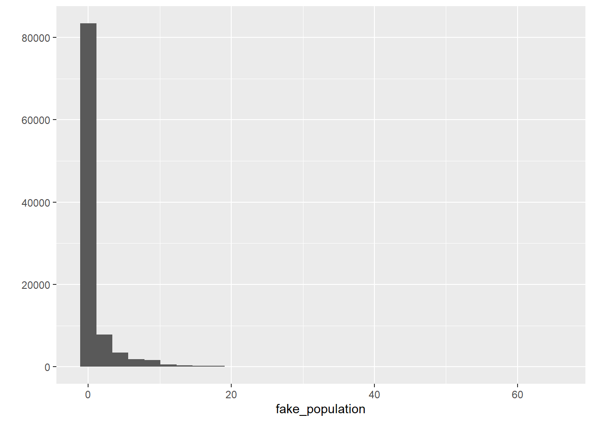

# Statistical Inference

## Introduction

When conducting data analysis, we *usually* need to analyse data from a **sample**. Very rarely do we have access do **population**-level data. In most cases, we only have access to sample data. For example, the *Crime Survey for England and Wales* does not survey every single resident of the UK. Instead, it surveys a limited number of residents who are supposed to *represent* the entire population. This limited number of residents is a *sample*. Yet, we are only interested in information from this sample as long as they can be considered a *representative sample*---i.e., as long as we can **generalise information from a sample to a population**.

Think of it this way: suppose you are cooking tomato sauce in a large pan and want to check if you have added enough salt. You do not need to eat the entire pan to find out; instead, you take a small spoonful and, based on its taste, draw conclusions about the whole sauce. This approach only works if that small spoonful is truly representative of the entire pan. In this analogy, the spoonful is a sample, while the full pan of sauce represents the population. Similarly, when we analyse data from sources like the Crime Survey for England and Wales, we rely on survey respondents (the sample) to make inferences about the entire population of England and Wales. The sample is valuable only to the extent that it accurately represents the population, allowing us to draw meaningful conclusions about the population.

How do we do that? This is where **statistical inference** comes in. Statistical inference allows us to use information from a sample to draw conclusions about a population---just like deciding whether the tomato sauce needs more salt based on a small spoonful or estimating the proportion of UK residents who have experienced violent crime using data from the CSEW. Whenever we work with a sample but aim to make conclusions about a population, we rely on statistical inference. These tools help us account for and model the *uncertainty* in our estimates. Even when we have full population data---such as all police-recorded crimes in a given area---statistical inference remains essential for handling uncertainty and making robust conclusions.

Up to now we have introduced a series of concepts and tools that are helpful to describe sample data. Today we are going to revisit those concepts and tools and learn how use them from a statistical inference point of view. In particular, we will approach this topic from the **frequentist** tradition. 

It is important you understand this is not the only way of doing data analysis. There is an alternative approach, **Bayesian statistics**, which is very important and increasingly popular. Unfortunately, we do not have the time this semester to also cover Bayesian statistics. Typically, you would learn about this approach in more advanced courses. 

We have two main subsections today: **Brief theoretical overview** and **Statistical inference in practice**. Unlike in previous sessions, the focus of the first subsection will be less applied and a bit more theoretical. However, it is important you pay attention, since understanding the foundations of statistical inference is essential for a proper understanding of everything else we have discussed in this course. The code we cover in the first subsection is a bit trickier but won't be instrumental for your assignment, so don't worry too much if you don't fully understand it---it's just there to help you understand some of the key concepts. In the second subsection, we will revisit some of the analyses we have done in previous weeks---calculating means and proportions, estimating linear regression models, multiple linear regression models, and logistic regression models---but now looking at how these analytic strategies allow us to make conclusions about the population.

## Brief theoretical overview

Let's begin with some conceptual clarification. In *most* data analysis exercises, we distinguish between a *sample* and a *population.* The key assumption here is that we want to draw conclusions about the population, but we do not have data on every observation within it. For instance, if we wanted to predict how prospective voters would cast their ballots in an upcoming election, surveying every voter would be impractical---it would be as costly and time-consuming as conducting the actual election. Instead, we rely on samples: a subset of units from the population. We select this subset of units with the goal of representing the whole population.

<style>
details {
  margin-bottom: 1em; /* Adds space below each details block */
}
</style>

**Your turn!** In the statements below, identify the targeted population and the analytic sample:

+ **Blood Test** -- A doctor takes a small vial of blood from a patient to check their overall health

<details>
<summary><i>Reveal answer!</i></summary>

  - <b>Population</b>: <i>All the blood in the patient's body</i>
  - <b>Sample</b>: <i>The small vial of blood taken for testing</i>

</details>

+ **Taste-Testing Coffee** -- A barista takes a small sip from a freshly brewed coffee to determine if it has the right balance of flavours.

<details>
<summary><i>Reveal answer!</i></summary>

  - <b>Population</b>: <i>The entire cup of coffee</i>
  - <b>Sample</b>: <i>The sip taken for testing</i>

</details>

+ **Election Polling** -- A research firm surveys 2,000 registered voters to estimate the percentage of people who support a particular candidate.

<details>
<summary><i>Reveal answer!</i></summary>

  - <b>Population</b>: <i>All registered voters</i>
  - <b>Sample</b>: <i>The 2,000 voters surveyed</i>

</details>

+ **Student Satisfaction Survey** -- A university wants to assess student satisfaction, so it surveys 10% of its undergraduate students.

<details>
<summary><i>Reveal answer!</i></summary>

  - <b>Population</b>: <i>All undergraduate students at the university</i>
  - <b>Sample</b>: <i>The 10% of students surveyed</i>

</details> 

+ **Crime Victimisation Survey** -- The Crime Survey for England and Wales (CSEW) interviews 35,000 individuals to estimate the national rate of victimisation.

<details>
<summary><i>Reveal answer!</i></summary>

  - <b>Population</b>: <i>All residents of England and Wales</i>
  - <b>Sample</b>: <i>The 35,000 survey respondents</i>

</details>

+ **Drug Effectiveness Trial** -- A pharmaceutical company tests a new drug on 1,000 patients to evaluate its effectiveness before public approval.

<details>
<summary><i>Reveal answer!</i></summary>

  - <b>Population</b>: <i>All patients who could potentially use the drug</i>  
  - <b>Sample</b>: <i>The 1,000 patients in the clinical trial</i>  

</details>

+ **Air Quality Monitoring** -- Researchers place air quality sensors in 100 locations across a city to estimate overall pollution levels.

<details>
<summary><i>Reveal answer!</i></summary>

  - <b>Population</b>: <i>All air in the city</i>
  - <b>Sample</b>: <i>The air quality measurements from the 100 locations</i>

</details>

+ **Police Use of Force Analysis** -- A study reviews body-worn camera footage from 100 police stops to assess patterns of force used by officers.

<details>
<summary><i>Reveal answer!</i></summary>

  - <b>Population</b>: <i>All police stops in the jurisdiction</i>  
  - <b>Sample</b>: <i>The 100 police stops analysed</i>

</details>

The big question, then, is: how confident can we be that our sample truly represents the population? After all, the small vial of blood taken for testing may not accurately reflect the overall health of the patient, the 1,000 patients in a clinical trial could could happen to be unusually sensitive to the drug, or the 100 police stops analysed might all involve exceptionally aggressive encounters. In other words, the sample could be significantly different from the population.

We address this challenge with one of the most powerful tools in statistics: **randomisation**. As long as we have a *random sample* (aka 'probability samples'), we can use statistical inference tools to assess how confident we can be when drawing conclusions about the population. A truly random sample means that every unit in the population has the same probability of being selected into the sample. For example, in the cases above: every student at the university should have an equal chance of being chosen for the student satisfaction survey; every resident of England and Wales should be equally likely to be interviewed by the CSEW team; and every police stop in the jurisdiction should have the same probability of being included in the sample of 100 stops analysed.

Not all analytic samples are random samples. Sometimes, researchers must rely on *convenience samples* (or *non-probability samples*), where selection into the sample is not random. This typically happens when reaching the target population is challenging or when participating in the research is costly. For example, student satisfaction surveys often rely on convenience samples: everyone is invited to participate, but only a subset of students actually respond---i.e., a subset self-selects into the sample. Surveys involving police officers also tend to use convenience samples, as only a subset of officers may be willing to participate in research. When working with convenience samples, it is crucial to remember that they are susceptible to **selection bias** (or *sampling bias*). More importantly, statistical inference tools cannot be used with data drawn from convenience samples, as they do not provide a representative snapshot of the population.

{width=50%}

From now on, let's assume we are working with probability samples---samples that have been collected through random selection of units.

### Sampling distribution \& Central limit theorem {-}

Okay, this makes sense. If we have a random sample, we can apply statistical inference tools that allow us to assess how confident we can be at drawing conclusions about the population. Now, let's have a closer look at statistical inference.

The first thing to note is that different random samples can be obtained from the same population. Let's use the CSEW as an example. From the population of people aged 16 and over living in England and Wales (more than 45 million people, according to the [ONS](https://www.gov.uk/government/statistics/population-estimates-for-the-uk-england-wales-scotland-and-northern-ireland-mid-2021?)), we want to draw a sample of 35,000 individuals. How many different combinations of 35,000 individuals could we select from a population of over 45 million? The answer is... *a lot*. There are so many possible combinations that we can say there are *virtually infinite possibilities*. In fact, there are infinite possible random samples that could be drawn from this population. So, what ensures that our sample---or any of these infinite possible samples---is actually representative of the population?

In reality, even though there are infinite possible samples, only a single random simple will be drawn from the population---e.g., there is only a single annual CSEW sample.

Let's take a closer look at this idea. To help us better understand some of the theoretical concepts we're introducing this week, we will generate some fictitious data. We will use `R` to create this data, which we will treat as the population data. This is artificial because, in reality, we never have access to complete population-level data. From this fictitious population, we will then draw a number of random samples. Again, this is artificial because, in practice, we only have a single sample that is supposed to represent the population.

**Important**: *this analysis is not something we typically perform in regular data analysis workflows, nor is it something you will be required to do for your final coursework. It’s simply designed to help us better understand some concepts related to statistical inference*.

Let's start by creating this fictional dataset with 100,000 observations and treat it as our fake population. We can do this using the `rnbinom()` function, which will randomly generate a variable following a skewed distribution (the technical term is a *negative binomial* distribution, which is a discrete probability distribution). This is useful because we often work with severely skewed data in criminology. Because the `rnbinom()` function *randomly* generates a dataset, we would get a slightly different distribution every time we run the code; so, to ensure that we all get exactly the same results, we can use the `set.seed()` function---if we all set the same "seed", we'll get the same randomly generated distribution.


```r
# set seed to ensure we all have the same results
set.seed(100)

# generate a fictional dataset with 100,000 observations
fake_population <- rnbinom(100000, mu = 1, size = 0.15) 
```

The code above creates data that follow a negative binomial distribution, essentially a highly skewed distribution. Don't worry too much about the other parameters we are using as arguments at this stage, but if curious look at `?rnbinom`.

We can also summarise and get the standard deviation for this object using the `summary()` and `sd()` functions, respectively:


```r
# describe the fictitious distribution
summary(fake_population)
```

```
##    Min. 1st Qu.  Median    Mean 3rd Qu.    Max. 
##  0.0000  0.0000  0.0000  0.9873  1.0000 65.0000
```

```r
# calculate the standard deviation of the fictitious distribution
sd(fake_population)
```

```
## [1] 2.744007
```

So, we can see that this generated variable, which we are treating as the population, ranges from 0 to 65, with a standard deviation of 2.74. The average score is 0.99. Let's remember this number. 

We can also see what the shape of the distribution looks like:


```r
# load the ggplot2 package
library(ggplot2)

# plot the histogram of the generated distribution
qplot(fake_population)
```



To make our lives a bit easier, let's pretend this object contains population-level information on whether individuals have previously engaged in offending behaviour in the previous year. So, this is a population of 100,000 individuals, and the distribution indicates how many offences each of these individuals have committed. As expected, the majority of the population has committed 0 crimes, whereas some individuals have engaged in one or more criminal behaviours. Let's see how many offenders we have in this fake population.


```r
# check how many observations are greater than 0
sum(fake_population > 0)
```

```
## [1] 26078
```

26078 individuals have committed at least one crime in the previous year. That implies 26.08% of the population. Let's remember this number too.

We are now going to put this variable in a `data.frame` object. We are also going to create a new categorical variable identifying whether someone offended over the past year (e.g., anybody with a count of crime higher than 0). Let's start by creating a new data frame (`fake_population`) with the skewed variable we created rebaptised as `crimecount`.


```r
# create new data.frame object
fake_population <- data.frame(crimecount = fake_population)
```

Then let's define all values above 0 as "Yes" in a variable identifying offenders and everybody else as "No". We use the `mutate` and the `case_when()` functions from the `dplyr` package for this.


```r
# load the dplyr package
library(dplyr)

# create new variable called "offender" that indicates whether each
# respondent has committed at least one crime in the previous year
fake_population <- mutate(fake_population, offender = case_when(crimecount > 0 ~ "Yes",
                                                                crimecount == 0 ~ "No"))

# Let's check the results
table(fake_population$offender)
```

```
## 
##    No   Yes 
## 73922 26078
```

Good. So, we have a population in which 26.08% of the individuals have committed at least one offence in the previous year and the average number of offences committed by each individual is 0.99.

However, as mentioned before, we *never* have access to population-level data. We only have access to samples---and we use sample-level information to draw conclusions about the population. So, let's `R` to generate random samples from the `fake_population` population. We can then compare our sample means with the population mean! They should be similar, right?

Let's start creating a probability sample of 1000 observations randomly obtained from the `fake_population` dataset. Note that we need the `sample()` function from the `mosaic` package.


```r
# install the 'mosaic' package if you haven't yet
## install.packages("mosaic")

# load the 'mosaic' package
library(mosaic)

# obtain a random sample with 1000 observations from the fake_population object
fake_sample_1 <- mosaic::sample(fake_population, 1000)
```

We have a new dataset called `fake_sample_1` in our environment now. It has 1000 observations and 3 columns. Do note the `fake_sample_1` object has an additional column named `orig.id`, which indicates the row number of the sampled observation in the original `fake_population` object.

For starters, let's check the average number of offences *sampled* individuals have committed. We expect it to be similar to the *population mean* of 0.99.


```r
# check the sample mean of the variable 'crimecount' in the fake_sample_1 dataset
mean(fake_sample_1$crimecount)
```

```
## [1] 0.99
```

It is almost identical to the population mean! That's great. Now let's check the proportion of individuals who have committed at least one offence. We expect it to be similar to the *population proportion* of 26.08%.


```r
# check the sample proportion of the variable 'offender' in the fake_sample_1 dataset
table(fake_sample_1$offender) %>% prop.table()
```

```
## 
##    No   Yes 
## 0.734 0.266
```

Again, *very* similar to the population proportion!

But hang on. That was just one possible random sample drawn from the population. As we mentioned earlier, there are infinite possible random sample that could be drawn from the same population. Is it possible that a different sample would have different estimates?

Let's generate more samples and check their estimates.


```r
# obtain several random samples with 1000 observations each from the fake_population object
fake_sample_2 <- mosaic::sample(fake_population, 1000)
fake_sample_3 <- mosaic::sample(fake_population, 1000)
fake_sample_4 <- mosaic::sample(fake_population, 1000)
fake_sample_5 <- mosaic::sample(fake_population, 1000)
fake_sample_6 <- mosaic::sample(fake_population, 1000)
fake_sample_7 <- mosaic::sample(fake_population, 1000)
fake_sample_8 <- mosaic::sample(fake_population, 1000)
fake_sample_9 <- mosaic::sample(fake_population, 1000)
fake_sample_10 <- mosaic::sample(fake_population, 1000)

# print the sample means of the variable 'crimecounts' across all ten samples
purrr::map_dbl(list(fake_sample_1, fake_sample_2, fake_sample_3, fake_sample_4, fake_sample_5,
                    fake_sample_6, fake_sample_7, fake_sample_8, fake_sample_9, fake_sample_10),
               ~ mean(.x$crimecount, na.rm = T))
```

```
##  [1] 0.990 0.983 1.025 0.879 1.103 0.996 1.012 0.991 0.994 0.893
```

As we can see, not all sample means are exactly the same. Some of them are *very* similar to the population mean, like `fake_sample_1` and `fake_sample_2`, whereas other are slightly more different, such as `fake_sample_3` and `fake_sample_4`.

Your exact results may differ from those shown here, but you can surely see the point. We may have a problem with using sample means as a guess for the population mean. Your guesses (or estimates, or *guesstimates*) will vary. How much of a problem is this? [This excellent piece and demonstration](http://www.nytimes.com/2014/05/02/upshot/how-not-to-be-misled-by-the-jobs-report.html?_r=0) by New York Times reporters illustrate the problem well. We are going to learn that something called the **central limit theorem** is of great assistance here.

Say we decided to draw more samples from the same population. Instead of just 10 samples, we decide to draw hundreds, or maybe thousands of samples. In reality, there are infinite possible random samples, but let's say we were able to draw all of them---every single random sample (with the same sample size, in our case, $n = 1000$) from the population. The distribution of all possible random samples obtained from the population is called **sampling distribution**. It is *the distribution of the statistic for all possible samples from the same population of a given size*. 

This is a very abstract concept... but let's try to make sense of it. Let's generate **50,000** samples (of size $n=1000$, as before) instead of just 10 as before. Then, for each one of those 50,000 samples, we compute the sample mean indicating the average number of offences individuals have committed. This strategy is called a *sampling experiment*. 

This is computationally intensive (after all, we're obtaining 50,000 random samples from the fake population!)---so may take a bit. Wait until you see the object appear in your environment.


```r
# generate 50,000 random samples from the fake_population object and
# compute the mean of 'crimecount'
samples_50k_crimecount <- do(50000) * with(sample(fake_population, 1000), mean(crimecount))
```

So now we have 50,000 sample means from samples of size 1000 taken from our fake population. Let's visually explore the distribution of the sample means.


```r
# Plot the distribution of 50,000 sample means
qplot(samples_50k_crimecount$with, xlab = "Distribution of means from samples of size 1000")
```


The sampling distribution follows a normal distribution! When you (1) take many random samples from a variable; (2) compute the means for each of these samples; and (3) plot the means of each of these samples, you end up with something (i.e., the sampling distribution) that is also normally distributed. And what is the mean of the sampling distribution---i.e., if we analyse the means obtained from each one of the 50,000 samples we generated and computed their overall mean, what would it be? Let's check it:


```r
# computes mean of the sample means
mean(samples_50k_crimecount$with) 
```

```
## [1] 0.9872288
```

Wait a minute, we remember this number! This exactly the same as the population mean, isn't it?


```r
# computes population mean of the variable "crimecount"
mean(fake_population$crimecount)
```

```
## [1] 0.98726
```

Wow! What we have observed is part of something called the **central limit theorem**, a concept from probability theory. One of the first things that the central limit theorem tells us is that **the mean of the sampling distribution of the means should equal the mean of the population**.

The beauty of it is that, if the sampling distribution (i) is a normal distribution and (ii) has a mean that is the same as the population mean, we can use properties about the normal distribution to help us link data obtained from a random sample to the underlying population---allowing us to make statistical inference! What's even more impressive is that the original variable does not need to be normally distributed. Our variable today, `crimecount`, follows a highly skewed distribution (in the population and in each random sample); and yet, the sampling distribution of the several means of `crimecount` obtained from several samples is normally distributed.

But which properties of the normal distribution are we talking about? The [true normal distribution](https://en.wikipedia.org/wiki/Normal_distribution) has known properties that we can now use. For example, we know that 68% of the entire distribution is within 1 standard deviation from the mean, we know that 95.5% of the distribution is 2 standard deviations away from the mean, and that 99.7% of the distribution is 3 standard deviations away from the mean.

Why is that relevant? Because, in practice, we only have one random sample aimed to represent the population. We don't know if any given simple is similar or not to the population, as some samples might more or less close to the population parameters. The variation across all samples---i.e., the standard deviation of the sampling distribution---we call that **standard error**. Because the sampling distribution follows a normal distribution, we do know that 68% of all possible samples are within one standard error from the population mean, that 95.5% of all possible samples are within 2 standard errors from the population mean, and that 99.7% of all possible samples are within 3 standard deviations from the population mean.

{width=80%}

In other words, it is extremely rare that a random sample would yield sample means (i.e., estimates) that are too different from the population mean. How rare? That depends on our **confidence level**. In social sciences, we typically choose **95% confidence level** as the standard threshold for evidence. Looking at the theoretical standard normal distribution, we know that about 95% of the cases fall within 2 standard deviations on either side of the mean. Therefore, we know then that about 95% of the sample means (95.46% to be more precise) will fall within two standard errors of the population mean (i.e., the mean of the sampling distribution). So, we can say that the margin of error, the largest likely estimation error, equals 2 standard errors. More accurately, the margin of error equals 1.96 standard errors (1.96 corresponds to 95% whereas the value 2 corresponds to 95.46%).

If you want to further consolidate some of these concepts you may find [these videos](https://www.khanacademy.org/math/probability/statistics-inferential/sampling_distribution/v/central-limit-theorem) on sampling distributions from Khan Academy useful.

### Statistical inference: confidence intervals {-}

Now, let's take a closer look at this idea of *standard errors*. If the standard error is the standard deviation of the sampling distribution, in the case of our sampling experiment, we can simply compute the standard deviation of the `samples_50k_crimcount` object. (*Note*: usually, the standard error needs to be guessed/estimated as well, as in practice we only have data from a single sample).


```r
# check the standard deviation of the sampling procedure
sd(samples_50k_crimecount$with)
```

```
## [1] 0.08585455
```

The standard error was 0.09. If we multiply 0.09 by 1.96, we obtain `r 0.17. This means that 95% of the samples in this sampling distribution will have an error that won’t be bigger than that. They will only at most differ from the mean of the sampling distribution by (plus and minus) 0.17. However, 5% of the samples will have a margin of error bigger than that (in absolute terms).

The wonderful thing is that we can use the margin of error to provide information about the degree to which our sample estimate may vary from the population mean. We can use it to give a measure of the uncertainty in our estimation. How?

> “We rely on this obvious relation: If M (our sample mean) is likely to be close to μ (the population mean)---as the last page or two has illustrated---then μ is likely to be close to M. As simple as that. The simulation shows us that, for most samples, M (the sample mean) falls pretty close to μ (the population mean), in fact within margin of error of μ. Now, we have only a single M and don’t know μ. But, unless we’ve been unlucky, our M has fallen within the margin of error of μ, and so, if we mark out an interval extending the margin of error on either side of our, most likely we’ve included μ. Indeed, and that interval is the confidence interval (CI)” (Cumming, 2012: 69).

If we have a large random sample, the 95% confidence interval will then be:  

+ Upper limit: sample mean $+ 1.96*$ standard error  
+ Lower limit: sample mean $- 1.96*$ standard error
  
This will be clearer with a complete example. Let’s have a look at `fake_sample_4`, a random sample of 1000 observations drawn from the `fake_population`. (*Feel free to try this with other samples!*).


```r
# check the sample mean of 'crimecount' in fake_sample_4
mean(fake_sample_4$crimecount)
```

```
## [1] 0.879
```

The mean of `crimecount` in `fake_sample_4` is 0.88. In this case, we know that this is slightly different but still fairly close to the population mean of NA, but in real-life scenarios we only see the sample mean---never the population mean.

So, we can estimate the confidence interval. Because we want the 95% confidence interval, we define the interval as a range $1.96 *$ the standard error below and above our sample mean of 0.88. Given that the standard error in this case is 0.17, the lower bound of the 95% confidence interval is simply 0.88 $- 1.96 *$ 0.09 $=$ 0.55, whereas the upper bound of the 95% confidence interval is 0.88 $+ 1.96 *$ 0.09 $=$ 1.21.

What does this mean? Simply that **we are 95% confident that the population mean is within the $[$ 0.55; 1.21 $]$ range**. More specifically, 95% of all confidence intervals (i.e., from all possible samples, the sampling distribution) will contain the population mean and 5% will miss it.

If we know the population mean, then we can see whether a sample confidence interval overlaps with the population mean. But in real life we run samples precisely because we don't know the population parameters. So, unfortunately, when you do a sample you can never be sure whether your estimated confidence interval is one of the rare unlucky ones that miss it. 

The truth is we will never know whether our confidence interval captures the population parameter or not, *we can only say that under certain assumptions if we had repeated the procedure many times it will include it 95% of the time*. It is important not to get confused about it. We cannot never know in real life applications if our confidence interval actually covers the population mean. This is one of the reasons why in statistics when making inferences we cannot provide definitive answers,^[As an aside, you can use [this Java applet](http://bcs.whfreeman.com/ips4e/cat_010/applets/confidenceinterval.html) to see what happens when one uses different parameters with confidence intervals. In the right hand side you will see a button that says “Sample”. Press there. This will produce a horizontal line representing the confidence interval. The left hand side end of the line represents the lower limit of the confidence interval and the right hand side end of the line represents the upper limit of the confidence interval. The red point in the middle is your sample mean, your point estimate. If you are lucky the line will be black and it will cross the green vertical line. This means that your CI covers the population mean. There will be a difference with your point estimate (i.e., your red point is unlikely to be just in top of the green vertical line). But, at least, the population parameter will be included within the range of plausible values for it that our confidence interval is estimating. If you keep pressing the “Sample” button (please do 30 or 50 times), you will see that most confidence intervals include the population parameter: most will cross the green line and will be represented by a black line. Sometimes your point estimate (the red point at the centre of the horizontal lines) will be to the right of the population mean (will be higher) or to the left (will be lower), but the confidence interval will include the population mean (and cross the green vertical line).] there is always an element of uncertainty that is part of any scientific endeavour---and which goes along way towards explaining why we need to replicate studies, to see if theirs findings hold. 

It is generally considered better practice to report your confidence intervals than your point estimates. Why?  

  + First, because you are being explicit about the fact you are just guessing. Point estimates such as the sample mean create a false impression of precision.  
  + But beware the CI can also be misleading! 95% of the times you may get the true parameter, but that’s not the same than to say that 95% of the time your mean will lie between your upper and lower boundaries for your confidence interval. [This is a common interpretative mistake made by researchers and, even, teachers](http://link.springer.com/article/10.3758%2Fs13423-013-0572-3). Do not make it yourself!!! **A confidence interval can only be used to evaluate the procedure not a specific estimated interval**.  

So to reiterate:  

  + **INCORRECT INTERPRETATION**: “There is a 95% chance that the average number of offences is between 0.55 and 1.21”. This is a very common misconception! It seems very close to true, but it isn’t because the population mean value is fixed. So, it is either in the interval or not and you can't possibly know whether that is the case. This is subtle but important.
  + What is correct? **95% of the time, when we calculate a confidence interval in this way, the true mean will be between the two values. 5% of the time, it will not.** Because the true mean (population mean) is an unknown value, we don’t know if we are in the 5% or the 95%. BUT 95% is pretty good. This is the only correct interpretation of our confidence interval, so do not take it any other as valid.
  + Is is not terrible to say something like “We are 95% confident that the average number of offences is between 0.55 and 1.21.” This is a common shorthand for the idea that the calculations “work” 95% of the time. 
  + Remember that we can’t have a 100% confidence interval. By definition, the population mean is not known. If we could calculate it exactly we would! But that would mean that we need a census of our population with is often not possible or feasible.
  + Finally, because if the range of values that you give me for your CI is smaller or bigger I will know that your estimate is more or less precise respectively. That is, **with the CI you are giving me a measure of your uncertainty.** The bigger the CI the more uncertain we are about the true population parameter.


### Statistical inference: hypothesis testing {-}

Remember when started talking about null hypotheses in Week 5? We said that, in bivariate (or multivariate) analysis, we always start with a null hypothesis that assumes no relationship between the independent and the dependent variables. Then we conduct data analysis to collect evidence for or against the null hypothesis. We didn't mention it at the time, but that was actually actually about statistical inference! 

The null hypothesis is always a statement about the population. The statement is that there is no relationship between the independent and the dependent variables *in the population*. Then we conduct a statistical *test*, using statistical inference tools, that providence evidence indicating whether we can or cannot reject the null hypothesis---thus using data from a sample to make conclusions about the population.

More specifically, the null hypothesis always states that the estimated statistic measuring the association (e.g., the mean difference, the slope coefficient, etc.) is 0 in the population. The alternative hypothesis then states that that statistic is not 0 in the population. The evidence produced by statistical tests that allow us to reject, or not, the null hypothesis is based on statistical inference:

  + **Confidence intervals**. For every statistic we estimate, we will always estimate a corresponding standard error. We can then use that standard error to compute confidence intervals---e.g., the 95% confidence interval, as we did above: the lower bound of the 95% confidence interval would be given by the estimated statistic $- 1.96 *$ the standard error, whereas the upper bound of the 95% confidence interval would be given by the estimated statistic $+ 1.96 *$ the standard error. As long as the 95% confidence interval does not cross 0, we can reject the null hypothesis with 95% confidence and conclude that the estimated association is statistically significant (i.e., likely to be true in the population).
  
  + **p-values**. So in essence we are after a probability, specifically a conditional probability (i.e, *the probability of our data if the null hypothesis were true*). We are trying to quantify the probability of seeing data like the one we have observed if we take as given that the null hypothesis is true (and the value "should be" zero). We call this probability the **p-value**. You may have heard this term before. All it means, it bears repeating, is **the probability of observing our data if the null hypothesis were true**.

  >"**When the p value is high**, then we can conclude that we have not seeing anything unusual. Events that have a high probability of happening happen often. The data are thus consistent with the model from the null hypothesis, and we have no reason to reject the null hypothesis. But we realize many other similar hypotheses could also account for the data we've seen, so we haven't proven that the null hypothesis is true. The most we can say is that it doesn't appear to be false. Formally, we fail to reject the null hypothesis. That's a pretty weak conclusion, but it's all we're entitled to. **When the p value is low enough**, it says that it's very unlikely we'd observed data like these if our null hypothesis were true. We started with a model. Now the model tells us that the data are unlikely to have happened. The model and the data are at odds with each other, so we have to make a choice. Either the null hypothesis is correct and we've just seen something remarkable, or the null hypothesis is wrong..." (De Veaux et al. 2012: 480)

  When is a p value high and when is low? Typically, we use criteria similar to those we use when constructing confidence intervals: we would consider a p value low enough if 95% of the time the observed data was considered to be inconsistent with the model proposed by our null hypothesis. So, we look for p values that are smaller or bigger than 0.05. However, there is nothing sacrosanct about 95% and you could have good reasons to depart from this criterion (read page 123 to 128 of Weisburd and Britt, 2010 for further details). You will see that statistics books refer to the threshold we use to define a p value as high or low as our **level of statistical significance** (also often referred to as the **alpha level**). In our example here we will use an alpha level of 0.05. That is, we will reject the null hypothesis *only if our p level is below that threshold*.
  
Both approaches are complementary and provide consistent information. If a given p-value is below 0.05, then the 95% confidence interval does not cross zero. If you are using, say, the 1% significance level (in which case, the null hypothesis can be rejected if $p<0.01$), then you should estimate the 99% confidence interval; and so on. 

The ultimate goal of statistical tests for hypothesis testing is to obtain a p value: the probability that the observed statistic (or a more extreme value) occurs if the null model is correct. If the p value is small enough (smaller than our alpha level: such as 0.05) then we will **"reject the null hypothesis"**. If it is not, we will **"fail to reject the null hypothesis"**. The language is important.

Whatever you decide, the *American Psychological Association Statistical Committee* recommends that it is always a good idea to report the p value as an indication of the strength of the evidence. That is, not only report the finding to be significant or not, also report your actual p value.

One final word. P values have attracted a lot of debate over the years. They are often misunderstood and people often read too much into them. They have also been used in a too simplistic way as a yardstic to decide what research findings are "worthy". It is important to know what they are and how they work. It is particularly important not to overinterpret them either. The term statistical **significance** is particularly misleading because in common usage we think of something significant as important. But in our context is basically equivalent to say that we have observed in our sample/study may not be noise. That's it. You will find all sorts of reactions to p values. Some people think we should ban them and use alternative approaches to data analysis (like Bayesian statistics). Others think that we should use more stringent thresholds (like p values below .01 or .001). Yet most scientists still rely on them, so it is important that you learn what they are, their limitations, and how to interpret them in a correct manner.

## Statistical inference in practice

You may have spotted a big problem in what came before. How did we compute the confidence interval? We multiplied 1.96 times the standard error. Remember: the standard error is the standard deviation of the sampling distribution of the mean. And... well, unless you are willing to repeat a survey thousands and thousands of times with the same population, you won’t know what the standard error is! The population mean is unknown and we want to estimate it. *But the standard error that we need for constructing our confidence interval is also unknown!* 

If you are working with proportions there is an easier way to estimate the standard error only with sample data (for details see the required reading). But with means this is not possible. There is, however, a solution. You can use *the standard deviation of your sample* as an estimate for the standard error. You would also need to make some adjustments to the formula for the confidence interval (you divide the sample standard deviation by the square root of the sample size). You don't need to worry to much about the mathematics of it! In practice here we will rely on `R` to apply these formulas and compute the confidence intervals. 

It is important, though, that you know that this approach works reasonably well when applying the Normal probability model to large samples. But with small samples using the sample standard deviation as an estimate of the standard error (so that we can compute the confidence interval) is problematic. The sample standard deviation also varies from sample to sample and this extra variation in smaller samples will mess up the computation of the margin of errors. William Gosset's suggested we needed to use a different probability distribution for this cases, the *t Student distribution*. 

You can learn more about this distribution and the work of Gosset in the suggested reading. The t-Student distribution and the normal distribution are almost indistinguishable for large samples. In essence that means you will still multiply by 1.96. But with smaller sample sizes that value will be different if you use a normal distribution or a t student distribution. Refer to the recommended textbooks for further clarification.

It is fairly straightforward to get the confidence intervals using `R`. *In order to use the t-Student distribution we need to assume the data were randomly sampled and that the population distribution is unimodal and symmetric.*

In the following subsections, we are going to rely on data from the British Crime Survey 2007-08 and revisit everything we studied this semester applying statistical inference tools. Let's start loading the data:


```r
# load readr package
library(readr)

# import the data using read_csv() function
csew_0708 <- read_csv("https://raw.githubusercontent.com/uom-resquant/modelling_book/refs/heads/master/datasets/BCS0708.csv")
```

### Means and proportions {-}


### Statistical inference in linear regression models {-}

### Statistical inference in multiple linear regression models {-}

### Statistical inference in logistic regression models {-}


## Statistical significance vs. Substantive significance


## Presenting results from regression analysis


## Lab exercises


