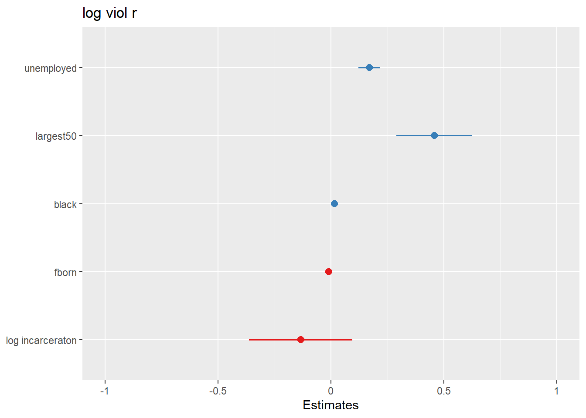
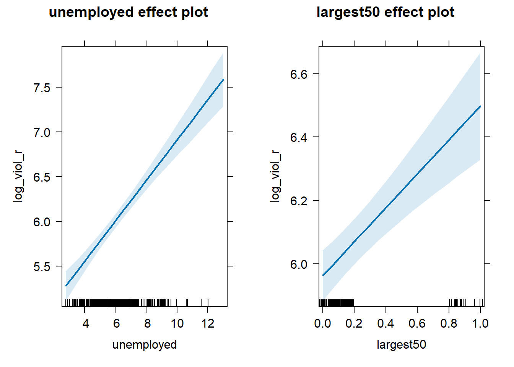
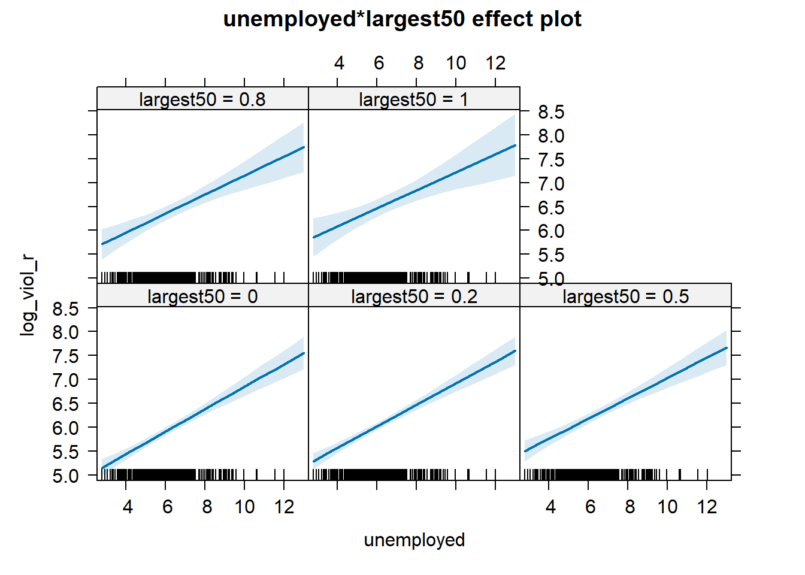
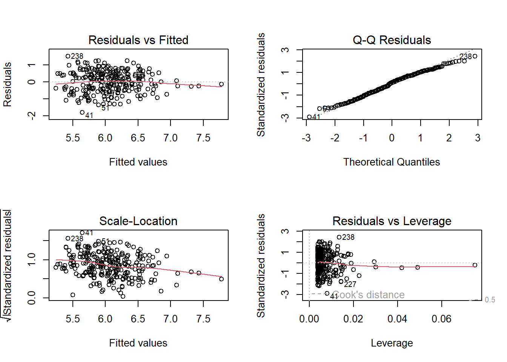
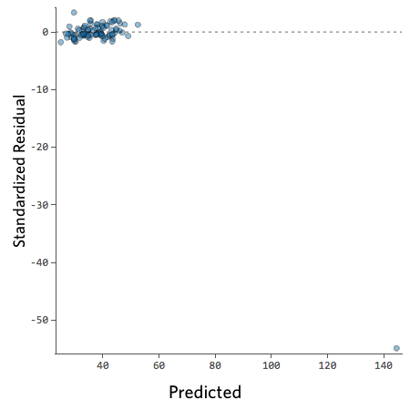
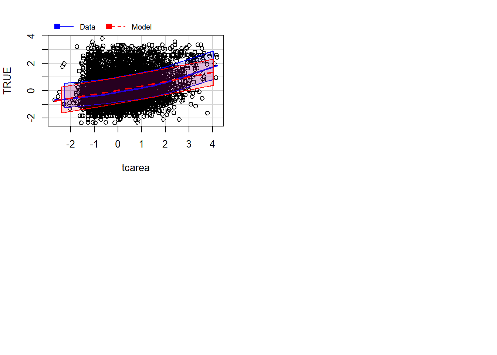

# Regression II

## Motivating multiple regression

So we have seen that our models with just one predictor are not terribly powerful. Partly that's due to the fact that they are not properly specified, they do not include a solid set of good predictor variables that can help us to explain variation in our response variable. We can build better models by expanding the number of predictors (although keep in mind you should also aim to build models as parsimonious as possible).

Another reason why it is important to think about additional variables in your model is to control for spurious correlations (although here you may also want to use your common sense when selecting your variables!). You must have heard before that correlation does not equal causation. Just because two things are associated we cannot assume that one is the cause for the other. Typically we see how the pilots switch the secure the belt button when there is turbulence. These two things are associated, they tend to come together. But the pilots are not causing the turbulences by pressing a switch! The world is full of **spurious correlations**, associations between two variables that should not be taking too seriously. You can explore a few [here](http://tylervigen.com/). It's funny. 

Looking only at covariation between pair of variables can be misleading. It may lead you to conclude that a relationship is more important than it really is. This is no trivial matter, but one of the most important ones we confront in research and policy[^11]. 

It's not an exaggeration to say that most quantitative explanatory research is about trying to control for the presence of **confounders**, variables that may explain explain away observed associations. Think about any criminology question: Does marriage reduces crime? Or is it that people that get married are different from those that don't (and are those pre-existing differences that are associated with less crime)? Do gangs lead to more crime? Or is it that young people that join gangs are more likely to be offenders to start with? Are the police being racist when they stop and search more members of ethnic minorities? Or is it that there are other factors (i.e., offending, area of residence, time spent in the street) that, once controlled, would mean there is no ethnic dis-proportionality in stop and searches? Does a particular program reduces crime? Or is the observed change due to something else?

These things also matter for policy. Wilson and Kelling, for example, argued that signs of incivility (or antisocial behaviour) in a community lead to more serious forms of crime later on as people withdraw to the safety of their homes when they see those signs of incivilities and this leads to a reduction in informal mechanisms of social control. All the policies to tackle antisocial behaviour in this country are very much informed by this model and were heavily influenced by broken windows theory.

But is the model right? Sampson and Raudenbush argue it is not entirely correct. They argue, and tried to show, that there are other confounding (poverty, collective efficacy) factors that explain the association of signs of incivility and more serious crime. In other words, the reason why you see antisocial behaviour in the same communities that you see crime is because other structural factors explain both of those outcomes. They also argue that perceptions of antisocial behaviour are not just produced by observed antisocial behaviour but also by stereotypes about social class and race. If you believe them, then the policy implications are that only tackling antisocial behaviour won't help you to reduce crime (as Wilson and Kelling have argued) . So as you can see this stuff matters for policy not just for theory. 

Multiple regression is one way of checking the relevance of competing explanations. You could set up a model where you try to predict crime levels with an indicator of broken windows and an indicator of structural disadvantage. If after controlling for structural disadvantage you see that the regression coefficient for broken windows is still significant you may be onto something, particularly if the estimated effect is still large. If, on the other hand, the t test for the regression coefficient of your broken windows variable is no longer significant, then you may be tempted to think that perhaps Sampson and Raudenbush were onto something. 

## Fitting and interpreting a multiple regression model

It could not be any easier to fit a multiple regression model. You simply modify the formula in the `lm()` function by adding terms for the additional inputs.


```r
data_url <- "https://dataverse.harvard.edu/api/access/datafile/:persistentId?persistentId=doi:10.7910/DVN/46WIH0/ARS2VS"
sharkey <- read.table(url(data_url), sep = '\t',header = T)
library(dplyr)
```

```
## 
## Attaching package: 'dplyr'
```

```
## The following objects are masked from 'package:stats':
## 
##     filter, lag
```

```
## The following objects are masked from 'package:base':
## 
##     intersect, setdiff, setequal, union
```

```r
df <- filter(sharkey, year == "2012")
df <- select(df, place_name, state_name, viol_r, black, lesshs, unemployed, fborn, incarceration, log_incarceraton, swornftime_r, log_viol_r, largest50)
fit_3 <- lm(log_viol_r ~ unemployed + largest50, data=df)
summary(fit_3)
```

```
## 
## Call:
## lm(formula = log_viol_r ~ unemployed + largest50, data = df)
## 
## Residuals:
##     Min      1Q  Median      3Q     Max 
## -1.7338 -0.4047 -0.0189  0.4531  1.5726 
## 
## Coefficients:
##             Estimate Std. Error t value Pr(>|t|)    
## (Intercept)  4.54871    0.14101  32.258  < 2e-16 ***
## unemployed   0.22625    0.02186  10.351  < 2e-16 ***
## largest50    0.53495    0.09476   5.645 4.29e-08 ***
## ---
## Signif. codes:  0 '***' 0.001 '**' 0.01 '*' 0.05 '.' 0.1 ' ' 1
## 
## Residual standard error: 0.5915 on 261 degrees of freedom
## Multiple R-squared:  0.3657,	Adjusted R-squared:  0.3608 
## F-statistic: 75.23 on 2 and 261 DF,  p-value: < 2.2e-16
```

With more than one input, you need to ask yourself whether all of the regression coefficients are zero. This hypothesis is tested with a F test, similar to the one we described when describing ANOVA (in fact ANOVA is just a special case of regression). Again we are assuming the residuals are normally distributed, though with large samples the F statistics approximates the F distribution.

You see the F test printed at the bottom of the summary output and the associated p value, which in this case is way below the conventional .05 that we use to declare statistical significance and reject the null hypothesis. At least one of our inputs must be related to our response variable. 

Notice that the table printed also reports a t test for each of the predictors. These are testing whether each of these predictors is associated with the response variable when adjusting for the other variables in the model. They report the "partial effect of adding that variable to the model" (James et al. 2014: 77). In this case we can see that both variables seem to be significantly associated with the response variable.

If we look at the r squared we can now see that it is higher than before. This quantity, r squared, will always increase as a consequence of adding new variables, even if the new variables added are weakly related to the response variable. But the increase we are observing suggests that adding these two variables results in a substantially improvement to our previous model.

We see that the coefficients for the predictors change very little, it goes down a bit for *unemployed* and it goes down somehow more for *largest50*. **But their interpretation now changes**. A common interpretation is that now the regression for each variable tells you about changes in Y related to that variable **when the other variables in the model are held constant**. So, for example, you could say the coefficient for *unemployed* represents the increase in the log of the violence rate for every one-unit increase in the measure of unemployment *when holding all other variables in the model constant* (in this case that refers to holding constant *largest50*). But this terminology can be a bit misleading.

Other interpretations are also possible and are more generalizable. Gelman and Hill (2007: p. 34) emphasise what they call the *predictive interpretation* that considers how "the outcome variable differs, on average, when comparing two groups of units that differ by 1 in the relevant predictor while being identical in all the other predictors". So [if you're regressing y on u and v, the coefficient of u is the average difference in y per difference in u, comparing pairs of items that differ in u but are identical in v](http://andrewgelman.com/2013/01/05/understanding-regression-models-and-regression-coefficients/).

So, for example, in this case we could say that comparing respondents who have the same level of unemployment but who differed in whether they are one of the largest cities or not, the model predicts a expected difference of .53 in their violent crime measure. And that cities with the same size category, but that differ by one percent point in unemployment, we would expect to see a difference of 0.23 in their violent crime measure. So we are interpreting the regression slopes **as comparisons of observation that differ in one predictor while being at the same levels of the other predictors**.

As you can see, interpreting regression coefficients can be kind of tricky[^12]. The relationship between the response y and any one explanatory variable can change greatly depending on what other explanatory variables are present in the model. 

For example, if you contrast this model with the one we run with only *largest50* as a predictor you will notice the intercept has changed. You can no longer read the intercept as the mean value of violence for smaller cities. *Adding predictors to the model changes their meaning*. Now the intercept index the value of violence for smaller cities *that, in addition, score 0 in unemployed*. In this case you don't have cases that meet this condition (equal zero in all your predictors). More often than not, then, there is not much value in bothering to interpret the intercept because if does not represent a real observation in your sample.

Something you need to be particularly careful about is to interpret the coefficients in a causal manner.  At least your data come from an experiment this is unlikely to be helpful. With observational data regression coefficients should not be read as indexing causal relations. This sort of textbook warning is, however, often neglectfully ignored by professional researchers. Often authors carefully draw sharp distinctions between causal and correlational claims when discussing their data analysis, but then interpret the correlational patterns in a totally causal way in their conclusion section. This is what is called the [causation](http://junkcharts.typepad.com/numbersruleyourworld/2012/07/the-causation-creep.html) or [causal](http://www.carlislerainey.com/2012/12/05/another-example-of-causal-creep/) creep. Beware. Don't do this tempting as it may be.

Comparing the simple models with this more complex model we could say that adjusting for *largest50* does not change much the impact of *unemployed* in violence and almost the same can be said about the effect of *largest50* when holding *unemployed* fixed. 

## Presenting your regression results.

Communicating your results in a clear manner is incredibly important. We have seen the tabular results produced by R. If you want to use them in a paper you may need to do some tidying up of those results. There are a number of packages (`textreg`, `stargazer`) that automatise that process. They take your `lm` objects and produce tables that you can put straight away in your reports or papers. One popular trend in presenting results is the **coefficient plot** as an alternative to the table of regression coefficients. There are various ways of producing coefficient plots with R for a variety of models. See [here](http://www.carlislerainey.com/2012/06/30/coefficient-plots-in-r/) and [here](http://www.carlislerainey.com/2012/07/03/an-improvement-to-coefficient-plots/), for example.

We are going to use instead the `plot_model()` function of the `sjPlot` package, that makes it easier to produce this sort of plots. You can find a more detailed tutorial about this function [here](http://rpubs.com/sjPlot/sjplm). See below for an example:


```r
library(sjPlot)
```

```
## Warning: package 'sjPlot' was built under R version 4.3.3
```

Let's try with a more complex example:


```r
fit_4 <- lm(log_viol_r ~ unemployed + largest50 + black + fborn + log_incarceraton, data=df)
plot_model(fit_4)
```



<!-- Be advised to use these plots judiciously. There may be other sort of plots that may be [more appropriate](http://www.carlislerainey.com/2012/07/06/why-i-dont-like-coefficient-plots/) for what you want to communicate to your audience than the coefficient plot.-->

You can further customise this:


```r
plot_model(fit_4, title="Violence across cities")
```


What you see plotted here is the point estimates (the circles), the confidence intervals around those estimates (the longer the line the less precise the estimate), and the colours represent whether the effect is negative (red) or positive (blue). There are other packages that also provide similar functionality, like the `dotwhisker` package that you may want to explore, see more details [here](https://cran.r-project.org/web/packages/dotwhisker/vignettes/dotwhisker-vignette.html).

The `sjPlot` package also allows you to produce html tables for more professional presentation of your regression tables. For this we use the `tab_model()` function. This kind of tabulation may be particularly helpful for your final assignment.


```r
tab_model(fit_4)
```

<table style="border-collapse:collapse; border:none;">
<tr>
<th style="border-top: double; text-align:center; font-style:normal; font-weight:bold; padding:0.2cm;  text-align:left; ">&nbsp;</th>
<th colspan="3" style="border-top: double; text-align:center; font-style:normal; font-weight:bold; padding:0.2cm; ">log viol r</th>
</tr>
<tr>
<td style=" text-align:center; border-bottom:1px solid; font-style:italic; font-weight:normal;  text-align:left; ">Predictors</td>
<td style=" text-align:center; border-bottom:1px solid; font-style:italic; font-weight:normal;  ">Estimates</td>
<td style=" text-align:center; border-bottom:1px solid; font-style:italic; font-weight:normal;  ">CI</td>
<td style=" text-align:center; border-bottom:1px solid; font-style:italic; font-weight:normal;  ">p</td>
</tr>
<tr>
<td style=" padding:0.2cm; text-align:left; vertical-align:top; text-align:left; ">(Intercept)</td>
<td style=" padding:0.2cm; text-align:left; vertical-align:top; text-align:center;  ">5.65</td>
<td style=" padding:0.2cm; text-align:left; vertical-align:top; text-align:center;  ">4.19&nbsp;&ndash;&nbsp;7.12</td>
<td style=" padding:0.2cm; text-align:left; vertical-align:top; text-align:center;  "><strong>&lt;0.001</strong></td>
</tr>
<tr>
<td style=" padding:0.2cm; text-align:left; vertical-align:top; text-align:left; ">unemployed</td>
<td style=" padding:0.2cm; text-align:left; vertical-align:top; text-align:center;  ">0.17</td>
<td style=" padding:0.2cm; text-align:left; vertical-align:top; text-align:center;  ">0.12&nbsp;&ndash;&nbsp;0.22</td>
<td style=" padding:0.2cm; text-align:left; vertical-align:top; text-align:center;  "><strong>&lt;0.001</strong></td>
</tr>
<tr>
<td style=" padding:0.2cm; text-align:left; vertical-align:top; text-align:left; ">largest50</td>
<td style=" padding:0.2cm; text-align:left; vertical-align:top; text-align:center;  ">0.46</td>
<td style=" padding:0.2cm; text-align:left; vertical-align:top; text-align:center;  ">0.29&nbsp;&ndash;&nbsp;0.63</td>
<td style=" padding:0.2cm; text-align:left; vertical-align:top; text-align:center;  "><strong>&lt;0.001</strong></td>
</tr>
<tr>
<td style=" padding:0.2cm; text-align:left; vertical-align:top; text-align:left; ">black</td>
<td style=" padding:0.2cm; text-align:left; vertical-align:top; text-align:center;  ">0.02</td>
<td style=" padding:0.2cm; text-align:left; vertical-align:top; text-align:center;  ">0.01&nbsp;&ndash;&nbsp;0.02</td>
<td style=" padding:0.2cm; text-align:left; vertical-align:top; text-align:center;  "><strong>&lt;0.001</strong></td>
</tr>
<tr>
<td style=" padding:0.2cm; text-align:left; vertical-align:top; text-align:left; ">fborn</td>
<td style=" padding:0.2cm; text-align:left; vertical-align:top; text-align:center;  ">&#45;0.01</td>
<td style=" padding:0.2cm; text-align:left; vertical-align:top; text-align:center;  ">&#45;0.02&nbsp;&ndash;&nbsp;-0.00</td>
<td style=" padding:0.2cm; text-align:left; vertical-align:top; text-align:center;  "><strong>0.001</strong></td>
</tr>
<tr>
<td style=" padding:0.2cm; text-align:left; vertical-align:top; text-align:left; ">log incarceraton</td>
<td style=" padding:0.2cm; text-align:left; vertical-align:top; text-align:center;  ">&#45;0.13</td>
<td style=" padding:0.2cm; text-align:left; vertical-align:top; text-align:center;  ">&#45;0.36&nbsp;&ndash;&nbsp;0.10</td>
<td style=" padding:0.2cm; text-align:left; vertical-align:top; text-align:center;  ">0.251</td>
</tr>
<tr>
<td style=" padding:0.2cm; text-align:left; vertical-align:top; text-align:left; padding-top:0.1cm; padding-bottom:0.1cm; border-top:1px solid;">Observations</td>
<td style=" padding:0.2cm; text-align:left; vertical-align:top; padding-top:0.1cm; padding-bottom:0.1cm; text-align:left; border-top:1px solid;" colspan="3">263</td>
</tr>
<tr>
<td style=" padding:0.2cm; text-align:left; vertical-align:top; text-align:left; padding-top:0.1cm; padding-bottom:0.1cm;">R<sup>2</sup> / R<sup>2</sup> adjusted</td>
<td style=" padding:0.2cm; text-align:left; vertical-align:top; padding-top:0.1cm; padding-bottom:0.1cm; text-align:left;" colspan="3">0.508 / 0.499</td>
</tr>

</table>

As before you can further customise this table. Let's change for example the name that is displayed for the dependent variable.


```r
tab_model(fit_4, dv.labels = "Violence rate (log)")
```

<table style="border-collapse:collapse; border:none;">
<tr>
<th style="border-top: double; text-align:center; font-style:normal; font-weight:bold; padding:0.2cm;  text-align:left; ">&nbsp;</th>
<th colspan="3" style="border-top: double; text-align:center; font-style:normal; font-weight:bold; padding:0.2cm; ">Violence rate (log)</th>
</tr>
<tr>
<td style=" text-align:center; border-bottom:1px solid; font-style:italic; font-weight:normal;  text-align:left; ">Predictors</td>
<td style=" text-align:center; border-bottom:1px solid; font-style:italic; font-weight:normal;  ">Estimates</td>
<td style=" text-align:center; border-bottom:1px solid; font-style:italic; font-weight:normal;  ">CI</td>
<td style=" text-align:center; border-bottom:1px solid; font-style:italic; font-weight:normal;  ">p</td>
</tr>
<tr>
<td style=" padding:0.2cm; text-align:left; vertical-align:top; text-align:left; ">(Intercept)</td>
<td style=" padding:0.2cm; text-align:left; vertical-align:top; text-align:center;  ">5.65</td>
<td style=" padding:0.2cm; text-align:left; vertical-align:top; text-align:center;  ">4.19&nbsp;&ndash;&nbsp;7.12</td>
<td style=" padding:0.2cm; text-align:left; vertical-align:top; text-align:center;  "><strong>&lt;0.001</strong></td>
</tr>
<tr>
<td style=" padding:0.2cm; text-align:left; vertical-align:top; text-align:left; ">unemployed</td>
<td style=" padding:0.2cm; text-align:left; vertical-align:top; text-align:center;  ">0.17</td>
<td style=" padding:0.2cm; text-align:left; vertical-align:top; text-align:center;  ">0.12&nbsp;&ndash;&nbsp;0.22</td>
<td style=" padding:0.2cm; text-align:left; vertical-align:top; text-align:center;  "><strong>&lt;0.001</strong></td>
</tr>
<tr>
<td style=" padding:0.2cm; text-align:left; vertical-align:top; text-align:left; ">largest50</td>
<td style=" padding:0.2cm; text-align:left; vertical-align:top; text-align:center;  ">0.46</td>
<td style=" padding:0.2cm; text-align:left; vertical-align:top; text-align:center;  ">0.29&nbsp;&ndash;&nbsp;0.63</td>
<td style=" padding:0.2cm; text-align:left; vertical-align:top; text-align:center;  "><strong>&lt;0.001</strong></td>
</tr>
<tr>
<td style=" padding:0.2cm; text-align:left; vertical-align:top; text-align:left; ">black</td>
<td style=" padding:0.2cm; text-align:left; vertical-align:top; text-align:center;  ">0.02</td>
<td style=" padding:0.2cm; text-align:left; vertical-align:top; text-align:center;  ">0.01&nbsp;&ndash;&nbsp;0.02</td>
<td style=" padding:0.2cm; text-align:left; vertical-align:top; text-align:center;  "><strong>&lt;0.001</strong></td>
</tr>
<tr>
<td style=" padding:0.2cm; text-align:left; vertical-align:top; text-align:left; ">fborn</td>
<td style=" padding:0.2cm; text-align:left; vertical-align:top; text-align:center;  ">&#45;0.01</td>
<td style=" padding:0.2cm; text-align:left; vertical-align:top; text-align:center;  ">&#45;0.02&nbsp;&ndash;&nbsp;-0.00</td>
<td style=" padding:0.2cm; text-align:left; vertical-align:top; text-align:center;  "><strong>0.001</strong></td>
</tr>
<tr>
<td style=" padding:0.2cm; text-align:left; vertical-align:top; text-align:left; ">log incarceraton</td>
<td style=" padding:0.2cm; text-align:left; vertical-align:top; text-align:center;  ">&#45;0.13</td>
<td style=" padding:0.2cm; text-align:left; vertical-align:top; text-align:center;  ">&#45;0.36&nbsp;&ndash;&nbsp;0.10</td>
<td style=" padding:0.2cm; text-align:left; vertical-align:top; text-align:center;  ">0.251</td>
</tr>
<tr>
<td style=" padding:0.2cm; text-align:left; vertical-align:top; text-align:left; padding-top:0.1cm; padding-bottom:0.1cm; border-top:1px solid;">Observations</td>
<td style=" padding:0.2cm; text-align:left; vertical-align:top; padding-top:0.1cm; padding-bottom:0.1cm; text-align:left; border-top:1px solid;" colspan="3">263</td>
</tr>
<tr>
<td style=" padding:0.2cm; text-align:left; vertical-align:top; text-align:left; padding-top:0.1cm; padding-bottom:0.1cm;">R<sup>2</sup> / R<sup>2</sup> adjusted</td>
<td style=" padding:0.2cm; text-align:left; vertical-align:top; padding-top:0.1cm; padding-bottom:0.1cm; text-align:left;" colspan="3">0.508 / 0.499</td>
</tr>

</table>

Or you could change the labels for the independent variables:


```r
tab_model(fit_4, pred.labels = c("(Intercept)", "Percent unemployment", "Largest cities (Yes)", "Percent black", "Percent foreign born", "Incarceration rate (log)"), dv.labels = "Violence rate (log)")
```

<table style="border-collapse:collapse; border:none;">
<tr>
<th style="border-top: double; text-align:center; font-style:normal; font-weight:bold; padding:0.2cm;  text-align:left; ">&nbsp;</th>
<th colspan="3" style="border-top: double; text-align:center; font-style:normal; font-weight:bold; padding:0.2cm; ">Violence rate (log)</th>
</tr>
<tr>
<td style=" text-align:center; border-bottom:1px solid; font-style:italic; font-weight:normal;  text-align:left; ">Predictors</td>
<td style=" text-align:center; border-bottom:1px solid; font-style:italic; font-weight:normal;  ">Estimates</td>
<td style=" text-align:center; border-bottom:1px solid; font-style:italic; font-weight:normal;  ">CI</td>
<td style=" text-align:center; border-bottom:1px solid; font-style:italic; font-weight:normal;  ">p</td>
</tr>
<tr>
<td style=" padding:0.2cm; text-align:left; vertical-align:top; text-align:left; ">(Intercept)</td>
<td style=" padding:0.2cm; text-align:left; vertical-align:top; text-align:center;  ">5.65</td>
<td style=" padding:0.2cm; text-align:left; vertical-align:top; text-align:center;  ">4.19&nbsp;&ndash;&nbsp;7.12</td>
<td style=" padding:0.2cm; text-align:left; vertical-align:top; text-align:center;  "><strong>&lt;0.001</strong></td>
</tr>
<tr>
<td style=" padding:0.2cm; text-align:left; vertical-align:top; text-align:left; ">Percent unemployment</td>
<td style=" padding:0.2cm; text-align:left; vertical-align:top; text-align:center;  ">0.17</td>
<td style=" padding:0.2cm; text-align:left; vertical-align:top; text-align:center;  ">0.12&nbsp;&ndash;&nbsp;0.22</td>
<td style=" padding:0.2cm; text-align:left; vertical-align:top; text-align:center;  "><strong>&lt;0.001</strong></td>
</tr>
<tr>
<td style=" padding:0.2cm; text-align:left; vertical-align:top; text-align:left; ">Largest cities (Yes)</td>
<td style=" padding:0.2cm; text-align:left; vertical-align:top; text-align:center;  ">0.46</td>
<td style=" padding:0.2cm; text-align:left; vertical-align:top; text-align:center;  ">0.29&nbsp;&ndash;&nbsp;0.63</td>
<td style=" padding:0.2cm; text-align:left; vertical-align:top; text-align:center;  "><strong>&lt;0.001</strong></td>
</tr>
<tr>
<td style=" padding:0.2cm; text-align:left; vertical-align:top; text-align:left; ">Percent black</td>
<td style=" padding:0.2cm; text-align:left; vertical-align:top; text-align:center;  ">0.02</td>
<td style=" padding:0.2cm; text-align:left; vertical-align:top; text-align:center;  ">0.01&nbsp;&ndash;&nbsp;0.02</td>
<td style=" padding:0.2cm; text-align:left; vertical-align:top; text-align:center;  "><strong>&lt;0.001</strong></td>
</tr>
<tr>
<td style=" padding:0.2cm; text-align:left; vertical-align:top; text-align:left; ">Percent foreign born</td>
<td style=" padding:0.2cm; text-align:left; vertical-align:top; text-align:center;  ">&#45;0.01</td>
<td style=" padding:0.2cm; text-align:left; vertical-align:top; text-align:center;  ">&#45;0.02&nbsp;&ndash;&nbsp;-0.00</td>
<td style=" padding:0.2cm; text-align:left; vertical-align:top; text-align:center;  "><strong>0.001</strong></td>
</tr>
<tr>
<td style=" padding:0.2cm; text-align:left; vertical-align:top; text-align:left; ">Incarceration rate (log)</td>
<td style=" padding:0.2cm; text-align:left; vertical-align:top; text-align:center;  ">&#45;0.13</td>
<td style=" padding:0.2cm; text-align:left; vertical-align:top; text-align:center;  ">&#45;0.36&nbsp;&ndash;&nbsp;0.10</td>
<td style=" padding:0.2cm; text-align:left; vertical-align:top; text-align:center;  ">0.251</td>
</tr>
<tr>
<td style=" padding:0.2cm; text-align:left; vertical-align:top; text-align:left; padding-top:0.1cm; padding-bottom:0.1cm; border-top:1px solid;">Observations</td>
<td style=" padding:0.2cm; text-align:left; vertical-align:top; padding-top:0.1cm; padding-bottom:0.1cm; text-align:left; border-top:1px solid;" colspan="3">263</td>
</tr>
<tr>
<td style=" padding:0.2cm; text-align:left; vertical-align:top; text-align:left; padding-top:0.1cm; padding-bottom:0.1cm;">R<sup>2</sup> / R<sup>2</sup> adjusted</td>
<td style=" padding:0.2cm; text-align:left; vertical-align:top; padding-top:0.1cm; padding-bottom:0.1cm; text-align:left;" colspan="3">0.508 / 0.499</td>
</tr>

</table>

Visual display of the effects of the variables in the model are particularly helpful. The `effects` package allows us to produce plots to visualise these relationships (when adjusting for the other variables in the model). Here's an example going back to our model fit_3 which contained unemployment and the dummy for large cities as predictor variables:


```r
library(effects)
```

```
## Warning: package 'effects' was built under R version 4.3.3
```

```
## Loading required package: carData
```

```
## lattice theme set by effectsTheme()
## See ?effectsTheme for details.
```

```r
plot(allEffects(fit_3), ask=FALSE)
```



Notice that the line has a confidence interval drawn around it (to reflect the likely impact of sampling variation) and that the predicted means for smaller and largest cities (when controlling for unemployment) also have a confidence interval.

## Rescaling input variables to assist interpretation

The interpretation or regression coefficients is sensitive to the scale of measurement of the predictors. This means one cannot compare the magnitude of the coefficients to compare the relevance of variables to predict the response variable. Let's look at the more recent model, how can we tell what predictors have a stronger effect?


```r
summary(fit_4)
```

```
## 
## Call:
## lm(formula = log_viol_r ~ unemployed + largest50 + black + fborn + 
##     log_incarceraton, data = df)
## 
## Residuals:
##     Min      1Q  Median      3Q     Max 
## -1.4546 -0.3523 -0.0009  0.3827  1.5771 
## 
## Coefficients:
##                   Estimate Std. Error t value Pr(>|t|)    
## (Intercept)       5.654459   0.743725   7.603 5.44e-13 ***
## unemployed        0.169895   0.024496   6.936 3.27e-11 ***
## largest50         0.457226   0.085311   5.360 1.86e-07 ***
## black             0.015003   0.002678   5.602 5.44e-08 ***
## fborn            -0.010414   0.003101  -3.358 0.000904 ***
## log_incarceraton -0.133946   0.116461  -1.150 0.251158    
## ---
## Signif. codes:  0 '***' 0.001 '**' 0.01 '*' 0.05 '.' 0.1 ' ' 1
## 
## Residual standard error: 0.523 on 257 degrees of freedom
##   (1 observation deleted due to missingness)
## Multiple R-squared:  0.5082,	Adjusted R-squared:  0.4987 
## F-statistic: 53.12 on 5 and 257 DF,  p-value: < 2.2e-16
```

We just cannot. One way of dealing with this is by rescaling the input variables. A common method involves subtracting the mean and dividing by the standard deviation of each numerical input. The coefficients in these models is the expected difference in the response variable, comparing units that differ by one standard deviation in the predictor while adjusting for other predictors in the model. 

Instead, [Gelman (2008)](http://www.stat.columbia.edu/~gelman/research/published/standardizing7.pdf) has proposed dividing each numeric variables *by two times its standard deviation*, so that the generic comparison is with inputs equal to plus/minus one standard deviation. As Gelman explains the resulting coefficients are then comparable to untransformed binary predictors. The implementation of this approach in the `arm` package subtract the mean of each binary input while it subtract the mean and divide by two standard deviations for every numeric input.

The way we would obtain these rescaled inputs uses the `standardize()` function of the `arm` package, that takes as an argument the name of the stored fit model.


```r
library(arm)
standardize(fit_4)
```

```
## 
## Call:
## lm(formula = log_viol_r ~ z.unemployed + c.largest50 + z.black + 
##     z.fborn + z.log_incarceraton, data = df)
## 
## Coefficients:
##        (Intercept)        z.unemployed         c.largest50             z.black  
##            6.06080             0.56923             0.45723             0.49188  
##            z.fborn  z.log_incarceraton  
##           -0.24890            -0.08133
```

Notice the main change affects the numerical predictors. The unstandardised coefficients are influenced by the degree of variability in your predictors, which means that typically they will be larger for your binary inputs. With unstandardised coefficients you are comparing complete change in one variable (whether one is a large city or not) with one-unit changes in your numerical variable, which may not amount to much change. So, by putting in a comparable scale, you avoid this problem.

Standardising in the way described here will help you to make fairer comparisons. This standardised coefficients are comparable in a way that the unstandardised coefficients are not. We can now see what inputs have a comparatively stronger effect. It is very important to realise, though, that one **should not** compare standardised coefficients *across different models*.

## Testing conditional hypothesis: interactions

In the social sciences there is a great interest in what are called conditional hypothesis or interactions. Many of our theories do not assume simply **additive effects** but **multiplicative effects**.For example, [Wikstrom and his colleagues (2011)](http://euc.sagepub.com/content/8/5/401.short) suggest that the threat of punishment only affects the probability of involvement on crime for those that have a propensity to offend but are largely irrelevant for people who do not have this propensity. Or you may think that a particular crime prevention programme may work in some environments but not in others. The interest in this kind of conditional hypothesis is growing.

One of the assumptions of the regression model is that the relationship between the response variable and your predictors is additive. That is, if you have two predictors `x1` and `x2`. Regression assumes that the effect of `x1` on `y` is the same at all levels of `x2`. If that is not the case, you are then violating one of the assumptions of regression. This is in fact one of the most important assumptions of regression, even if researchers often overlook it.

One way of extending our model to accommodate for interaction effects is to add additional terms to our model, a third predictor `x3`, where `x3` is simply the product of multiplying `x1` by `x2`. Notice we keep a term for each of the **main effects** (the original predictors) as well as a new term for the interaction effect. "Analysts should include all constitutive terms when specifying multiplicative interaction models except in very rare circumstances" (Brambor et al., 2006: 66).

How do we do this in R? One way is to use the following notation in the formula argument. Notice how we have added a third term `unemployed:largest50`, which is asking R to test the conditional hypothesis that the size of the cities may have a different impact on violent crime rate.


```r
fit_5 <- lm(log_viol_r ~ unemployed + largest50 + unemployed:largest50 , data=df)
# which is equivalent to: 
# fit_5 <- lm(log_viol_r ~ unemployed * largest50, data=BCS0708)
summary(fit_5)
```

```
## 
## Call:
## lm(formula = log_viol_r ~ unemployed + largest50 + unemployed:largest50, 
##     data = df)
## 
## Residuals:
##      Min       1Q   Median       3Q      Max 
## -1.71844 -0.41330 -0.02989  0.45583  1.59625 
## 
## Coefficients:
##                      Estimate Std. Error t value Pr(>|t|)    
## (Intercept)           4.49267    0.15636  28.734   <2e-16 ***
## unemployed            0.23532    0.02443   9.630   <2e-16 ***
## largest50             0.83064    0.36794   2.258   0.0248 *  
## unemployed:largest50 -0.04557    0.05479  -0.832   0.4063    
## ---
## Signif. codes:  0 '***' 0.001 '**' 0.01 '*' 0.05 '.' 0.1 ' ' 1
## 
## Residual standard error: 0.5919 on 260 degrees of freedom
## Multiple R-squared:  0.3673,	Adjusted R-squared:   0.36 
## F-statistic: 50.32 on 3 and 260 DF,  p-value: < 2.2e-16
```

You see here that essentially you have only two inputs (the size of the city and unemployment) but several regression coefficients. Gelman and Hill (2007) suggest reserving the term input for the variables encoding the information and to use the term predictor to refer to each of the terms in the model. So here we have two inputs and four predictors (one for the constant term, one for unemployment, another for the largest 50 dummy, and a final one for the interaction effect).

In this case the test for the interaction effect is non-significant, which suggests there isn't such an interaction. The R squared barely changes. Let's visualise the results with the `effects` package:


```r
plot(allEffects(fit_5), ask=FALSE)
```



Notice that essentially what we are doing is running two regression lines and testing whether the slope is different for the two groups. The intercept is different, we know that largest cities are more violent, but what we are testing here is whether violence goes up in a steeper fashion (and in the same direction) for one or the other group as unemployment goes up. We see that's not the case here. The estimated lines are almost parallel.

A word of warning, the moment you introduce an interaction effect the meaning of the coefficients for the other predictors changes (what it is often referred as to the "main effects" as opposed to the interaction effect). You cannot retain the interpretation we introduced earlier. Now, for example, the coefficient for the *largest50* variable relates the marginal effect of this variable when *unemployment* equals zero. The typical table of results helps you to understand whether the effects are significant but offers little of interest that will help you to meaningfully interpret what the effects are. For this is better you use some of the graphical displays we have covered.

Essentially what happens is that the regression coefficients that get printed are interpretable only for certain groups. So now:

+ The intercept still represents the predicted score of violence for the smaller cities and have a score of 0 in unemployment (as before).

+ The coefficient of the *largest50Yes* predictor now can be thought of as the difference between the predicted score of violence for small cities *that have a score of 0 in unemployment* and largest cities *that have a score of 0 in unemployment*.

+ The coefficient of *unemployed* now becomes the comparison of mean violence *for small cities* who differ by one point in unemployment.

+ The coefficient for the interaction term represents the difference in the slope for *unemployed* comparing smaller and largest cities, the difference in the slope of the two lines that we visualised above.

Models with interaction terms are too often misinterpreted. We strongly recommend you read this piece by [Brambor et al (2005)](https://files.nyu.edu/mrg217/public/pa_final.pdf) to understand some of the issues involved. When discussing logistic regression we will return to this and will consider tricks to ease the interpretation.

Equally, [John Fox (2003)](http://www.jstatsoft.org/v08/i15/paper) piece on the `effects` package goes to much more detail that we can here to explain the logic and some of the options that are available when producing plots to show interactions with this package. You may also want to have a look at the newer `interactions` package [here](https://interactions.jacob-long.com/index.html).

## Regression assumptions 

Previously we covered assumptions made by various statistical tests. The regression model also makes assumptions of its own. In fact, there are so many that we could spend an entire class discussing them. Gelman and Hill (2007) point out that the most important regression assumptions by decreasing order of importance are:

+ **Validity**. The data should be appropriate for the question that you are trying to answer:

> "Optimally, this means that the outcome measure should accurately reflect the phenomenon of interest, the model should include all relevant predictors, and the model should generalize to all cases to which it will be applied... Data used in empirical research rarely meet all (if any) of these criteria precisely. However, keeping these goals in mind can help you be precise about the types of questions you can and cannot answer reliably"

+ **Additiviy and linearity**. These are the most important mathematical assumptions of the model. We already talked about additivity in the previous section and discussed how you can include interaction effects in your models if the additivity assumption is violated. We discuss problems with non-linearities  as well using the example of the age-crime-curve. If the relationship is non linear (e.g, it is curvilinear) predicted values will be wrong in a biased manner, meaning that predicted values will systematically miss the true pattern of the mean of y (as related to the x-variables).


+ **Independence of errors**. Regression assumes that the errors from the prediction line (or hyperplane for multiple regression) are independent. If there is dependency between the observations (you are assessing change across the same units, working with spatial units, or with units that are somehow grouped such as students from the same class), you may have to use models that are more appropriate (e.g., multilevel models, spatial regression, etc.).

+ **Equal variances of errors**. When the variance of the residuals is unequal, you may need different estimation methods. This is, nonetheless, considered a minor issue. There is a small effect on the validity of t-test and F-test results, but generally regression inferences are robust with regard to the variance issue.

+ **Normality of errors**. The residuals should be normally distributed. Gelman and Hill (2007: 46) discuss this as the least important of the assumptions and in fact "do *not* recommend diagnostics of the normality of the regression residuals". If the errors do not have a normal distribution, it usually is not particularly serious. Regression inferences tend to be robust with respect to normality (or nonnormality of the errors). In practice, the residuals may appear to be nonnormal when the wrong regression equation has been used. So, we will show you how to inspect normality of the residuals not because this is a problem on itself, but because it may be give you further evidence that there is some other problem with the model you are applying to your data.

Apart from this, it is convenient to diagnose multicollinearity (this affects interpretation) and influential observations.

So these are the assumptions of linear regression. 

In this section we can go through very quickly how to test for some of them using visuals. While finding that some of the assumptions are violated do not necessarily mean that you have to scrap your model, it is important to use these diagnostics to illustrate that you have considered what the possible issues with your model is, and if you find any serious issues that you address them. 

In r, we can use the `plot()` function on our output lm object to look through some diagnostics. This gives us 4 plots, so to show them all, we'll use the code `par(mfrow = c(2, 2))` to split our plot window into 4 panes (remember to set back, run `par(mfrow = c(1, 1))`). For example, let's return to `fit_1`, our very first model. 


```r
fit_1 <- lm(log_viol_r ~ unemployed, data = df)
par(mfrow = c(2, 2))
plot(fit_1)
```




The 4 plots we get are 

- **Residuals vs Fitted**. Used to check the linear relationship assumptions. A horizontal line, without distinct patterns is an indication for a linear relationship, what is good.
- **Normal Q-Q**. Used to examine whether the residuals are normally distributed. It’s good if residuals points follow the straight dashed line.
- **Scale-Location (or Spread-Location)**. Used to check the homogeneity of variance of the residuals (homoscedasticity). Horizontal line with equally spread points is a good indication of homoscedasticity. This is not the case in our example, where we have a bit of a heteroscedasticity problem (remember funnel-shape from the video!).
- **Residuals vs Leverage**. Used to identify influential cases, that is extreme values that might influence the regression results when included or excluded from the analysis. 

We can also run some tests to confirm what we see in the plots. 

For example, to test for heteroskedasticity (unequal variance in our residuals) we can run a Breusch-Pagan test from the `lmtest` package or a NCV test from the `car` package. 


```r
lmtest::bptest(fit_1)  # Breusch-Pagan test
```

```
## 
## 	studentized Breusch-Pagan test
## 
## data:  fit_1
## BP = 11.498, df = 1, p-value = 0.0006965
```

```r
car::ncvTest(fit_1) # NCV test
```

```
## Non-constant Variance Score Test 
## Variance formula: ~ fitted.values 
## Chisquare = 8.270574, Df = 1, p = 0.0040293
```


Both these test have a p-value less that a significance level of 0.05, therefore we can reject the null hypothesis that the variance of the residuals is constant and infer that heteroscedasticity is indeed present, thereby confirming our graphical inference.

For testing whether the residuals violate the normality assumption, we can use the  Anderson-Darling test for the composite hypothesis of normality with the `ad.test()` function in the `nortest` package.


```r
nortest::ad.test(fit_1$residuals)
```

```
## 
## 	Anderson-Darling normality test
## 
## data:  fit_1$residuals
## A = 1.0488, p-value = 0.009182
```

For the purposes of this module, it is enough that you understand that these assumptions of regression exist, what they mean, and how you might test for them. For some of them, for example additivity, we discussed above some ways to address this (look at the section on interaction effects). For others, it is just important to keep in mind when these might be violated, and raise these as possible limitations in your ability to rely on the conclusions you draw from your results. 

## Plotting residuals

Many of the assumptions can be tested first by having a look at your residuals. Remember, the residuals are the 'error' in your model. In previous weeks we defined the ordinary residuals as the difference between the observed and the predicted values, the distance between the points in your scatterplot and the regression line. Apart from the ordinary residuals, most software computes other forms of closely related ones: the standardised, the studentised, and the Pearson residuals. 

The raw residuals are just the difference between the observed and the predicted, the other three are ways of normalising this measure, so you can compare what is large, what is small, etc. For example, with the standardized residuals, you essentailly calculate z scores, and given a normal distribution of the standardized residuals, the mean is 0, and the standard deviations is 1. 
Pearson residuas are raw residuals divided by the standard error of the observed value. 
Studentized resiruals (also called standardized pearson residuals) are raw residuals divided by their standard error. 
You can read more about these [here](https://r-forge.r-project.org/scm/viewvc.php/*checkout*/pkg/BinomTools/inst/ResidualsGLM.pdf?revision=6&root=binomtools&pathrev=6). 

Plotting these residuals versus the fitted values and versus each of the predictors is the most basic way of diagnosing problems with your regression model. However, as Fox and Weisberg (2011) emphasise 
> this "is useful for revealing problems but less useful for determining the exact nature of the problem" and consequently one needs "other diagnostic graphs to suggest improvements to the model".

In the previous session we fitted the model `tcviolent ~ tcarea + sex`. This was our `fit_3` model during that session. You may have to run the model again if you do not have it in your global environment.

To obtain the basic residual plots for this model we use the `residualPlots()` function of the `car` package.


```r
library(car)
```

```
## 
## Attaching package: 'car'
```

```
## The following object is masked from 'package:arm':
## 
##     logit
```

```
## The following object is masked from 'package:dplyr':
## 
##     recode
```

```r
BCS0708<-read.csv("https://raw.githubusercontent.com/eonk/dar_book/main/datasets/BCS0708.csv")

fit_3 <- lm(tcviolent ~ tcarea + sex, data=BCS0708)
residualPlots(fit_3)
```


```
##            Test stat Pr(>|Test stat|)    
## tcarea        6.2571        4.123e-10 ***
## sex                                      
## Tukey test    4.6065        4.094e-06 ***
## ---
## Signif. codes:  0 '***' 0.001 '**' 0.01 '*' 0.05 '.' 0.1 ' ' 1
```
This function will produce plots of the Pearson residuals versus each of the predictors in the model and versus the fitted values.

#### Residuals vs predicted values
The most important of this is the last one, *the scatterplot of the Pearson residuals versus the fitted values*. In these plots one has to pay particular attention to nonlinear trends, trends in variations across the graph, but also isolated points. 
Ideally a plot of the residuals should show that: 

- they’re pretty symmetrically distributed, tending to cluster towards the middle of the plot
- they’re clustered around the lower single digits of the y-axis (e.g., 0.5 or 1.5, not 30 or 150)
- in general there aren’t clear patterns

For example this is a good looking scatterplot of residuals vs fitted values: 

 

On the other hand, if your plot isn’t evenly distributed vertically, or they have an outlier, or they have a clear shape to them, that indicates you can detect a clear pattern or trend in your residuals. In this case, then your model has room for improvement.

For example, these are scatterplots of residuals vs fitted values that indicate a problem: 
 
 
 
 

How concerned should you be if your model isn’t perfect, if your residuals look a bit unhealthy? It’s up to you. Most of the time a decent model is better than none at all. So take your model, try to improve it, and then decide whether the accuracy is good enough to be useful for your purposes.

#### Residuals vs predictors

These plots are related to the **homogeneity of variance** assumption we introduced earlier.

When the predictor is **categorical**, we will see a collection of boxplots (one for each level in the predictor). A good fit will be indicated by boxplots that have the same centre and similar spread. 

When the predictor is **numeric**, we see a scatterplot of the predictor against the Pearson residuals. Here we also look at any systematic differences in the spread of the residuals across the X axis. When the variances are not unequal you can often see a funnel form shaping up, with less variance at one end of the X axis than the other. Though other systematic patterns are also possible. You also need to pay attention to the shape of the red line printed in the output. This line should be straight. If you observe non-linearities (e.g., a curved line), this may be a more serious issue than the unequal spread and will need addressing.

#### Diagnostic

When you run the `residualPlots()` function R will also print two numerical tests. 

First we have a curvature test for each of the plots by adding a quadratic term and testing the quadratic to be zero (more on this in a few sections). This is Tukey's test for nonadditivity when plotting against fitted values. When this test is significant it may indicate a **lack of fit** for this particular predictor. 

The Tukey test optimally should not be significant. We can see in the first of the three plots that the red line is a bit curved. It is this pattern that the printed tests are picking up. 


#### Marginal plots
We can further diagnose the model by printing **marginal model plots** using the `marginalModelPlots()` function of the `car` package.


```
## Error in plot.window(...): need finite 'xlim' values
```


This will plot a scatterplot for each predictor variable against the response variable. This displays the conditional distribution of the response given each predictor, *ignoring the other predictors*. They are called marginal plots because they show the marginal relationship between the outcome and *each predictor*. It will also print a scatterplot of the response versus the fitted value displaying the conditional distribution of the outcome given the fit of the model. We observe here the curvature that was already identified by the previous plots (notice the blue line).

We can also use the `marginalModelPlots()` function to assess the **homogeneity of variance** assumption using the following argument:


```r
marginalModelPlots(fit_3, sd = TRUE)
```

```
## Warning in xy.coords(x, y, xlabel, ylabel, log): NAs introduced by coercion
```

```
## Warning in min(x): no non-missing arguments to min; returning Inf
```

```
## Warning in max(x): no non-missing arguments to max; returning -Inf
```

```
## Error in plot.window(...): need finite 'xlim' values
```



This will print the estimated standard deviation lines to the graph. You would want this to be **constant** across the X axis.

#### Diagnostic for homoskedasiticity
And since we are discussing homoskedasiticity (e.g., homogeneity of variance or constant/equal variance), it is worth pointing out that the `car` package implements a score test that evaluates whether the variance is constant. To obtain this test we use the `ncvTest()` function.


```r
ncvTest(fit_3)
```

```
## Non-constant Variance Score Test 
## Variance formula: ~ fitted.values 
## Chisquare = 186.8947, Df = 1, p = < 2.22e-16
```

When the test is **significant**, as it is here, we may suspect there **is** a problem with non-constant variance (also called heterokedasticity). In practice, should already be visible from the plot of residuals versus fits plot.


## Model building and variable selection

How do you construct a good model? This partly depends on your goal, although there are commonalities. You do want to start with theory as a way to select your predictors and when specifying the nature of the relationship to your response variable (e.g., additive, multiplicative). Gelman and Hill (2007) provide a series of general principles[^13]. we would like to emphasise at this stage two of them:

+ Include all input variables that, for substantive reasons, might be expected to be important in predicting the outcome.

+ For inputs with large effects, consider including their interactions as well.

It is often the case that for any model, the response variable is only related to a subset of the predictors. There are some scenarios where you may be interested in understanding what is the best subset of predictors. Imagine that you want to develop a risk assessment tool to be used by police officers that respond to a domestic violence incident, so that you could use this tool for forecasting the future risk of violence. There is a cost to adding too many predictors. A police officer time should not be wasted gathering information on predictors that are not associated with future risk. So you may want to identify the predictors that will help in this process.

Ideally, we would like to perform variable selection by trying out a lot of different models, each containing a different subset of the predictors. There are various statistics that help in making comparisons across models. Unfortunately, as the number of potentially relevant predictors increases the number of potential models to compare increases exponentially. So you need methods that help you in this process. There are a number of tools that you can use for **variable selection** but this goes beyond the aims of this introduction. If you are interested you may want to read [this](http://link.springer.com/chapter/10.1007/978-1-4614-7138-7_6).


## Summary: exercise for this week
Once you finish your lab session, don't forget to do this [Exercise](https://eonk.shinyapps.io/MCD_ex) and have a chance to sum-up this week's R codes.


[^8]: [This](http://link.springer.com/chapter/10.1007/978-1-4614-9170-5_15) is a fine chapter too if you struggle with the explanations in the required reading. Many universities, like the University of Manchester, have full access to Springer ebooks. You can also have a look at [these notes](http://people.stern.nyu.edu/wgreene/Statistics/MultipleRegressionBasicsCollection.pdf).
[^9]: [This](http://blog.minitab.com/blog/adventures-in-statistics/regression-analysis-how-do-i-interpret-r-squared-and-assess-the-goodness-of-fit) is a reasonable explanation of how to interpret R-Squared.
[^10]: [This blog post](http://www.sumsar.net/blog/2013/12/an-animation-of-the-construction-of-a-confidence-interval/) provides a nice animation of the confidence interval and hypothesis testing.
[^11]: [This](http://vudlab.com/simpsons/) is a nice illustration of the Simpon's Paradox, a well known example of omitted variable bias.
[^12]: We recommend reading chapter 13 "Woes of regression coefficients" of an old book Mostseller and Tukey (1977) Data Analysis and Regression. Reading: Addison-Wesley Publishing.
[^13]: Look at [this](
http://www.r-bloggers.com/stop-using-bivariate-correlations-for-variable-selection/) too.
